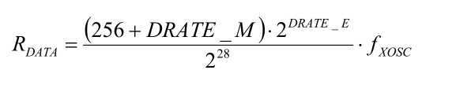
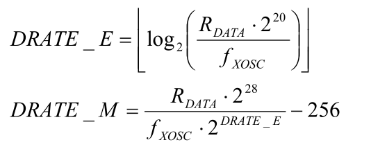

CC1101 datashit in Russian

# Modules

## E07-M1101D-SMA

# 10. 4 проводная последовательная конфигурация и интерфейс данных

CC1101 конфигурируется через простой 4-проводной SPI-совместимый интерфейс (SI, SO, SCLK и CSn), где CC1101 является ведомым. Этот интерфейс также используется для чтения и записи буферизованных данных. Все передачи по интерфейсу SPI выполняются в первую очередь.
Все транзакции в интерфейсе SPI начинаются с байта заголовка, содержащего бит R / W, бит доступа к пакету (B) и 6-битный адрес (A5 - A0)

Вывод CSn должен быть низким во время передачи по шине SPI. Если CSn становится высоким во время передачи байта заголовка или во время чтения / записи из / в регистр, передача будет отменена. Время для адреса и передачи данных по интерфейсу SPI показано на рисунке 13 со ссылкой на таблицу 22.
Когда уровень CSn низок, MCU должен подождать, пока вывод CC1101 SO не станет низким, прежде чем начать передачу байта заголовка. Это указывает на то, что кристалл работает. Если чип не находился в состояниях SLEEP или XOFF, вывод SO всегда будет понижаться сразу после того, как будет взято значение CSn.

## 10.1 Байт состояния чипа

Когда байт заголовка, байт данных или командный строб отправляется на интерфейс SPI, байт состояния микросхемы отправляется CC1101 на вывод SO. Байт состояния содержит ключевые сигналы состояния, полезные для MCU. Первый бит s7 является сигналом CHIP_RDYn, и этот сигнал должен иметь низкий уровень перед первым положительным фронтом SCLK. Сигнал CHIP_RDYn указывает, что кристалл работает.
Биты 6, 5 и 4 составляют значение STATE. Это значение отражает состояние чипа. XOSC и питание цифрового ядра включены в состоянии IDLE, но все остальные модули выключены. Частота и конфигурация канала должны обновляться только тогда, когда чип находится в этом состоянии. Состояние приема будет активным, когда микросхема находится в режиме приема. Аналогично, TX активен, когда чип передает.
Последние четыре бита (3: 0) в байте состояния содержат FIFO_BYTES_AVAILABLE. Для операций чтения (бит R / W ¯ в байте заголовка установлен в 1), поле FIFO_BYTES_AVAILABLE содержит количество байтов, доступных для чтения из FIFO RX. Для операций записи (бит R / W ¯ в байте заголовка установлен в 0), поле FIFO_BYTES_AVAILABLE содержит количество байтов, которые могут быть записаны в TIF FIFO. Когда FIFO_BYTES_AVAILABLE = 15, 15 или больше
байты доступны / свободны.

###### Таблица 23 дает сводку байтов состояния.

| Bits | **Name**                  | **Description**                                              |
| ---- | ------------------------- | ------------------------------------------------------------ |
| 7    | CHIP_RDYn                 | Остается высоким, пока мощность и кристалл не стабилизируются. Всегда должен быть низким при использовании интерфейса SPI. |
| 6:4  | STATE[2:0]                | Указывает текущий режим основного автомата                   |
|      | 000 - IDLE                | Состояние IDLE (также сообщается для некоторых переходных состояний вместо SETTLING или CALIBRATE) |
|      | 001 - RX                  | Режим приема                                                 |
|      | 010 - TX                  | Режим передачи                                               |
|      | 011 - FSTXON              | Fast TX ready                                                |
|      | 100 - CALIBRATE           | Выполняется калибровка синтезатора частоты                   |
|      | 101 - SETTLING            | PLL настраивается                                            |
|      | 110 - RXFIFO_OVERFLOW     | RX FIFO переполнен. Считайте любые полезные данные, затем очистите FIFO с помощью SFRX. |
|      | 111 - TXFIFO_UNDERFLOW    | TX FIFO опустился. Подтвердить с помощью SFTX                |
| 3:0  | FIFO_BYTES_AVAILABLE[3:0] | Количество байтов, доступных в RX FIFO или свободных байтов в TX FIFO |

## 10.2 Регистрация доступа

Регистры конфигурации на CC1101 расположены по адресам SPI от 0x00 до 0x2E. В таблице 43 перечислены все регистры конфигурации. Настоятельно рекомендуется использовать SmartRF® Studio [8] для генерации оптимальных настроек регистра. Подробное описание каждого регистра приведено в разделах 29.1 и 29.2. Все регистры конфигурации могут быть записаны и прочитаны. Бит R / W управляет записью или чтением регистра. При записи в регистры байт состояния отправляется на вывод SO каждый раз, когда на вывод SI передается байт заголовка или байт данных. При чтении из регистров байт состояния отправляется на вывод SO каждый раз, когда байт заголовка передается на вывод SI.
Доступ к регистрам с последовательными адресами можно получить эффективным способом, установив пакетный бит (B) в байте заголовка. Биты адреса (A5 - A0) устанавливают начальный адрес во внутреннем счетчике адресов. Этот счетчик увеличивается на один каждый новый байт (каждые 8 тактовых импульсов). Пакетный доступ является доступом для чтения или записи и должен быть прекращен путем установки высокого значения CSn.
Для адресов регистров в диапазоне 0x30-0x3D бит пакета используется для выбора между регистрами состояния, когда бит пакета равен единице, и между командными стробами, когда бит пакета равен нулю. Подробнее см. В разделе 10.3 ниже. Из-за этого пакетный доступ недоступен для регистров состояния, и они должны быть доступны по одному за раз. Регистры состояния могут быть прочитаны только.

## 10.3 SPI Чтение

При чтении полей регистров через интерфейс SPI, в то время как поля регистров обновляются аппаратными средствами радиосвязи (например, MARCSTATE или TXBYTES), существует небольшая, но конечная вероятность того, что одно чтение из регистра будет повреждено. Например, вероятность того, что какое-либо одно чтение из TXBYTES будет повреждено, при условии использования максимальной скорости передачи данных, составляет приблизительно 80 ppm. Обратитесь к примечаниям об ошибках CC1101 [4] для получения более подробной информации.

## 10.4 Командные Стробы

Стробы команд можно рассматривать как однобайтовые инструкции для CC1101. Посредством обращения к регистру строба команды будут запущены внутренние последовательности. Эти команды используются для отключения кварцевого генератора, включения режима приема, включения пробуждения по радио и т. Д. 13 стробов команд перечислены в [Табл. 42](#Таблица 42. Стробы команд).

------

Примечание. Строб SIDLE удаляет все ожидающие командные стробы до достижения состояния IDLE. Это означает, что, например, если строб SIDLE выдается, когда радиостанция находится в состоянии RX, любые другие стробы команд, выданные до того, как радиостанция достигнет состояния IDLE, будут игнорироваться.

------

Доступ к регистрам стробов команд осуществляется путем передачи одного байта заголовка (данные не передаются). То есть записываются только бит R / W, бит доступа к пакету (установленный в 0) и шесть битов адреса (в диапазоне от 0x30 до 0x3D). Бит R / W может быть либо единичным, либо нулевым и будет определять способ интерпретации поля FIFO_BYTES_AVAILABLE в байте состояния.
При записи командных стробов байт состояния отправляется на вывод SO.
За командным стробом может последовать любой другой доступ к SPI без превышения CSn. Однако, если строб SRES выдается, нужно будет дождаться, чтобы SO снова опустился до низкого уровня, прежде чем можно будет выдать следующий байт заголовка, как показано на рисунке 14. Комбинации команд выполняются немедленно, за исключением SPWD, SWOR и стробоскопы SXOFF, которые выполняются, когда CSn повышается.

## 10.5 Доступ к FIFO

Доступ к 64-байтовому TX FIFO и 64-байтовому RX FIFO осуществляется через адрес 0x3F. Когда бит R / W равен нулю, к TX FIFO обращаются, а к RX FIFO обращаются, когда бит R / W равен единице.
TX FIFO только для записи, а RX FIFO только для чтения.
Пакетный бит используется, чтобы определить, является ли доступ FIFO однобайтовым доступом или пакетным доступом. Однобайтовый метод доступа ожидает байт заголовка с битом пакета, установленным в ноль, и одним байтом данных. После байта данных ожидается новый байт заголовка; следовательно, CSn может оставаться низким. Метод пакетного доступа ожидает один байт заголовка, а затем последовательные байты данных до тех пор, пока не будет прекращен доступ путем установки высокого уровня CSn.
Следующие байты заголовка обращаются к FIFO:

- 0x3F: однобайтовый доступ к TX FIFO
- 0x7F: пакетный доступ к TX FIFO
- 0xBF: однобайтовый доступ к RX FIFO
- 0xFF: пакетный доступ к RX FIFO

При записи в TX FIFO байт состояния (см. Раздел 10.1) выводится на SO для каждого нового байта данных, как показано на рисунке 13. Этот байт состояния может использоваться для обнаружения недостаточного значения TX FIFO при записи данных в TX FIFO.

Обратите внимание, что байт состояния содержит количество свободных байтов перед записью текущего байта в TIF FIFO. Когда последний байт, который соответствует FIFO TX, передается по SI, байт состояния, полученный одновременно по SO, будет указывать, что один байт свободен в FIFO TX.
TX FIFO может быть сброшен путем выдачи строба команды SFTX. Точно так же командный строб SFRX сбрасывает FIFO RX. Строб команд SFTX или SFRX может быть выдан только в состояниях IDLE, TXFIFO_UNDERFLOW или RXFIFO_OVERFLOW. Оба FIFO сбрасываются при переходе в состояние SLEEP.
На рисунке 15 представлен краткий обзор возможных типов доступа к регистрам.

## 10.6. PATABLE доступ

Адрес 0x3E используется для доступа к PATABLE, который используется для выбора настроек управления мощностью PA. SPI ожидает до восьми байтов данных после получения адреса. Программируя PATABLE, можно увеличить или уменьшить управляемую мощность PA.
достигается, а также ASK модуляция для уменьшения пропускной способности. См. SmartRF® Studio [8] для получения информации о рекомендуемых последовательностях формирования / изменения скорости PA. См. Также раздел 24 на стр. 56.
Подробнее о программировании выходной мощности.
PATABLE - это 8-байтовая таблица, которая определяет настройки управления PA, которые будут использоваться для каждого из восьми значений мощности PA (выбираемых 3-битным значением FREND0.PA_POWER). Таблица записывается и читается с самого низкого значения (0) до самого высокого (7), по одному байту за раз. Счетчик индекса используется для контроля доступа к таблице. Этот счетчик увеличивается каждый раз, когда байт считывается или записывается в таблицу, и устанавливается наименьший индекс при высоком значении CSn. При достижении максимального значения счетчик перезапускается с нуля.
Доступ к PATABLE является однобайтовым или пакетным доступом в зависимости от пакета. При использовании пакетного доступа счетчик индекса будет считать; при достижении 7 счетчик будет перезапущен с 0. Бит R / W управляет доступом к чтению или записи.
Если один байт записан в PATABLE, и это значение должно быть считано, CSn должен быть установлен на высокий уровень перед доступом для чтения, чтобы установить счетчик индекса на ноль.
Обратите внимание, что содержимое PATABLE теряется при входе в состояние SLEEP, за исключением первого байта (индекс 0).
Для получения дополнительной информации см. Примечание к дизайну DN501 [21].

# 11 Интерфейс микроконтроллера и конфигурация контактов

В типичной системе CC1101 будет взаимодействовать с микроконтроллером. Этот микроконтроллер должен уметь:

- программировать CC1101 в разные режимы
- читать и записывать буферизованные данные
- Считывание информации о состоянии через 4-проводный интерфейс конфигурации шины SPI (SI, SO, SCLK и CSn).

## 11.1 Интерфейс конфигурации

Микроконтроллер использует четыре контакта ввода / вывода для интерфейса конфигурации SPI (SI, SO, SCLK и CSn). SPI описан в разделе 10.

## 11.2 Выводы общего контроля и состояния

CC1101 имеет два выделенных настраиваемых контакта (GDO0 и GDO2) и один общий контакт (GDO1), который может выводить информацию о внутреннем состоянии, полезную для управляющего программного обеспечения. Эти контакты могут использоваться для генерации прерываний на MCU. См. Раздел 26 на стр. 59 для более подробной информации о сигналах, которые можно запрограммировать.
GDO1 используется совместно с выводом SO в интерфейсе SPI. Настройка по умолчанию для GDO1 / SO - выход с 3 состояниями. При выборе любой другой опции программирования вывод GDO1 / SO станет общим выводом. Когда CSn низкий, вывод всегда будет функционировать как обычный вывод SO.
В синхронном и асинхронном последовательном режимах вывод GDO0 используется как вывод ввода последовательных данных TX в режиме передачи.

Вывод GDO0 также можно использовать для встроенного аналогового датчика температуры. Измеряя напряжение на выводе GDO0 с помощью внешнего АЦП, можно рассчитать температуру. Характеристики датчика температуры приведены в разделе 4.7. При настройке регистра PTEST по умолчанию (0x7F) выход датчика температуры доступен только при включенном синтезаторе частоты (например, состояния MANCAL, FSTXON, RX и TX). Необходимо записать 0xBF в регистр PTEST, чтобы использовать аналоговый датчик температуры в состоянии IDLE. Перед выходом из состояния IDLE регистр PTEST должен быть восстановлен до значения по умолчанию (0x7F).

## 11.3 Дополнительная функция радиоуправления

CC1101 имеет дополнительный способ управления радиостанцией путем повторного использования SI, SCLK и CSn из интерфейса SPI. Эта функция позволяет осуществлять простое трехконтактное управление основными состояниями радиостанции: SLEEP, IDLE, RX и TX. Эта дополнительная функция включена с помощью бита конфигурации MCSM0.PIN_CTRL_EN.
Изменения состояния задаются следующим образом:

- Если CSn высокий, SI и SCLK устанавливаются в желаемое состояние в соответствии с таблицей 24.
- Если CSn становится низким, состояние SI и SCLK фиксируется, и командный строб генерируется внутри в соответствии с конфигурацией выводов.

Изменить состояние можно только с последним функционалом. Это означает, что, например, RX не будет перезапущен, если для SI и SCLK установлены переключатели RX и CSn. Когда CSn низок, SI и SCLK имеют нормальную функциональность SPI.
Все команды управления выводом выполняются немедленно, кроме строба SPWD. Строб SPWD задерживается до тех пор, пока CSn не станет высоким.

| **CSn** | **SCLK**   | **SI**     | **Function**                                     |
| ------- | ---------- | ---------- | ------------------------------------------------ |
| 1       | X          | X          | Chip unaffected by SCLK/SI                       |
| ¯       | 0          | 0          | Generates SPWD strobe                            |
| ¯       | 0          | 1          | Generates STX strobe                             |
| ¯       | 1          | 0          | Generates SIDLE strobe                           |
| ¯       | 1          | 1          | Generates SRX strobe                             |
| 0       | SPI   mode | SPI   mode | SPI mode (wakes   up into IDLE if in SLEEP/XOFF) |

###### Table 24: Optional Pin Control Coding

# 12 Программирование скорости передачи данных

Скорость передачи данных, используемая при передаче, или скорость передачи данных, ожидаемая при приеме, программируется регистрами конфигурации MDMCFG3.DRATE_M и MDMCFG4.DRATE_E.
Скорость передачи данных определяется по формуле ниже.
Как видно из формулы, запрограммированная скорость передачи данных зависит от частоты кристалла.

Чтобы удовлетворить различные требования к ширине канала, фильтр канала приемника программируется. Регистры конфигурации MDMCFG4.CHANBW_E и MDMCFG4.CHANBW_M управляют полосой пропускания фильтра канала приемника, которая масштабируется с частотой кварцевого генератора.
Следующая формула дает связь между настройками регистра и полосой пропускания фильтра канала:

Следующий подход может быть использован для поиска подходящих значений для данной скорости передачи данных:

Если DRATE_M округляется до ближайшего целого числа и становится 256, увеличьте DRATE_E и используйте DRATE_M = 0.
Скорость передачи данных может быть установлена от 0,6 кБод до 500 кБод с минимальным размером шага в соответствии с таблицей 25 ниже. В таблице 3 указаны минимальная и максимальная скорости передачи данных для различных форматов модуляции.

| **Min Data** **Rate** **[kBaud]** | **Typical** **Data** **Rate** **[kBaud]** | **Max Data** **Rate** **[kBaud]** | **Data** **rate** **Step Size** **[kBaud]** |
| --------------------------------- | ----------------------------------------- | --------------------------------- | ------------------------------------------- |
| 0.6                               | 1.0                                       | 0.79                              | 0.0015                                      |
| 0.79                              | 1.2                                       | 1.58                              | 0.0031                                      |
| 1.59                              | 2.4                                       | 3.17                              | 0.0062                                      |
| 3.17                              | 4.8                                       | 6.33                              | 0.0124                                      |
| 6.35                              | 9.6                                       | 12.7                              | 0.0248                                      |
| 12.7                              | 19.6                                      | 25.3                              | 0.0496                                      |
| 25.4                              | 38.4                                      | 50.7                              | 0.0992                                      |
| 50.8                              | 76.8                                      | 101.4                             | 0.1984                                      |
| 101.6                             | 153.6                                     | 202.8                             | 0.3967                                      |
| 203.1                             | 250                                       | 405.5                             | 0.7935                                      |
| 406.3                             | 500                                       | 500                               | 1.5869                                      |

###### Таблица 25: Размер шага скорости передачи данных (при условии, что кристалл 26 МГц)

# 13 Полоса пропускания фильтра канала приемника

Чтобы удовлетворить различные требования к ширине канала, фильтр канала приемника программируется. Регистры конфигурации MDMCFG4.CHANBW_E и MDMCFG4.CHANBW_M управляют полосой пропускания фильтра канала приемника, которая масштабируется с помощью кварцевого генератора
частота.
Следующая формула дает связь между настройками регистра и полосой пропускания фильтра канала:

Таблица 26: Ширина полосы фильтра канала [кГц] (при условии, что кристалл 26 МГц)

| **MDMCFG4. CHANBW_M** | **MDMCFG4.CHANBW_E** |        |        |        |
| --------------------- | -------------------- | ------ | ------ | ------ |
|                       | **00**               | **01** | **10** | **11** |
| **00**                | 812                  | 406    | 203    | 102    |
| **01**                | 650                  | 325    | 162    | 81     |
| **10**                | 541                  | 270    | 135    | 68     |
| **11**                | 464                  | 232    | 116    | 58     |

###### 

Для лучшей производительности полоса пропускания фильтра канала должна быть выбрана так, чтобы полоса пропускания сигнала занимала не более 80% полосы пропускания фильтра канала. Допуск центра канала из-за неточности кристалла также должен быть вычтен из ширины полосы фильтра канала. Следующий пример иллюстрирует это:
Если полоса пропускания фильтра канала установлена на 500 кГц, сигнал должен оставаться в пределах 80% от
500 кГц, что составляет 400 кГц. Принимая во внимание частоту 915 МГц и погрешность частоты ± 20 ppm как для передающего, так и для приемного устройства, общая погрешность частоты составляет ± 40 ppm от 915 МГц, что составляет ± 37 кГц. Если вся ширина полосы передаваемого сигнала должна приниматься в пределах 400 кГц, ширина полосы передаваемого сигнала должна составлять максимум 400 кГц - 2 • 37 кГц, что составляет 326 кГц.

Компенсируя смещение частоты между передатчиком и приемником, можно уменьшить ширину полосы фильтра и повысить чувствительность, см. Подробнее в DN005 [20] и в разделе 14.1.

# 14 Демодулятор, символьный синхронизатор и решение для передачи данных

CC1101 содержит усовершенствованный и настраиваемый демодулятор. Фильтрация каналов и компенсация смещения частоты выполняется в цифровом виде. Для генерирования уровня RSSI (см. Раздел 0 для получения дополнительной информации) оценивается уровень сигнала в канале. Фильтрация данных также включена для повышения производительности.

## 14.1 Компенсация смещения частоты

CC1101 имеет очень хорошее разрешение по частоте (см. Таблицу 15). Эта функция может использоваться для компенсации смещения частоты и дрейфа.
При использовании модуляции 2-FSK, GFSK, 4-FSK или MSK демодулятор будет компенсировать смещение между частотой передатчика и приемника в определенных пределах, оценивая центр принимаемых данных. Конфигурация компенсации смещения частоты управляется из регистра FOCCFG. Путем компенсации большого смещения частоты между передатчиком и приемником можно улучшить чувствительность, см. DN005 [20].
Диапазон отслеживания алгоритма выбирается в виде доли полосы пропускания канала с помощью регистра конфигурации FOCCFG.FOC_LIMIT.
Если бит FOCCFG.FOC_BS_CS_GATE установлен, компенсатор смещения будет зависать до тех пор, пока не будет подтверждено значение несущей. Это может быть полезно, когда радиостанция находится в режиме RX в течение длительных периодов без трафика, поскольку алгоритм может смещаться к границам при попытке отследить шум.
Цикл отслеживания имеет два коэффициента усиления, которые влияют на время установления и чувствительность алгоритма к шуму. FOCCFG.FOC_PRE_K устанавливает коэффициент усиления до обнаружения слова синхронизации, а FOCCFG.FOC_POST_K выбирает коэффициент усиления после того, как слово синхронизации было найдено.

Расчетное значение смещения частоты доступно в регистре состояния FREQEST. Это может быть использовано для постоянной компенсации смещения частоты. Записав значение из FREQEST в FSCTRL0.FREQOFF, синтезатор частоты будет автоматически настроен в соответствии с оцененным смещением частоты. Более подробную информацию об этом алгоритме компенсации постоянной частоты можно найти в DN015 [13].

## 14.2 Битовая синхронизация

Алгоритм битовой синхронизации извлекает часы из входящих символов. Алгоритм требует, чтобы ожидаемая скорость передачи данных была запрограммирована, как описано в [разделе 12](#12 Программирование скорости передачи данных) . Повторная синхронизация выполняется непрерывно, чтобы скорректировать ошибку в входящей скорости передачи символов.

## 14.3 Байт Синхронизация

Синхронизация байтов достигается путем непрерывного поиска слова синхронизации. Слово синхронизации является 16-битным настраиваемым полем (может быть повторено для получения 32-битного), которое автоматически вставляется в начале пакета модулятором в режиме передачи. MSB в слове синхронизации отправляется первым. Демодулятор использует это поле, чтобы найти границы байтов в потоке битов. Слово синхронизации также будет функционировать в качестве системного идентификатора, поскольку только пакеты с правильным предварительно заданным словом синхронизации будут приниматься, если в регистре MDMCFG2 включено обнаружение слова синхронизации в RX (см. Раздел 17.1). Детектор синхрослов коррелирует с настроенным пользователем 16- или 32-битным синхрословом. Порог корреляции может быть установлен на 15/16, 16/16 или 30/32 бит соответствия. Слово синхронизации может быть дополнительно уточнено с использованием механизма индикатора качества преамбулы, описанного ниже, и / или условия определения несущей. Слово синхронизации настраивается через регистры SYNC1 и SYNC0.

# 15 Поддержка оборудования для обработки пакетов CC1101 имеет встроенную аппаратную поддержку для протокольно-ориентированных радиопротоколов.

В режиме передачи обработчик пакетов может быть сконфигурирован для добавления следующих элементов к пакету, сохраненному в TIF FIFO:

- Программируемое количество байтов преамбулы
- Двухбайтовое слово синхронизации (sync). Может быть продублировано, чтобы дать 4-байтовое слово синхронизации (рекомендуется). Невозможно только вставить преамбулу или только вставить слово синхронизации
- Контрольная сумма CRC, вычисленная по полю данных.

Рекомендуемая настройка - 4-байтовая преамбула и 4-байтовое слово синхронизации, за исключением скорости передачи данных 500 кБод, где рекомендуемая длина преамбулы составляет 8 байтов. Кроме того, в поле данных и необязательной 2-байтовой контрольной сумме CRC может быть реализовано следующее:

- Отбеливание данных с помощью последовательности PN9
- Прямое исправление ошибок (FEC) с использованием перемежения и кодирования данных (сверточное кодирование)

В режиме приема поддержка обработки пакетов будет де-конструировать пакет данных путем реализации следующего (если включено):

- обнаружение преамбулы
- • Синхронизация слов
- Расчет CRC и проверка CRC
- Однобайтовая проверка адреса
- Проверка длины пакета (байт длины сравнивается с программируемой максимальной длиной)
- De-отбеливание зубов
- чередование и декодирование

При желании в RIF FIFO можно добавить два байта состояния (см. Таблицу 27 и таблицу 28) со значением RSSI, индикацией качества канала и состоянием CRC.

| **Bit** | **Field** **Name** | **Description** |
| ------- | ------------------ | --------------- |
| 7:0     | RSSI               | RSSI value      |

###### Таблица 27: Байт состояния полученного пакета 1 (первый байт добавляется после данных)

| **Bit** | **Field** **Name** | **Description**                                              |
| ------- | ------------------ | ------------------------------------------------------------ |
| 7       | CRC_OK             | 1: CRC for received data   OK (or CRC disabled)   0: CRC error   in received data |
| 6:0     | LQI                | Indicating the link quality                                  |

###### Таблица 28: Байт состояния полученного пакета 2 (второй байт, добавленный после данных)

------

Примечание. Поля регистра, управляющие функциями обработки пакетов, следует изменять только тогда, когда CC1101 находится в состоянии IDLE.

------

## 19.5 Wake On Radio (WOR)

Дополнительная функция Wake on Radio (WOR) позволяет CC1101 периодически выходить из режима SLEEP и прослушивать входящие пакеты без взаимодействия с MCU.
Когда стробоскопическая команда SWOR отправляется через интерфейс SPI, CC1101 переходит в состояние SLEEP после отпускания CSn. Генератор RC должен быть включен перед использованием строба SWOR, поскольку он является источником синхронизации для таймера WOR. Встроенный в чип таймер переведет CC1101 в состояние IDLE, а затем в состояние RX. После программируемого времени в RX чип вернется в состояние SLEEP, если пакет не получен. См. Рисунок 25 и Раздел 0 для получения подробной информации о том, как работает тайм-аут. Чтобы выйти из режима WOR, установите CC1101 в состояние IDLE.
CC1101 может быть установлен, чтобы сигнализировать MCU о том, что пакет был принят с использованием выводов GDO. Если пакет получен, MCSM1.RXOFF_MODE определит поведение в конце принятого пакета. Когда MCU прочитал пакет, он может перевести микросхему обратно в SLEEP со стробом SWOR из состояния IDLE.

------

Примечание. FIFO теряет свое содержимое в состоянии SLEEP.

------

Таймер WOR имеет два события: событие 0 и событие 1. В состоянии SLEEP с активированным WOR, достижение события 0 включит цифровой регулятор и запустит кварцевый генератор. Событие 1 следует за Событием 0 после запрограммированного времени ожидания.
Время между двумя последовательными событиями 0 программируется значением мантиссы, заданным WOREVT1.EVENT0 и WOREVT0.EVENT0, и значение показателя степени, установленное WORCTRL.WOR_RES. Уравнение:

Тайм-аут события 1 программируется с помощью WORCTRL.EVENT1. На рисунке 25 показана временная зависимость между временем ожидания события 0 и временем события 1.

Время от CC1101 входит в состояние SLEEP до тех пор, пока не будет запрограммировано появление следующего Event0, tSLEEP на рисунке 25 должно быть больше 11,08 мс при использовании кристалла 26 МГц и 10,67 мс при использовании кристалла 27 МГц. Если tSLEEP меньше 11,08 (10,67) мс, есть вероятность, что последующее событие 0 произойдет

слишком рано. Замечание по применению AN047 [7] подробно объясняет теорию работы и различные регистры, используемые при использовании WOR, а также выделяет важные аспекты при использовании режима WOR.

### 19.5.1 RC генератор и синхронизация

Частота RC-генератора малой мощности, используемого для функциональности WOR, зависит от температуры и напряжения питания. Чтобы частота была максимально точной, генератор RC будет откалиброван при любой возможности, когда XOSC работает, а микросхема не находится в состоянии SLEEP. Когда питание и XOSC включены, часы, используемые таймером WOR, являются разделенными часами XOSC. Когда микросхема переходит в состояние ожидания, генератор RC будет использовать последний действительный результат калибровки. Частота генератора RC привязана к основной частоте кристалла, деленной на 750.
В тех случаях, когда радиостанция активируется очень часто, обычно несколько раз в секунду, можно выполнить калибровку генератора RC один раз, а затем отключить калибровку, чтобы уменьшить потребление тока. Это достигается установкой WORCTRL.RC_CAL = 0 и требует, чтобы значения калибровки генератора RC были считаны из регистров RCCTRL0_STATUS и RCCTRL1_STATUS и записаны обратно в RCCTRL0 и RCCTRL1 соответственно. Если калибровка генератора RC выключена, ее придется снова включить вручную, если
изменения температуры и напряжения питания. См. Примечание по применению AN047 [7] для получения более подробной информации.

## 19.6 Timing

### 19.6.1 Общее время перехода государства

Главный радиоконтроллер должен ждать в определенных состояниях, чтобы убедиться, что внутренние аналоговые / цифровые компоненты установлены и готовы к работе в новых состояниях. Ряд факторов важен для переходного периода:

• частота кварцевого генератора, fxosc
• Включено ли усиление PA или нет
• Скорость передачи данных в тех случаях, когда включена линейная активация
• значение регистров TEST0, TEST1 и FSCAL3

Таблица 34 показывает синхронизацию в циклах кварцевых часов для переходов состояния ключа.
Время включения и время запуска XOSC являются переменными, но в пределах, указанных в таблице 13.

Обратите внимание, что времена перехода TX к IDLE и TX к RX являются функциями скорости передачи данных (fbaudrate). При включенном линейном изменении PA (т. Е. FREND0.PA_POWER) 000b), TX на IDLE и TX на RX потребуются (FREND0.PA_POWER) / 8 • более высокая скорость передачи данных, чем указано в таблице 34

###### Таблица 34: Общее время перехода состояния (пример для кварцевого генератора 26 МГц, скорость передачи данных 250 кБод и TEST0 = 0x0B (максимальное время калибровки)).

| **Description**                     | **Transition** **Time** **(no** **PA** **ramping)** | **Transition** **Time** **[µs]** |
| ----------------------------------- | --------------------------------------------------- | -------------------------------- |
| IDLE to RX, no calibration          | 1953/fxosc                                          | 75.1                             |
| IDLE to RX, with calibration        | 1953/fxosc + FS calibration Time                    | 799                              |
| IDLE to TX/FSTXON, no calibration   | 1954/fxosc                                          | 75.2                             |
| IDLE to TX/FSTXON, with calibration | 1953/fxosc + FS calibration Time                    | 799                              |
| TX to RX switch                     | 782/fxosc + 0.25/fbaudrate                          | 31.1                             |
| RX to TX switch                     | 782/fxosc                                           | 30.1                             |
| TX to IDLE, no calibration          | ~0.25/fbaudrate                                     | ~1                               |
| TX to IDLE, with calibration        | ~0.25/fbaudrate + FS calibration Time               | 725                              |
| RX to IDLE, no calibration          | 2/fxosc                                             | ~0.1                             |
| RX to IDLE, with calibration        | 2/fxosc + FS calibration Time                       | 724                              |
| Manual calibration                  | 283/fxosc + FS calibration Time                     | 735                              |

### 19.6.2 Время калибровки синтезатора частоты

Таблица 35 суммирует время калибровки синтезатора частоты (FS) для возможных настроек TEST0 и FSCAL3.CHP_CURR_CAL_EN. Установка FSCAL3.CHP_CURR_CAL_EN на 00b отключает этап калибровки топливного насоса. TEST0 установлен на значения, рекомендуемые программным обеспечением SmartRF® Studio [8]. Возможные значения для

TEST0 при работе с разными полосами частот 0x09 и 0x0B. Программное обеспечение SmartRF® Studio [8] всегда устанавливает для FSCAL3.CHP_CURR_CAL_EN значение 10b.

Обратите внимание, что в расширенном спектре со скачкообразной перестройкой частоты или многоканальном протоколе время калибровки может быть уменьшено с 712/724 мкс до 145/157 мкс. Это объясняется в разделе 28.2.

###### Таблица 35. Время калибровки частотного синтезатора (кристалл 26/27 МГц)

| **TEST0** | **FSCAL3.CHP_CURR_CAL_EN** | **FS Calibration Time** **f****xosc** **= 26 MHz** | **FS Calibration Time** **f****xosc** **= 27 MHz** |
| --------- | -------------------------- | -------------------------------------------------- | -------------------------------------------------- |
| 0x09      | 00b                        | 3764/fxosc = 145 us                                | 3764/fxosc = 139 us                                |
| 0x09      | 10b                        | 18506/fxosc = 712 us                               | 18506/fxosc = 685 us                               |
| 0x0B      | 00b                        | 4073/fxosc = 157 us                                | 4073/fxosc = 151 us                                |
| 0x0B      | 10b                        | 18815/fxosc = 724 us                               | 18815/fxosc = 697 us                               |

### 19.7 Таймер завершения приема

CC1101 имеет дополнительные функции для автоматического завершения приема по истечении программируемого времени. Основное использование этой функции - Wake on Radio, но она также может быть полезна для других приложений. Таймер завершения запускается, когда находится в состоянии приема. Время ожидания программируется с помощью настройки MCSM2.RX_TIME. Когда таймер истекает, радиоконтроллер проверит условия пребывания в RX; если условие не выполнено, RX прекратит работу.
Программируемые условия:
• MCSM2.RX_TIME_QUAL = 0: продолжить прием, если слово синхронизации найдено
• MCSM2.RX_TIME_QUAL = 1: продолжить прием, если было найдено слово синхронизации или если качество преамбулы превышает пороговое значение (PQT)
Если система ожидает начала передачи при включении приемника, можно использовать функцию MCSM2.RX_TIME_RSSI. Радиоконтроллер затем прекратит прием, если первая действительная выборка значений несущей указывает на отсутствие несущей (RSSI ниже порогового значения). См. Раздел 17.4 на стр. 44 для более подробной информации о Carrier Sense.
Для модуляции ASK / OOK отсутствие чувства несущей считается действительным только после восьми периодов символа. Таким образом, функция MCSM2.RX_TIME_RSSI может использоваться в режиме ASK / OOK, когда расстояние между символами «1» составляет восемь или менее.
Если RX завершается из-за отсутствия несущей, когда используется функция MCSM2.RX_TIME_RSSI, или если при использовании функции тайм-аута MCSM2.RX_TIME не было найдено синхронизирующее слово, микросхема всегда возвращается к IDLE, если WOR отключена, и обратно к SLEEP, если WOR включен. В противном случае настройка MCSM1.RXOFF_MODE определяет состояние, к которому следует перейти после завершения приема. Это означает, что микросхема не будет автоматически возвращаться в режим SLEEP после получения слова синхронизации. Поэтому рекомендуется всегда активировать микроконтроллер при обнаружении синхрослов при использовании режима WOR. Это можно сделать, выбрав выходной сигнал 6 (см. Таблицу 41 на стр. 60) на одном из программируемых выходных выводов GDO, и запрограммировав микроконтроллер на активацию прерывания, инициируемого фронтом с этого вывода GDO.

# 20 Буфер FIFO

CC1101 содержит два 64-байтовых FIFO, один для принятых данных и один для данных, подлежащих передаче. Интерфейс SPI используется для чтения из RX FIFO и записи в TX FIFO.
Раздел 10.5 содержит подробную информацию о доступе SPI FIFO. Контроллер FIFO обнаружит переполнение в RX FIFO и недостаточное в TX FIFO.
При записи в TX FIFO MCU несет ответственность за предотвращение переполнения TX FIFO. Переполнение TX FIFO приведет к ошибке в содержимом TX FIFO.
Аналогично, при чтении RX FIFO MCU должен избегать чтения RX FIFO после его пустого значения, так как недостаточное значение RX FIFO приведет к ошибке при считывании данных из RX FIFO.
Байт состояния микросхемы, который доступен на выводе SO во время передачи заголовка SPI и содержит степень заполнения RX FIFO, если доступ является операцией чтения, и степень заполнения TX FIFO, если доступ является операцией записи.
Раздел 10.1 на странице 30 содержит более подробную информацию об этом.
Количество байтов в RX FIFO и TX FIFO можно прочитать из регистров состояния RXBYTES.NUM_RXBYTES и TXBYTES.NUM_TXBYTES соответственно. Если полученный байт данных записывается в RX FIFO в то же самое время, когда последний байт в RX FIFO считывается через интерфейс SPI, указатель RX FIFO не обновляется должным образом, и последний прочитанный байт будет дублирован. Чтобы избежать этой проблемы, RX FIFO никогда не должен очищаться до получения последнего байта пакета.
Для пакетов длиной менее 64 байтов рекомендуется дождаться получения полного пакета, прежде чем читать его из RIF FIFO.
Если длина пакета превышает 64 байта, MCU должен определить, сколько байтов может быть прочитано из RIF FIFO (RXBYTES.NUM_RXBYTES-1).
Можно использовать следующую программную программу:

1. Прочитайте RXBYTES.NUM_RXBYTES несколько раз со скоростью, указанной как минимум в два раза превышающей скорость приема байтов RF, пока одно и то же значение не будет возвращено дважды; сохранить значение в п.

2. Если в пакете осталось n <# байтов, считайте n-1 байтов из FIFO RX.

3. Повторяйте шаги 1 и 2 до тех пор, пока n = количество байтов, оставшихся в пакете.

4. Считайте оставшиеся байты из RX FIFO.

4-битная настройка FIFOTHR.FIFO_THR используется для программирования пороговых точек в FIFO.
В таблице 36 перечислены 16 настроек FIFO_THR и соответствующие пороговые значения для RX и TX FIFO. Пороговое значение кодируется в противоположных направлениях для RX FIFO и TX FIFO. Это дает равный запас для условий переполнения и недостаточного заполнения при достижении порогового значения.

# 26 общего назначения - проверка выводов управления

Три вывода цифрового выхода GDO0, GDO1 и GDO2 являются выводами общего управления, настроенными соответственно с IOCFG0.GDO0_CFG, IOCFG1.GDO1_CFG и IOCFG2.GDO2_CFG. В таблице 41 показаны различные сигналы, которые можно отслеживать на выводах GDO. Эти сигналы могут использоваться как входы в MCU.
GDO1 является тем же выводом, что и вывод SO на интерфейсе SPI, поэтому запрограммированный на этом выводе выход будет действителен только при высоком значении CSn. Значение по умолчанию для GDO1 равно 3, что полезно, когда интерфейс SPI используется совместно с другими устройствами.

Значением по умолчанию для GDO0 является выход тактовой частоты 135-141 кГц (частота XOSC, деленная на 192). Поскольку XOSC включается при перезагрузке при включении питания, его можно использовать для тактирования MCU в системах с одним кристаллом. Когда MCU запущен и работает, он может изменить тактовую частоту, записав IOCFG0.GDO0_CFG.

Встроенный аналоговый датчик температуры включается путем записи значения 128 (0x80) в регистр IOCFG0. Напряжение на выводе GDO0 пропорционально температуре. См. Раздел 4.7 на стр. 18 для технических характеристик датчика температуры.
Если значение IOCFGx.GDOx_CFG меньше 0x20, а IOCFGx_GDOx_INV равно 0 (1), выводы GDO0 и GDO2 будут подключены к 0 (1), а вывод GDO1 будет подключен к 1 (0) в состоянии SLEEP. Эти сигналы будут подключены до тех пор, пока сигнал CHIP_RDYn не станет низким.
Если значение IOCFGx.GDOx_CFG равно 0x20 или выше, выводы GDO будут работать так же, как запрограммировано, также в состоянии SLEEP. Например, GDO1 имеет высокий импеданс во всех состояниях, если IOCFG1.GDO1_CFG = 0x2E.

###### Таблица 41: Выбор сигнала GDOx (x = 0, 1 или 2)

| GDOx_CFG[5:0]              | Description                                                  |
| -------------------------- | ------------------------------------------------------------ |
| 0 (0x00)                   | Связан с RX FIFO: утверждает, что RX FIFO заполнен на уровне порога RX FIFO или выше. Сбрасывает, когда RX FIFO опустошается ниже того же порога. |
| 1 (0x01)                   | Связанный с RX FIFO: утверждает, что RX FIFO заполнен на пороге RX FIFO или выше, или   достигнут конец пакета. Отменяет, когда RX FIFO пуст. |
| 2 (0x02)                   | Связанный с TX FIFO: Утверждает, когда TX FIFO заполнен на или   выше порогового значения TX FIFO. Сбрасывает, когда TX   FIFO ниже того же порога. |
| 3 (0x03)                   | Связан с TX FIFO: утверждает, что TX FIFO заполнен.   Отменяется, когда TX FIFO опустошается ниже порога TX FIFO. |
| 4 (0x04)                   | Подтверждает, когда RX FIFO переполнен.   Отменяет утверждение, когда FIFO был сброшен |
| 5 (0x05)                   | Подтверждает, когда TX FIFO опустился. Отключает, когда FIFO сбрасывается. |
| 6 (0x06)                   | Подтверждает, когда   синхронизирующее слово было отправлено / получено, и отменяет подтверждение в   конце пакета. В RX этот вывод также будет показывать, когда пакет отбрасывается из-за   фильтрации адреса или максимальной длины или когда радиостанция переходит в   состояние RXFIFO_OVERFLOW. В TX   вывод будет де-утвержден, если TX FIFO потерян. |
| 7 (0x07)                   | Подтверждает, когда   пакет был получен с CRC OK. Сбрасывает, когда первый байт считывается из RX FIFO. |
| 8 (0x08)                   | Достигнуто качество   преамбулы. Подтверждает, когда PQI выше запрограммированного значения PQT. Отменяется, когда   микросхема переходит в состояние RX (MARCSTATE = 0x0D) или PQI становится ниже запрограммированного значения PQT. |
| 9 (0x09)                   | Четкая оценка канала.   Высокий, когда уровень RSSI ниже порога (зависит от текущей настройки CCA_MODE). |
| 10 (0x0A)                  | Блокировка выхода детектора. ФАПЧ блокируется, если выход детектора блокировки имеет положительный переход или постоянно имеет высокий логический уровень. Для проверки блокировки ФАПЧ выход детектора блокировки должен использоваться как прерывание для MCU. |
| 11 (0x0B)                  | Серийные Часы. Синхронно с данными в синхронном последовательном режиме. В режиме RX данные устанавливаются на заднем фронте с помощью CC1101, когда GDOx_INV = 0. В режиме TX данные выбираются CC1101 по переднему фронту последовательных часов, когда GDOx_INV = 0. |
| 12 (0x0C)                  | Синхронный последовательный вывод данных. Используется для синхронного последовательного режима. |
| 13 (0x0D)                  | Последовательный вывод данных. Используется для асинхронного последовательного режима. |
| 14 (0x0E)                  | Носитель смысла. Высокий, если уровень RSSI выше порога. Сбрасывается при переходе в режим ожидания. |
| 15 (0x0F)                  | CRC_OK. The last CRC comparison matched.   Cleared when entering/restarting RX mode. |
| 16 (0x10) to 21 (0x15)     | Reserved – used for test.                                    |
| 22 (0x16)                  | RX_HARD_DATA[1]. Can be used together   with RX_SYMBOL_TICK for alternative serial RX output. |
| 23 (0x17)                  | RX_HARD_DATA[0]. Can be used together   with RX_SYMBOL_TICK for alternative serial RX output. |
| 24 (0x18) to 26 (0x1A)     | Reserved – used for test.                                    |
| 27 (0x1B)                  | PA_PD. Примечание: PA_PD будет иметь одинаковый уровень сигнала в состояниях SLEEP и TX. Для управления внешним коммутатором PA или RX / TX в приложениях, где используется состояние SLEEP, рекомендуется вместо этого использовать GDOx_CFGx = 0x2F. |
| 28 (0x1C)                  | LNA_PD. Примечание: LNA_PD будет иметь одинаковый уровень сигнала в состояниях SLEEP и RX. Для управления внешним коммутатором LNA или RX / TX в приложениях, где используется состояние SLEEP, рекомендуется вместо этого использовать GDOx_CFGx = 0x2F. |
| 29 (0x1D)                  | RX_SYMBOL_TICK. Can be used together with   RX_HARD_DATA for alternative serial RX output. |
| 30 (0x1E)   to   35 (0x23) | Reserved – used for test.                                    |
| 36 (0x24)                  | WOR_EVNT0.                                                   |
| 37 (0x25)                  | WOR_EVNT1.                                                   |
| 38 (0x26)                  | Reserved – used for test.                                    |
| 39 (0x27)                  | CLK_32k.                                                     |
| 40 (0x28)                  | Reserved – used for test.                                    |
| 41 (0x29)                  | CHIP_RDYn.                                                   |
| 42 (0x2A)                  | Reserved – used for test.                                    |
| 43 (0x2B)                  | XOSC_STABLE.                                                 |
| 44 (0x2C)                  | Reserved – used for test.                                    |
| 45 (0x2D)                  | GDO0_Z_EN_N. When this output is 0, GDO0 is   configured as input (for serial TX data). |
| 46 (0x2E)                  | Высокий импеданс (3 состояния).                              |
| 47 (0x2F)                  | HW to 0 (HW1 achieved by setting GDOx_INV=1).   Can be used to control an external LNA/PA or RX/TX switch. |
| 48 (0x30)                  | CLK_XOSC/1                                                   |
| 49 (0x31)                  | CLK_XOSC/1.5                                                 |
| 50 (0x32)                  | CLK_XOSC/2                                                   |
| 51 (0x33)                  | CLK_XOSC/3                                                   |
| 52 (0x34)                  | CLK_XOSC/4                                                   |
| 53 (0x35)                  | CLK_XOSC/6                                                   |
| 54 (0x36)                  | CLK_XOSC/8                                                   |
| 55 (0x37)                  | CLK_XOSC/12                                                  |
| 56 (0x38)                  | CLK_XOSC/16                                                  |
| 57 (0x39)                  | CLK_XOSC/24                                                  |
| 58 (0x3A)                  | CLK_XOSC/32                                                  |
| 59 (0x3B)                  | CLK_XOSC/48                                                  |
| 60 (0x3C)                  | CLK_XOSC/64                                                  |
| 61 (0x3D)                  | CLK_XOSC/96                                                  |
| 62 (0x3E)                  | CLK_XOSC/128                                                 |
| 63 (0x3F)                  | CLK_XOSC/192                                                 |

###### 

Примечание. Имеется 3 контакта GDO, но в любое время в   качестве выхода может быть выбран только один CLK_XOSC / n. Если необходимо отслеживать CLK_XOSC / n на одном из выводов GDO, для двух других   выводов GDO должны быть настроены значения менее 0x30. Значением по   умолчанию GDO0 является CLK_XOSC / 192.   Для оптимизации радиочастотных характеристик эти сигналы не следует   использовать, когда радиостанция находится в режиме RX или TX.   

# 27 Асинхронная и синхронная последовательная операция

Несколько функций и режимов работы были включены в CC1101 для обеспечения обратной совместимости с предыдущими продуктами Chipcon и другими существующими системами радиочастотной связи. Для новых систем рекомендуется использовать встроенные функции обработки пакетов, поскольку они могут обеспечить более надежную связь, значительно разгрузить микроконтроллер и упростить разработку программного обеспечения.

## 27.1 Асинхронная последовательная операция

Асинхронная передача включена в CC1101 для обратной совместимости с системами, которые уже используют асинхронную передачу данных.
Когда асинхронная передача включена, некоторые из механизмов поддержки для MCU, которые включены в CC1101, будут отключены, такие как оборудование обработки пакетов, буферизация в FIFO и так далее. Режим асинхронной передачи не допускает использования отбеливателя данных, перемежителя и FEC, и невозможно использовать манчестерское кодирование. MSK не поддерживается для асинхронной передачи.
Установка PKTCTRL0.PKT_FORMAT в 3 включает асинхронный последовательный режим. В TX вывод GDO0 используется для ввода данных (данные TX). Вывод данных может быть на GDO0, GDO1 или GDO2. Это устанавливается параметром IOCFG0.GDO0_CFG, IOCFG1.GDO1_CFG, IOCFG2.GDO2_CFG.
Модулятор CC1101 производит выборку уровня асинхронного входа в 8 раз быстрее, чем запрограммированная скорость передачи данных. Требование синхронизации для асинхронного потока состоит в том, что ошибка в битовом периоде должна составлять менее одной восьмой запрограммированной скорости передачи данных.
В асинхронном последовательном режиме решение не принимает данные на кристалле, а необработанные данные помещаются в строку вывода данных в RX. При использовании асинхронного последовательного режима убедитесь, что интерфейсный MCU выполняет надлежащую передискретизацию и может обрабатывать дрожание в строке вывода данных. MCU должен допускать дрожание ± 1/8 битового периода, поскольку поток данных дискретен по времени, используя 8 выборок на бит.
В асинхронном последовательном режиме будут происходить сбои длительностью 37 - 38,5 нс (1 / XOSC), возникающие нечасто и со случайными периодами. Простой RC-фильтр может быть добавлен к линии вывода данных между CC1101 и MCU, чтобы избавиться от глюков 37 - 38,5 нс и нс, если это считается проблемой. Частота среза фильтра 3 дБ должна быть достаточно высокой, чтобы данные не фильтровались, и в то же время достаточно низкой, чтобы устранить помехи. Например, для скорости передачи данных 2,4 кБод можно использовать резистор 1 кОм и конденсатор 2,7 нФ. Это дает частоту среза 3 дБ 59 кГц.

## 27.2 Синхронная последовательная операция

Установка PKTCTRL0.PKT_FORMAT в 1 включает синхронный последовательный режим. В синхронном последовательном режиме данные передаются по двухпроводному последовательному интерфейсу. CC1101 предоставляет часы, которые используются для установки новых данных в строке ввода данных или выборочных данных в строке вывода данных. Ввод данных (данные TX) находится на выводе GDO0. Этот вывод будет автоматически настроен как вход, когда TX активен. Задержка передачи составляет 8 бит. Вывод вывода данных может быть любым из выводов GDO. Это устанавливается полями IOCFG0.GDO0_CFG, IOCFG1.GDO1_CFG и IOCFG2.GDO2_CFG. Время от начала приема до получения данных на выводе данных приемника равно 9 битам.
Вставка / обнаружение преамбулы и слова синхронизации может быть или не быть активной, в зависимости от режима синхронизации, установленного MDMCFG2.SYNC_MODE.

Если преамбула и слово синхронизации отключены, все другие функции обработчика пакетов и FEC также должны быть отключены. MCU должен затем обрабатывать ввод преамбулы и синхронизировать слова и обнаруживать их в программном обеспечении.
Если преамбула и вставка / обнаружение слова синхронизации включены, могут использоваться все функции обработки пакетов и FEC. Единственным исключением является то, что функция фильтрации адресов недоступна в синхронном последовательном режиме.
При использовании функций обработки пакетов в синхронном последовательном режиме CC1101 вставит и обнаружит преамбулу и слово синхронизации, а MCU предоставит / получит только полезную нагрузку данных. Это эквивалентно рекомендуемому режиму работы FIFO.
Альтернативный вариант последовательного вывода RX - настроить любой из выводов GD0 для RX_SYMBOL_TICK и RX_HARD_DATA, см. Таблицу 41. RX_HARD_DATA [1: 0] является символом жесткого решения. RX_HARD_DATA [1: 0] содержит данные для 4-х форматных форматов модуляции, а RX_HARD_DATA [1] содержит данные для 2-х форматных форматов модуляции.
Сигнал RX_SYMBOL_TICK является символом синхроимпульса и имеет высокий уровень в течение половины периода символа всякий раз, когда новый символ представлен на выходах жесткого и программного данных. Эта опция может использоваться как для синхронных, так и для асинхронных интерфейсов.

# 28 Системные соображения и рекомендации

## 28.1 Правила SRD

Международные правила и национальные законы регулируют использование радиоприемников и передатчиков. Устройства ближнего действия (SRD) для безлицензионной работы на частотах ниже 1 ГГц обычно работают в полосах частот 315 МГц, 433 МГц, 868 МГц или 915 МГц. CC1101 специально разработан для такого использования с рабочими диапазонами 300 - 348 МГц, 387 - 464 МГц и 779 - 928 МГц. Наиболее важными правилами использования CC1101 в полосах частот 315 МГц, 433 МГц, 868 МГц или 915 МГц являются EN 300 220 (Европа) и FCC CFR47 часть 15 (США). Краткое изложение наиболее важных аспектов этих
Правила можно найти в примечании по применению AN001 [5] и примечании по применению AN050 [6].
Для соответствия требованиям ширины полосы модуляции согласно EN 300 220 в диапазоне частот от 863 до 870 МГц рекомендуется использовать кристалл 26 МГц для частот ниже 869 МГц и кристалл 27 МГц для частот выше 869 МГц. Для получения дополнительной информации см. Примечание по применению AN050 [6].
Обратите внимание, что соблюдение правил зависит от полной производительности системы. Клиент несет ответственность за обеспечение соответствия системы нормам.

## 28.2. Перескок частот и многоканальные системы

Полосы 315 МГц, 433 МГц, 868 МГц или 915 МГц используются многими системами как в промышленных, так и в офисных и домашних условиях. Поэтому рекомендуется использовать расширенный спектр со скачкообразной перестройкой частоты (FHSS) или многоканальный протокол, поскольку разнесение частот делает систему более устойчивой к помехам от других систем, работающих в той же полосе частот. FHSS также борется с многолучевым замиранием.
CC1101 отлично подходит для FHSS или многоканальных систем благодаря гибкому синтезатору частоты и эффективному интерфейсу связи. Использование поддержки обработки пакетов и буферизации данных также полезно в таких системах, поскольку эти функции значительно разгрузят хост-контроллер.
Данные о калибровке тока накачки, тока VCO и емкости конденсатора VCO требуются для каждой частоты при реализации скачкообразного изменения частоты для CC1101. Есть 3 способа получения данных калибровки из чипа:
1) Прыжок частоты с калибровкой для каждого скачка. Время калибровки ФАПЧ составляет приблизительно 725 мкс. Интервал гашения между каждым скачком частоты составляет приблизительно 800 мкс.

2) Быстрое скачкообразное изменение частоты без калибровки для каждого скачка может быть выполнено путем выполнения необходимой калибровки при запуске и сохранения результирующих значений регистров FSCAL3, FSCAL2 и FSCAL1 в памяти MCU. Значение регистра FSCAL1 калибровки емкости VCO должно быть найдено для каждой используемой частоты РЧ. Значение калибровки тока VCO и значение калибровки тока нагнетательного насоса, доступные в FSCAL2 и FSCAL3 соответственно, не зависят от радиочастотной частоты, поэтому одно и то же значение можно использовать для всех радиочастотных частот для этих двух регистров. Между каждым скачком частоты процесс калибровки может быть заменен записью значений регистров FSCAL3, FSCAL2 и FSCAL1, соответствующих следующей радиочастотной частоте. Время включения ФАПЧ составляет примерно 75 мкс. Интервал гашения между каждым скачком частоты составляет приблизительно 75 мкс.
3) Запустите калибровку на одной частоте при запуске. Затем запишите 0 в FSCAL3 [5: 4], чтобы отключить калибровку заправочного насоса. После записи в FSCAL3 [5: 4] стробируйте SRX (или STX) с MCSM0.FS_AUTOCAL = 1 для каждого нового скачка частоты. То есть калибровка тока VCO и емкости VCO выполняется, но не зарядка  калибровка тока насоса. Когда калибровка тока подкачки отключена, время калибровки уменьшается с 712/724 мкс до 145/157 мкс (кристалл 26 МГц и TEST0 = 0x09 / 0B). Интервал гашения между каждым скачком частоты составляет 220/232 мкс. Смотрите Таблицу 35.
Существует компромисс между временем гашения и объемом памяти, необходимым для хранения данных калибровки в энергонезависимой памяти. Решение 2) выше дает самый короткий интервал гашения, но требует больше памяти для хранения значений калибровки. Это решение также требует, чтобы напряжение питания и температура не сильно различались, чтобы иметь надежное решение. Решение 3) дает примерно на 570 мкс меньший интервал гашения, чем решение 1).

Рекомендуемые настройки для TEST0.VCO_SEL_CAL_EN меняются с частотой. Это означает, что всегда следует использовать SmartRF® Studio [8], чтобы получить правильные настройки для определенной частоты, прежде чем делать калибровка, независимо от того, какой метод калибровки используется.

## 28.3 Широкополосная модуляция, когда не используется расширенный спектр

Системы цифровой модуляции в соответствии с частью 15.247 FCC включают модуляцию 2-FSK, GFSK и 4-FSK. Максимальная пиковая выходная мощность 1 Вт (+30 дБм) допускается, если ширина полосы 6 дБ модулированного сигнала превышает 500 кГц. Кроме того, максимальная спектральная плотность мощности, подводимая к антенне, не должна превышать +8 дБм в любой полосе 3 кГц.

Работая на высоких скоростях передачи данных и частотном разделении, CC1101 подходит для систем, нацеленных на соответствие с системой цифровой модуляции, как определено частью 15.247 FCC. Внешний усилитель мощности необходим для увеличения выходной мощности выше +10 дБм. Пожалуйста, обратитесь к DN006 [14] для получения более подробной информации о широкополосной модуляции и CC1101.

## 28.4 Беспроводной MBUS

Беспроводной стандарт MBUS является стандартом связи для счетчиков и беспроводного считывания показаний счетчиков и определяет физический уровень и уровень канала передачи данных. Потребляемая мощность является критическим параметром для стороны счетчика, поскольку линия связи должна работать в течение всего срока службы счетчика без замены батареи. CC1101 в сочетании с MSP430 - отличный выбор для стандарта Wireless MBUS, CC1101 - действительно низкий

недорогой, маломощный и гибкий трансивер, а MSP430 - высокопроизводительный и маломощный MCU. Для получения дополнительной информации об использовании CC1101 для беспроводных приложений MBUS см. AN067 [17].
Поскольку стандарт Wireless MBUS работает в диапазоне 868-870 ISM, требования к радиосвязи также должны соответствовать стандартам ETSI EN 300 220 и CEPT / ERC / REC 70-03 E.

## 28.5 Передача данных

Высокая максимальная скорость передачи данных CC1101 открывается для пакетной передачи. Линия связи с низкой средней скоростью передачи данных (например, 10 кБод) может быть реализована с использованием более высокой скорости передачи данных в эфире. Буферизация данных и передача в пакетах с высокой скоростью передачи данных (например, 500 кБод) уменьшит время в активном режиме и, следовательно, также значительно уменьшит среднее потребление тока.

Сокращение времени в активном режиме уменьшит вероятность столкновений с другими системами в том же диапазоне частот.

## 28.6 Непрерывная передача

В приложениях с потоковой передачей данных CC1101 открывается для непрерывной передачи с эффективной скоростью передачи данных 500 кБод. Поскольку модуляция выполняется с помощью ФАПЧ с замкнутым контуром, ограничение в длине передачи (модуляция с разомкнутым контуром, используемая в некоторых приемопередатчиках, часто предотвращает этот вид непрерывной потоковой передачи данных и снижает эффективную скорость передачи данных).

## 28.7 Бюджетные системы

Поскольку CC1101 обеспечивает многоканальную производительность 0,6-500 кБод без каких-либо внешних SAW или контурных фильтров, можно создать очень дешевую систему. SMD-кристалл типа HC-49 используется в эталонных конструкциях CC1101EM ([2] и [3]). Хрустальная упаковка сильно влияет на цену. В конструкции печатной платы с ограниченным размером можно использовать кристалл меньшего размера, но более дорогой.

## 28.8 Системы с батарейным питанием

В приложениях с низким энергопотреблением состояние SLEEP с отключенным ядром кварцевого генератора следует использовать, когда CC1101 не активен. Можно оставить ядро кварцевого генератора
работает в состоянии SLEEP, если время запуска является критическим. Функциональность WOR следует использовать в приложениях с низким энергопотреблением.

## 28.9 Увеличение выходной мощности

В некоторых приложениях может быть необходимо расширить диапазон связи. Добавление внешнего усилителя мощности является наиболее эффективным способом сделать это. Усилитель мощности должен быть
вставлен между антенной и балуном и согласующей цепью. Два T / R-переключателя необходимы для отключения PA в режиме RX, см. Подробности на рисунке 30.

# 29 Регистры конфигурации

Конфигурирование CC1101 выполняется путем программирования 8-битных регистров. Оптимальные данные конфигурации, основанные на выбранных параметрах системы, легче всего найти с помощью программного обеспечения SmartRF Studio [8]. Полные описания регистров приведены в следующих таблицах. После сброса микросхемы все регистры имеют значения по умолчанию, как показано в таблицах. Оптимальная настройка регистра может отличаться от значения по умолчанию. После сброса все регистры, которые должны отличаться от значения по умолчанию, должны быть запрограммированы через интерфейс SPI.

В таблице 42 перечислены 13 регистров командных стробов. Доступ к этим регистрам инициирует изменение внутреннего состояния или режима. В таблице 43 перечислены 47 обычных 8-битных регистров конфигурации. Многие из этих регистров предназначены только для целей тестирования и не требуют записи для нормальной работы CC1101.

Есть также 12 регистров состояния, которые перечислены в таблице 44. Эти регистры, которые доступны только для чтения, содержат информацию о состоянии CC1101.

Доступ к двум FIFO осуществляется через один 8-битный регистр. Операции записи выполняют запись в TX FIFO, а операции чтения - чтение из RX FIFO. Во время передачи байта заголовка и при записи данных в регистр или TIF FIFO в строке SO возвращается байт состояния. Этот байт состояния описан в таблице 23 на стр. 30.
Таблица 45 суммирует адресное пространство SPI. Используемый адрес задается добавлением базового адреса слева и пакетов и битов чтения / записи вверху. Обратите внимание, что пакетный бит имеет различное значение для базовых адресов выше и ниже 0x2F

###### Таблица 42. Стробы команд

| **Address** | **Strobe** **Name** | **Description**                                              |
| ----------- | ------------------- | ------------------------------------------------------------ |
| 0x30        | SRES                | Сброс чипа.                                                  |
| 0x31        | SFSTXON             | Включите и откалибруйте синтезатор частоты (если MCSM0.FS_AUTOCAL = 1). Если в RX (с CCA): перейдите в состояние ожидания, когда работает только синтезатор (для быстрого возврата RX / TX). |
| 0x32        | SXOFF               | Выключить кварцевый генератор.                               |
| 0x33        | SCAL                | Откалибруйте синтезатор частоты и выключите его. SCAL может быть выведен из режима IDLE без установки режима ручной калибровки (MCSM0.FS_AUTOCAL = 0) |
| 0x34        | SRX                 | Включить RX. Сначала выполните калибровку, если исходят из IDLE и MCSM0.FS_AUTOCAL = 1. |
| 0x35        | STX                 | В состоянии IDLE: Включить TX. Сначала выполните калибровку, если MCSM0.FS_AUTOCAL = 1. Если в состоянии приема и CCA включен: переходить к передаче только в том случае, если канал свободен. |
| 0x36        | SIDLE               | Выйдите из RX / TX, выключите синтезатор частоты и выйдите из режима Wake-On-Radio, если это применимо. |
| 0x38        | SWOR                | Запустите последовательность автоматического приема RX (Wake-on-Radio), как описано в разделе 19.5, если WORCTRL.RC_PD = 0. |
| 0x39        | SPWD                | Войдите в режим отключения питания, когда CSn становится высоким. |
| 0x3A        | SFRX                | Очистите буфер RX FIFO. Выпускать SFRX только в состояниях IDLE или RXFIFO_OVERFLOW. |
| 0x3B        | SFTX                | Очистите буфер TX FIFO. Выпускайте SFTX только в состояниях IDLE или TXFIFO_UNDERFLOW. |
| 0x3C        | SWORRST             | Сброс часов реального времени на значение Event1.            |
| 0x3D        | SNOP                | Нет операции. Может использоваться для получения доступа к байту статуса чипа. |

###### Таблица 43: Обзор регистров конфигурации

| **Address** | **Register** | **Description**                                    | **Preserved in SLEEP State** |
| ----------- | ------------ | -------------------------------------------------- | ---------------------------- |
| 0x00        | IOCFG2       | GDO2 output pin configuration                      | Yes                          |
| 0x01        | IOCFG1       | GDO1 output pin configuration                      | Yes                          |
| 0x02        | IOCFG0       | GDO0 output pin configuration                      | Yes                          |
| 0x03        | FIFOTHR      | RX   FIFO and TX FIFO thresholds                   | Yes                          |
| 0x04        | SYNC1        | Sync word, high byte                               | Yes                          |
| 0x05        | SYNC0        | Sync word, low byte                                | Yes                          |
| 0x06        | PKTLEN       | Packet   length                                    | Yes                          |
| 0x07        | PKTCTRL1     | Packet   automation control                        | Yes                          |
| 0x08        | PKTCTRL0     | Packet   automation control                        | Yes                          |
| 0x09        | ADDR         | Device   address                                   | Yes                          |
| 0x0A        | CHANNR       | Channel   number                                   | Yes                          |
| 0x0B        | FSCTRL1      | Frequency synthesizer control                      | Yes                          |
| 0x0C        | FSCTRL0      | Frequency synthesizer control                      | Yes                          |
| 0x0D        | FREQ2        | Frequency control word, high byte                  | Yes                          |
| 0x0E        | FREQ1        | Frequency control word, middle byte                | Yes                          |
| 0x0F        | FREQ0        | Frequency control word, low byte                   | Yes                          |
| 0x10        | MDMCFG4      | Modem   configuration                              | Yes                          |
| 0x11        | MDMCFG3      | Modem   configuration                              | Yes                          |
| 0x12        | MDMCFG2      | Modem   configuration                              | Yes                          |
| 0x13        | MDMCFG1      | Modem   configuration                              | Yes                          |
| 0x14        | MDMCFG0      | Modem   configuration                              | Yes                          |
| 0x15        | DEVIATN      | Modem   deviation setting                          | Yes                          |
| 0x16        | MCSM2        | Main   Radio Control State Machine configuration   | Yes                          |
| 0x17        | MCSM1        | Main   Radio   Control State Machine configuration | Yes                          |
| 0x18        | MCSM0        | Main   Radio   Control State Machine configuration | Yes                          |
| 0x19        | FOCCFG       | Frequency Offset Compensation   configuration      | Yes                          |
| 0x1A        | BSCFG        | Bit   Synchronization configuration                | Yes                          |
| 0x1B        | AGCTRL2      | AGC   control                                      | Yes                          |
| 0x1C        | AGCTRL1      | AGC   control                                      | Yes                          |
| 0x1D        | AGCTRL0      | AGC   control                                      | Yes                          |
| 0x1E        | WOREVT1      | High   byte   Event 0 timeout                      | Yes                          |
| 0x1F        | WOREVT0      | Low byte Event 0 timeout                           | Yes                          |
| 0x20        | WORCTRL      | Wake On Radio control                              | Yes                          |
| 0x21        | FREND1       | Front end RX configuration                         | Yes                          |
| 0x22        | FREND0       | Front end TX configuration                         | Yes                          |
| 0x23        | FSCAL3       | Frequency synthesizer calibration                  | Yes                          |
| 0x24        | FSCAL2       | Frequency synthesizer calibration                  | Yes                          |
| 0x25        | FSCAL1       | Frequency synthesizer calibration                  | Yes                          |
| 0x26        | FSCAL0       | Frequency synthesizer calibration                  | Yes                          |
| 0x27        | RCCTRL1      | RC   oscillator configuration                      | Yes                          |
| 0x28        | RCCTRL0      | RC   oscillator configuration                      | Yes                          |
| 0x29        | FSTEST       | Frequency synthesizer calibration control          | No                           |
| 0x2A        | PTEST        | Production   test                                  | No                           |
| 0x2B        | AGCTEST      | AGC test                                           | No                           |
| 0x2C        | TEST2        | Various   test   settings                          | No                           |
| 0x2D        | TEST1        | Various   test   settings                          | No                           |
| 0x2E        | TEST0        | Various   test   settings                          | No                           |

###### Таблица 44: Обзор регистров состояния

| **Address** | **Register**   | **Description**                              |
| ----------- | -------------- | -------------------------------------------- |
| 0x30 (0xF0) | PARTNUM        | Номер детали для CC1101                      |
| 0x31 (0xF1) | VERSION        | Текущий номер версии                         |
| 0x32 (0xF2) | FREQEST        | Оценка смещения частоты                      |
| 0x33 (0xF3) | LQI            | Оценка демодулятора для качества связи       |
| 0x34 (0xF4) | RSSI           | Индикация уровня принимаемого сигнала        |
| 0x35 (0xF5) | MARCSTATE      | Контроль состояния машины                    |
| 0x36 (0xF6) | WORTIME1       | Старший байт таймера WOR                     |
| 0x37 (0xF7) | WORTIME0       | Младший байт таймера WOR                     |
| 0x38 (0xF8) | PKTSTATUS      | Текущий статус GDOx и статус пакета          |
| 0x39 (0xF9) | VCO_VC_DAC     | Текущая настройка от модуля калибровки PLL   |
| 0x3A (0xFA) | TXBYTES        | Недостаток и количество байтов в TX FIFO     |
| 0x3B (0xFB) | RXBYTES        | Переполнение и количество байтов в RX FIFO   |
| 0x3C (0xFC) | RCCTRL1_STATUS | Последний результат калибровки генератора RC |
| 0x3D (0xFD) | RCCTRL0_STATUS | Последний результат калибровки генератора RС |

## 29.1 Сведения о регистре конфигурации - регистры с сохраненными значениями в состоянии SLEEP

###### 0x00: IOCFG2 – GDO2 Output Pin Configuration

| Bit  | Name          | **Reset**  | **R/W** | Value | **Description**                                              |
| ---- | ------------- | ---------- | ------- | ----- | ------------------------------------------------------------ |
| 7    |               |            | R0      |       | Not   used                                                   |
| 6    | GDO2_INV      | 0          | R/W     |       | Инвертировать выход, т.е. выбрать активный низкий (1) / высокий (0) |
| 5:0  | GDO2_CFG[5:0] | 41  (0x29) | R/W     |       | По умолчанию установлено значение CHP_RDYn (см. [Таблицу 41](#Таблица 41: Выбор сигнала GDOx (x = 0, 1 или 2))). |

###### 0x01: IOCFG1 – GDO1 Output Pin Configuration

| Bit  | Name          | **Reset** | **R/W** | Value | **Description**                                              |
| ---- | ------------- | --------- | ------- | ----- | ------------------------------------------------------------ |
| 7    | GDO_DS        | 0         | RW      |       | Установите высокую (1) или низкую (0) выходную мощность на выводах GDO |
| 6    | GDO1_INV      | 0         | R/W     |       | Инвертировать выход, т.е. выбрать активный низкий (1) / высокий (0) |
| 5:0  | GDO1_CFG[5:0] | 46 (0x2E) | R/W     |       | По умолчанию 3 состояния (см. [Таблицу 41](#Таблица 41: Выбор сигнала GDOx (x = 0, 1 или 2))). |

###### 0x02: IOCFG0 – GDO0 Output Pin Configuration

| Bit  | Name               | **Reset** | **R/W** | Value | **Description**                                              |
| ---- | ------------------ | --------- | ------- | ----- | ------------------------------------------------------------ |
| 7    | TEMP_SENSOR_ENABLE | 0         | R/W     |       | Включить аналоговый датчик температуры. Запишите 0 во всех остальных битах регистра при использовании датчика температуры |
| 6    | GDO0_INV           | 0         | R/W     |       | Инвертировать выход, т.е. выбрать активный низкий (1) / высокий (0) |
| 5:0  | GDO0_CFG[5:0]      | 63 (0x3F) | R/W     |       | По умолчанию установлено значение CLK_XOSC / 192(см. [Таблицу 41](#Таблица 41: Выбор сигнала GDOx (x = 0, 1 или 2))). Рекомендуется отключить выход тактовой частоты при инициализации, чтобы оптимизировать производительность RF. |

###### 0x03: FIFOTHR - пороги RX FIFO и TX FIFO

| Bit  | Name              | **Reset** | **R/W** | Value                | **Description**                                              |
| ---- | ----------------- | --------- | ------- | -------------------- | ------------------------------------------------------------ |
| 7    |                   | 0         | R/W     |                      | Зарезервировано, напишите 0 для совместимости с возможными будущими расширениями |
| 6    | ADC_RETENTION     | 0         | R/W     | 0                    | TEST1 = 0x31 и TEST2 = 0x88 при пробуждении от SLEEP         |
|      |                   |           |         | 1                    | TEST1 = 0x35 и TEST2 = 0x81 при пробуждении из режима SLEEP  |
|      |                   |           |         |                      | Обратите внимание, что изменения в регистрах TEST из-за установки бита ADC_RETENTION видны только ВНУТРИ в аналоговой части. Значения, считанные из регистров TEST при выходе из режима SLEEP, всегда будут значением сброса. Бит ADC_RETENTION должен быть установлен в 1 перед переходом в режим SLEEP, если во время пробуждения требуются настройки с шириной полосы RX-фильтра ниже 325 кГц. |
| 5:4  | CLOSE_IN_RX [1:0] | 0(00)     | RW      |                      | Для более подробной информации, пожалуйста, смотрите DN010 [11] |
|      |                   |           |         | 0 (00)               | 0dB                                                          |
|      |                   |           |         | 1(01)                | 6dB                                                          |
|      |                   |           |         | 2(10)                | 12dB                                                         |
|      |                   |           |         | 3(11)                | 18dB                                                         |
| 3:0  | FIFO_THR[3:0]     | 7(0111)   | R/W     | 0 - 15 (0000 - 1111) | Установите порог для TX FIFO и RX FIFO. Порог превышается, когда количество байтов в FIFO равно или превышает пороговое значение. Bytes in TX FIFO / Bytes in RX FIFO = 61/4 -  1/64 |

###### 0x04: SYNC1 – Sync Word, High Byte

| **Bit** | **Field** **Name** | **Reset**    | **R/W** | **Description**                                 |
| ------- | ------------------ | ------------ | ------- | ----------------------------------------------- |
| 7:0     | SYNC[15:8]         | 211   (0xD3) | R/W     | 8 старших бит 16-разрядного слова синхронизации |

######  **0x05:** **SYNC0** **– Sync Word, Low Byte**

| **Bit** | **Field** **Name** | **Reset**    | **R/W** | **Description**                              |
| ------- | ------------------ | ------------ | ------- | -------------------------------------------- |
| 7:0     | SYNC[7:0]          | 145   (0x91) | R/W     | 8 младших бит 16-битного слова синхронизации |

######  **0x06:** **PKTLEN** **– Packet Length**

| **Bit** | **Field** **Name** | **Reset**    | **R/W** | **Description**                                              |
| ------- | ------------------ | ------------ | ------- | ------------------------------------------------------------ |
| 7:0     | PACKET_LENGTH      | 255   (0xFF) | R/W     | Указывает длину пакета, когда включен режим фиксированной длины пакета. Если используется режим переменной длины пакета, это значение указывает максимально допустимую длину пакета. Это значение должно отличаться от 0. |

###### **0x07:** **PKTCTRL1** **– Управление автоматизацией пакетов**

| **Bit** | **Field** **Name** | **Reset** | **R/W** |       | **Description**                                              |
| ------- | ------------------ | --------- | ------- | ----- | ------------------------------------------------------------ |
| 7:5     | PQT[2:0]           | 0(0x00)   | R/W     |       | Порог оценки качества преамбулы. Оценщик качества преамбулы увеличивает внутренний счетчик на единицу каждый раз, когда принимается бит, который отличается от предыдущего бита, и уменьшает счетчик на 8 каждый раз, когда принимается бит, который совпадает с последним битом.   Порог 4 • PQT для этого счетчика используется для обнаружения синхрослова. Когда PQT = 0, слово синхронизации всегда принимается. |
| 4       |                    | 0         | R0      |       | Not   Used.                                                  |
| 3       | CRC_AUTOFLUSH      | 0         | R/W     |       | Включите автоматическую очистку RX FIFO, когда CRC не в порядке. Для этого требуется, чтобы в RXIFIFO был только один пакет, а длина пакета была ограничена размером RX FIFO. |
| 2       | APPEND_STATUS      | 1         | R/W     |       | Когда включено, два байта состояния будут добавлены к полезной нагрузке пакета. Байты состояния содержат значения RSSI и LQI, а также CRC OK. |
| 1:0     | ADR_CHK[1:0]       | 0(00)     | R/W     |       | Управляет конфигурацией проверки адреса полученных пакетов.  |
|         |                    |           |         | 0(00) | No address check                                             |
|         |                    |           |         | 1(01) | Address check, no broadcast                                  |
|         |                    |           |         | 2(10) | Address check and 0 (0x00) broadcast                         |
|         |                    |           |         | 3(11) | Address                                                      |

###### 0x08: PKTCTRL0 - Управление автоматизацией пакетов

| **Bit** | **Field** **Name** | **Reset** | **R/W** | Value  | **Description**                                              |
| ------- | ------------------ | --------- | ------- | ------ | ------------------------------------------------------------ |
| 7       |                    |           | R0      |        | Not  used                                                    |
| 6       | WHITE_DATA         | 1         | R/W     |        | Включить /   выключить отбеливание данных                    |
|         |                    |           |         | 0      | Выключено                                                    |
|         |                    |           |         | 1      | Включено                                                     |
| 5:4     | PKT_FORMAT[1:0]    | 0 (00)    | R/W     |        | Format of RX and TX data                                     |
|         |                    |           |         | 0 (00) | Нормальный режим, используйте FIFO для RX и TX               |
|         |                    |           |         | 1 (01) | Синхронный последовательный режим, данные на входе GDO0 и данные на любом из выводов GDOx |
|         |                    |           |         | 2 (10) | Режим произвольной передачи; отправляет случайные данные с помощью генератора PN9. Используется для теста. Работает как обычный режим, настройка 0 (00), в RX |
|         |                    |           |         | 3 (11) | Асинхронный последовательный режим, данные на входе GDO0 и данные на любом из выводов GDOx |
| 3       |                    |           |         |        |                                                              |
| 2       | CRC_EN             | 1         | R/W     | 1      | расчет CRC в TX и проверка CRC в RX включены                 |
|         |                    |           |         | 0      | : CRC отключен для TX и RX                                   |
| 1       | LENGTH_CONFIG[1:0] | 1 (01)    | R/W     |        | Настройте длину пакета                                       |
|         |                    |           |         | 0 (00) | Режим фиксированной длины пакета. Длина настроена в регистре PKTLEN |
|         |                    |           |         | 1 (01) | Режим переменной длины пакета. Длина пакета, настроенная первым байтом после слова синхронизации |
|         |                    |           |         | 2 (10) | Режим бесконечной длины пакета                               |
|         |                    |           |         | 3 (11) | Зарезервированный                                            |

###### **0x09:** **ADDR** **– Device Address**

| **Bit** | **Field** **Name** | **Reset** | **R/W** | **Description**                                              |
| ------- | ------------------ | --------- | ------- | ------------------------------------------------------------ |
| 7:0     | DEVICE_ADDR[7:0]   | 0 (0x00)  | R/W     | Адрес, используемый для фильтрации пакетов. Дополнительные широковещательные адреса: 0 (0x00) и 255 (0xFF). |

######  **0x0A:** **CHANNR** **– Channel Number**

| **Bit** | **Field** **Name** | **Reset** | **R/W** | **Description**                                              |
| ------- | ------------------ | --------- | ------- | ------------------------------------------------------------ |
| 7:0     | CHAN[7:0]          | 0 (0x00)  | R/W     | 8-битный номер канала без знака, который умножается на настройку разнесения каналов и добавляется к базовой частоте. |

###### 0x0B: FSCTRL1– Управление синтезатором частоты

| Bit  | **Field** **Name** | Reset    | **R/W** | **Description**                                              |
| ---- | ------------------ | -------- | ------- | ------------------------------------------------------------ |
| 7:6  |                    |          | R0      | Not   used                                                   |
| 5    |                    | 0        | R/W     | Reserved                                                     |
| 4:0  | FREQ_IF[4:0]       | 15(0x0F) | R/W     | Желаемая частота ПЧ для использования в RX. Вычитается из базовой частоты FS в RX и управляет цифровым комплексным микшером в демодуляторе.   Значение по умолчанию дает частоту ПЧ   381 кГц, предполагая, что кристалл 26,0 МГц. |

###### 0x0C: FSCTRL0 – Управление синтезатором частоты

| **Bit** | **Field** **Name** | **Reset** | **R/W** | **Description**                                              |
| ------- | ------------------ | --------- | ------- | ------------------------------------------------------------ |
| 7:0     | FREQOFF[7:0]       | 0(0x00)   | R/W     | Сдвиг частоты добавляется к базовой частоте перед использованием синтезатором частоты. (2s-дополнение).   Разрешение не зависит от частоты XTAL. |

###### 0x0D: FREQ2 – Слово управления частотой, старший байт 

| Bit  | Field Name  | Reset    | R/W  | Description                                                  |
| ---- | ----------- | -------- | ---- | ------------------------------------------------------------ |
| 7:6  | FREQ[23:22] | 0 (00)   | R    | FREQ [23:22] всегда равно 0 (регистр FREQ2 меньше 36 с 26-27   МГц кристаллом) |
| 5:0  | FREQ[21:16] | 30(0x1E) | R/W  | FREQ [23:   0] - базовая частота для синтезатора частоты с шагом f / 216. |

###### 0x0E: FREQ1 – Слово управления частотой, средний байт

| Bit  | Field Name | Reset        | R/W  | Description         |
| ---- | ---------- | ------------ | ---- | ------------------- |
| 7:0  | FREQ[15:8] | 196   (0xC4) | R/W  | Ref. FREQ2 register |

#### 0x0F: FREQ0 – Слово управления частотой, младший байт

| Bit  | Field Name | Reset        | R/W  | Description         |
| ---- | ---------- | ------------ | ---- | ------------------- |
| 7:0  | FREQ[7:0]  | 236   (0xEC) | R/W  | Ref. FREQ2 register |

###### 0x10: MDMCFG4 – Конфигурация модема

| Bit  | Field Name    | Reset    | R/W  | Description                                                  |
| ---- | ------------- | -------- | ---- | ------------------------------------------------------------ |
| 7:6  | CHANBW_E[1:0] | 2(0x02)  | R/W  |                                                              |
| 5:4  | CHANBW_M[1:0] | 0(0x00)  | R/W  | Устанавливает коэффициент прореживания для входного потока АЦП дельта-сигма и, таким образом, ширину полосы канала. BWchanel=Fxosc / (8*(4+CHANBW_M)*2^CHANBW_E)  Значения по умолчанию дают полосу пропускания фильтра канала 203 кГц, предполагая, что кристалл   26,0 МГц. |
| 3:0  | DRATE_E[3:0]  | 12(0x0C) | R/W  | Показатель степени заданной пользователем скорости передачи символов |

###### 0x11: MDMCFG3 – Конфигурация модема 

| Bit  | Field Name   | Reset    | R/W  | Description                                                  |
| ---- | ------------ | -------- | ---- | ------------------------------------------------------------ |
| 7:0  | DRATE_M[7:0] | 34(0x22) | R/W  | В мантиссе пользователя указана скорость передачи   символов. Скорость передачи символов настраивается с использованием числа без  знака с плавающей запятой с 9-битной мантиссой и 4-битной экспонентой. 9-й   бит - это скрытое «1». Результирующая скорость передачи данных:  Rdata = ((256+DRATE_M) * 2^DRATE_E/2^28)*Fxosc. Значения по умолчанию дают скорость передачи данных 115,051 кБод (ближайшая настройка - 115,2 кБод), при условии кристалла 26,0 МГц. |

