# Обзор

Микроконтроллер - это интегральная схема, способная запускать программы. Сегодня на рынке представлено множество экземпляров от разных производителей. Цены на эти микроконтроллеры продолжают падать. На рынке любителей, архитектура с открытым исходным кодом под названием «Arduino», использующая ряд процессоров Atmel, завоевала воображение бесчисленных людей. Платы, содержащие эти чипы Atmel в сочетании с соглашением о соединениях, а также бесплатным набором инструментов разработки, снизили точку входа для игры с электроникой практически до нуля. В отличие от ПК, эти процессоры являются чрезвычайно низкими с небольшими объемами памяти и возможностей хранения. Они не будут заменять рабочий стол или ноутбук в ближайшее время. Для тех, кто хочет больше «крутости» в своих процессорах, ребята из Raspberry PI разработали очень дешевую (~ $ 45) плату, основанную на процессорах ARM, которая имеет гораздо больше памяти и использует micro SD для постоянного хранения данных. Эти устройства работают под управлением операционной системы Linux. Я не буду больше говорить о Raspberry PI, поскольку он относится к классу «компьютер», а не к микропроцессору.
Эти микроконтроллеры и архитектуры великолепны, и для них всегда найдется место. Тем не менее, есть подвох ... и это сеть. Эти устройства обладают удивительным набором возможностей, включая прямые электрические входы и выходы (GPIO) и поддержку различных протоколов, включая SPI, I2C, UART и многие другие, однако лишь немногие из них пока имеют беспроводную сеть.
Нет сомнений (на мой взгляд), что Arduino привлек всеобщее внимание. Arduino основан на чипах Atmel и имеет различные физические размеры в своих открытых аппаратных компонентах. Основной используемый микроконтроллер - ATmega328. На eBay можно найти экземпляры этих необработанных процессоров менее чем за 2 доллара, а полностью скомпонованные платы, содержащие их, менее чем за 3 доллара. Это в 10-20 раз дешевле, чем Raspberry PI. Конечно, каждый получает значительно меньше, чем Raspberry PI, поэтому сравнение может стать странным… однако, если кто-то хочет сделать, это переделать электронику или сделать несколько простых устройств, которые подключаются к светодиодам, переключателям или датчикам, тогда необходимые функциональные функции становятся ближе.
Между ними Arduino и Raspberry PI, кажется, покрывают все потребности. Если бы это было так, это была бы очень короткая книга. Давайте добавим поворот, который мы начали с ... беспроводной сети. Заставить устройство переместить шасси робота или светодиодные вспышки или сделать несколько шумов или прочитать данные с датчика и подать звуковой сигнал, когда температура становится слишком высокой ... это все замечательные и достойные проекты. Тем не менее, мы все очень хорошо понимаем ценность Интернета. Наши компьютеры подключены к Интернету, наши телефоны подключены, мы смотрим телевизор (Netflix) через Интернет, мы играем в игры через Интернет, мы общаемся (??) через Интернет ... и так далее. Интернет стал таким основным товаром, что мы смеялись бы, если бы кто-то предложил нам новый компьютер или телефон, у которого не было возможности выходить в Интернет.
А теперь представьте, что может сделать для нас микроконтроллер с собственным беспроводным Интернетом? Это будет процессор, который может запускать приложения так же или лучше, чем Arduino, который будет иметь поддержку GPIO и аппаратных протоколов, будет иметь ОЗУ и флэш-память ... но будет иметь потрясающую новую функцию, которая также сможет формировать Интернет соединения. И это ... проще говоря ... это то, чем является устройство ESP32. Это альтернативный микропроцессору, который уже упоминался, но также имеет встроенную поддержку WiFi и TCP / IP (Transmission Control Protocol / Internet Protocol). Более того, он также не намного дороже, чем Arduino. Ища eBay, мы находим модули ESP32 по цене около $ 6.

## ESP32

ESP32 - это название микроконтроллера, разработанного Espressif Systems. Espressif - китайская компания, базирующаяся в Шанхае. ESP32 рекламирует себя как автономное сетевое решение WiFi, предлагая себя в качестве моста от существующих микроконтроллеров к WiFi ... и ... также способен запускать автономные приложения.
Серийное производство ESP32 началось только в конце 2016 года, а это означает, что, по замыслу, это совершенно новая запись в линейке процессоров. А также
… В нашем мире, жаждущем технологий, новое обычно приравнивается к интересному. Спустя пару лет после производства микросхем сторонние OEM-производители берут эти микросхемы и создают для них «коммутационные платы». Если бы я дал вам сырой ESP32 прямо с завода, вряд ли мы бы знали, что с ним делать. Они очень маленькие и для любителей практически невозможно прикрепить провода, чтобы их можно было подключить к макетам. К счастью, OEM-производители закупают микросхемы, проектируют базовые схемы, проектируют печатные платы и изготавливают готовые платы с предварительно прикрепленными интегральными схемами, готовыми к использованию. Именно эти доски интересуют нас и которые мы можем купить за несколько долларов на eBay.

Существует множество стилей платы, но с точки зрения программирования они все одинаковы.
Смотрите также:
• ESP32 Технические данные

## Спецификация ESP32

Когда мы смотрим на новое электронное устройство, нас всегда интересуют его технические характеристики. Это набор характеристик, описанный производителем. Иногда для нас сразу становится ясно, что означает элемент спецификации, а для других требуется некоторое время, чтобы оценить его последствия. Вот краткий список основных элементов ESP32:

| **Attribute**                        | **Details**           |
| ------------------------------------ | --------------------- |
| Voltage                              | 3.3V                  |
| Current consumption                  | Unknown               |
| Flash memory attachable              | Module based          |
| Processor                            | Tensilica L108 32 bit |
| Processor speed                      | Dual 160MHz           |
| RAM                                  | 520K                  |
| GPIOs                                | 34                    |
| Analog to Digital                    | 7                     |
| 802.11 support                       | 11b/g/n/e/i           |
| Bluetooth                            | BLE                   |
| Maximum concurrent TCP   connections | 16                    |
| SPI                                  | 3                     |
| I2S                                  | 2                     |
| I2C                                  | 2                     |
| UART                                 | 3                     |

ESP32 - двухъядерный процессор с инструкциями Xtensa LX6. Ядра называются «PRO_CPU» и «APP_CPU».

Вопрос определения того, как долго ESP32 может работать от батарей, интересен. Потребление тока далеко от постоянного. При передаче на полной мощности он может потреблять 260 мА, но когда он находится в глубоком сне, ему нужно всего лишь 20 мА. Это большая разница. Это означает, что время работы ESP32 в резервуаре с фиксированным током зависит не только от времени, но и от того, что он делает в течение этого времени… и это зависит от программы, развернутой на нем.

ESP32 предназначен для использования с модулем памяти партнера, и это чаще всего флэш-память. Большинство модулей поставляются с некоторой вспышкой, связанной с ними. Поймите, что у флэш есть конечное число стираний на странице, прежде чем что-то не получится. Они оценены приблизительно в 10000 стираний. Обычно это не проблема для записи изменений конфигурации или ежедневных записей журнала ... но если ваше приложение постоянно очень быстро записывает новые данные, то это может быть проблемой, и ваша флэш-память выйдет из строя.

 Варианты ESP32

У ESP32 есть варианты. В первую очередь это касается количества ядер (1 или 2) и наличия встроенной флэш-памяти (да / нет). Различные доступные части:

•         ESP32-DOWDQ6

•         ESP32-D0WD

•         ESP32-D2WD

•         ESP32-S0WD

•         ESP32-PICO-D4

Номер детали ESP32 кодирует его детали:

ESP32 - <Core> - <Embedded Flash> - <Connection> - <Package> This then expands to:

| **Part**     | **Cores** | **Embedded Flash** | **Connection** | **Package** |
| ------------ | --------- | ------------------ | -------------- | ----------- |
| ESP32-D0WDQ6 | 2         | N/A                | WiFi + BT/BLE  | QFN 6*6     |
| ESP32-D0WD   | 2         | N/A                | WiFi + BT/BLE  | QFN 5*5     |
| ESP32-D2WD   | 2         | 16MBit             | WiFi + BT/BLE  | QFN 5*5     |
| ESP32-SOWD   | 1         | N/A                | WiFi + BT/BLE  | QFN 5*5     |

 

Эти части относятся к необработанным интегральным схемам ESP32, установленным на модулях.

## Modules

At the time of writing, the ESP32 has only recently become generally available, as such there are still relatively few modules to be bought.

###  ESP-WROOM-32

A module called the ESP-WROOM-32 is available from Espressif that contains an ESP32 plus accompanying supporting hardware such as 4MBytes flash memory. Don't mistake this for a breadboard friendly device … this is much more oriented to those with good electronics skills that wish to embed an ESP32 in a specific project. The module is only 18mm x 25.5mm and has pin spacings at the 1.27mm pitch.  This is an extremely small spacing.

  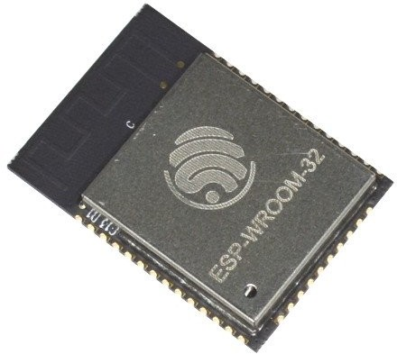

The fantastic web site called PIGHIXXX provides the most top quality pin-out images I have ever seen. Please visit their site. They have pin-outs for almost every conceivable device I have ever wanted to know about.

Here is a schematic of the current device:


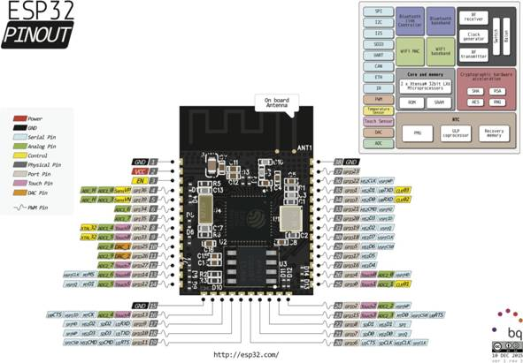

 

The WROOM-32 uses 6 GPIO pins for driving the external flash and these must **not** be used for other purposes. They are off limits. The pins are GPIO6, GPIO7, GPIO8, GPIO9, GPIO10 and GPIO11.

See also:

- •          [ESP-WROOM-32 Datasheet](https://espressif.com/sites/default/files/documentation/esp_wroom_32_datasheet_en.pdf)
- •          [Adafruit – seller of devices in US](https://www.adafruit.com/products/3320)
- •          [ESP-WROOM-32 Home Page](http://www.espressif.com/en/products/hardware/esp-wroom-32/overview)

  

### ESP32-DevKitC

С выпуском ESP32, Espressif выпустили свой собственный модуль для представления ESP32 большему количеству потребителей. Изготовленная ими доска называется ESP32-DevKit и считается дружественной к макету.

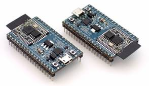

Плата содержит заголовки для ESP32, а также адаптер микро-USB и две кнопки, называемые включением и загрузкой. Эти кнопки можно использовать для «прошивки» или «загрузки» нового кода приложения в модуль. Чтобы выполнить эту задачу, нажмите и удерживайте кнопку «EN», одновременно нажимая и отпуская «Boot».

Вывод модуля показан на следующем рисунке:

  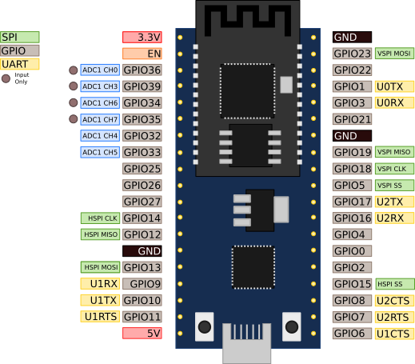


Для перезагрузки устройства, пульс EN низкий. Если GPIO0 высокий, устройство будет нормально загружаться, а если GPIO0 низкое, оно будет загружаться во флэш-режим, что позволит нам загрузить новое приложение во флэш-память устройства.

 Этот модуль использует CP2102 для USB-UART и имеет максимальную скорость передачи 921600.

See also:

•          [ESP32-DevKitC ](https://espressif.com/sites/default/files/documentation/esp32-devkitc_getting_started_guide_en.pdf)[– ](https://espressif.com/sites/default/files/documentation/esp32-devkitc_getting_started_guide_en.pdf)[Getting Started Guide](https://espressif.com/sites/default/files/documentation/esp32-devkitc_getting_started_guide_en.pdf)

•          [ESP32-DevKitC home page](http://www.espressif.com/en/products/hardware/esp32-devkitc/overview)

•          [Adafruit reseller](https://www.adafruit.com/products/3269)

  

### ESP-WROVER-KIT

The ESP-WROVER-KIT is the be-all and end-all of ESP32 development. It is pricier than the other modules coming in at about $50, however it is without question the most "robust" module currently available. It sports an LCD display, a socket for a camera, an on/off switch, a micro-sd connector, an RGB LED and many broken out connector pins.

The pins are broken out both on the front and rear.

This module is not at all bread-board friendly but that should be inherently understood from its purpose.

  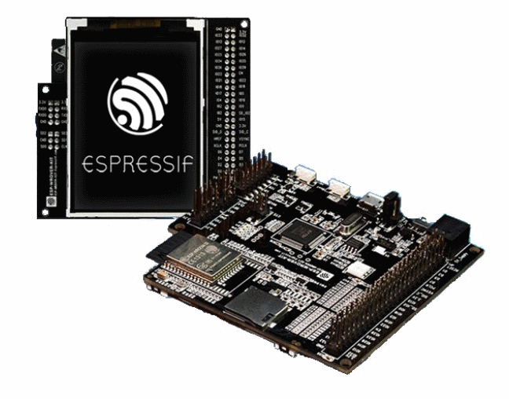

Here is the schematic of the USB interface:

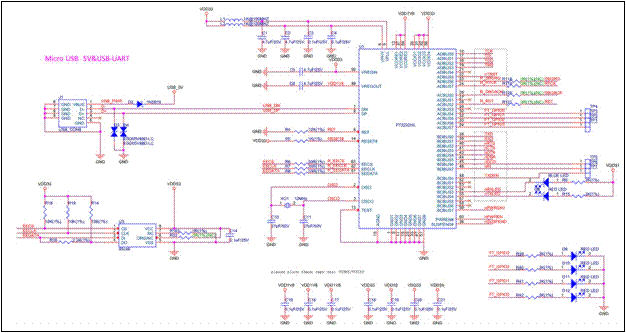

The LED anode pins are connected to IO0, IO2 and IO4.

 

| Red   | GPIO0 | 1 = on, 0 = off |
| ----- | ----- | --------------- |
| Green | GPIO2 | 1 = on, 0 = off |
| Blue  | GPIO4 | 1 = on, 0 = off |

 

The camera is connected as follows:


| **Function** | **Pin** |
| ------------ | ------- |
| SIO_C        | IO27    |
| SIO_D        | IO26    |
| VSYNC        | IO25    |
| HREF         | IO23    |
| PCLK         | IO22    |
| XCLK         | IO21    |
| RESET        | IO2     |
| D0           | IO4     |
| D1           | IO5     |
| D2           | IO18    |
| D3           | IO19    |
| D4           | IO36    |
| D5           | IO39    |
| D6           | IO34    |
| D7           | IO35    |
| PWDN         | GND     |

 

The LCD screen is SPI attached at:

 

| **Function** | **Pin** |
| ------------ | ------- |
| RESET        | IO18    |
| CLK          | IO19    |
| D/C          | IO21    |
| CS           | IO22    |
| MOSI         | IO23    |
| MISO         | IO25    |
| Backlight?   | IO5     |

 

There is an RGB led attached to GPIO 0, GPIO 2 and GPIO 4 (Blue)

The module can be powered from an external 2.5m power source (5V) or from USB. There is a jumper which **must** be in place to select which is enabled.


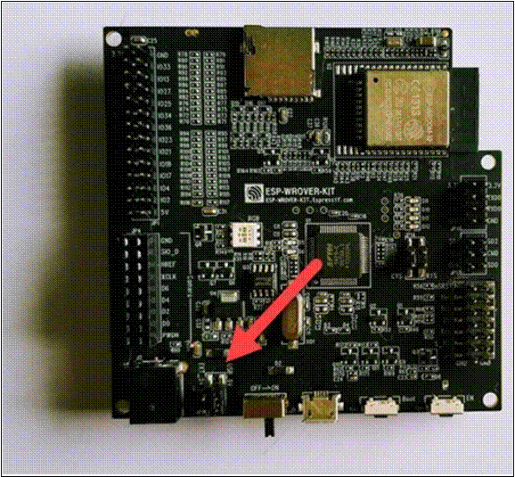

In addition, you should also enable the UARTs with two jumpers here:


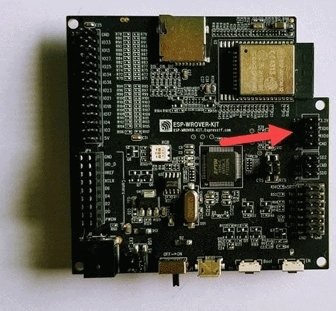

 There have been a number of releases of the WROVER board. Unfortunately, determining which board you have is not the easiest task because the identity isn't on the board. The following are good indications:

•         red board, female camera header – V1

•         black (shiny) board, male camera header – V2

•         black (matte) board, female camera header – V3

See also: [ESP32 Modules and Boards ](http://esp-idf.readthedocs.io/en/latest/hw-reference/modules-and-boards.html)for good pictures to aid in identification.

The USB device is an FTDI2232HL. This manifests as two serial ports. On Linux these are /dev/ttyUSB0 and /dev/ttyUSB1. It is /dev/ttyUSB1 that we wish to use for console and flashing.

 

There are two buttons on the boards labeled EN and Boot. Pressing EN brings the EN pin low.

See also:

•          [ESP-WROVER-KIT Home Page](http://www.espressif.com/en/products/hardware/esp-wrover-kit/overview)

•          [ESP-WROVER-KIT Getting Started Guide](http://esp-idf.readthedocs.io/en/latest/get-started/get-started-wrover-kit.html)

•          [Complete Schematic – ](https://dl.espressif.com/dl/schematics/ESP32-DevKitJ-v1_sch.pdf)[V1](https://dl.espressif.com/dl/schematics/ESP32-DevKitJ-v1_sch.pdf)

•          [Complete Schematic – V](https://dl.espressif.com/dl/schematics/ESP-WROVER-KIT_SCH-2.pdf)[2](https://dl.espressif.com/dl/schematics/ESP-WROVER-KIT_SCH-2.pdf)

•          [Complete Schematic – V3](https://dl.espressif.com/dl/schematics/ESP-WROVER-KIT_SCH-3.pdf)

•          [Adafruit reseller](https://www.adafruit.com/product/3384)

•          [FTDI – FT2232H home page](http://www.ftdichip.com/Products/ICs/FT2232H.html)

 

###  The SparkFun ESP32 thing

SparkFun make an ESP32 board called the "ESP32 Thing".

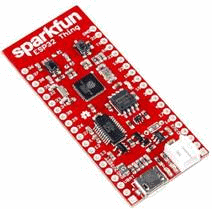  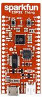


One of the distinguishing features of this board is the built in battery charger socket. We can use this board with a LIPO battery and charge that battery at the same time.

 

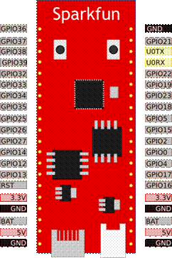

 

The width of the Sparkfun board allows it to sit in a breadboard with one row open either side of it. This makes it more convenient for quick prototyping.

 

See also:

•          [SparkFun ESP32 Thing](https://www.sparkfun.com/products/13907)

#  Connecting to the ESP32

ESP32 - это устройство Wi-Fi, и, следовательно, мы в конечном итоге подключимся к нему с помощью протоколов WiFi, но сначала потребуется некоторая загрузка. Устройство не знает, к какой сети подключаться, какой пароль использовать и другие необходимые параметры. Это, конечно, предполагает, что мы подключаемся как станция, если мы хотим, чтобы устройство было точкой доступа, или мы хотим загрузить в него наши собственные приложения, история становится глубже. Это подразумевает, что есть какой-то способ взаимодействия с устройством, отличным от WiFi, и… ответ - UART (последовательный). ESP32 имеет специальный интерфейс UART с выводами, помеченными как TX и RX. Вывод TX - это передача ESP32 (исходящая от ESP32), а вывод RX используется для приема данных (входящих в ESP32). Эти контакты могут быть подключены к партнеру UART. На сегодняшний день самым простым и удобным партнером для нас является конвертер USB → UART. Они подробно обсуждаются позже в книге. А пока давайте предположим, что мы их создали. Через UART мы можем подключить эмулятор терминала для отправки нажатий клавиш, и данные, полученные от ESP32, отображаются в виде символов на экран. Второй целью UART является получение двоичных данных, используемых для «прошивки» флэш-памяти устройства для записи новых приложений для выполнения. Для достижения этой цели в нашем распоряжении имеется множество технических инструментов.

Когда мы используем UART, нам нужно учитывать концепцию скорости передачи данных. Это скорость обмена данными между ESP32 и его партнером. Во время загрузки ESP32 пытается автоматически определить скорость передачи данных партнера и сопоставить ее. Предполагается, что по умолчанию установлено значение 115200, и если у вас подключен последовательный терминал, вы увидите сообщение вроде:

???

if it is configured to receive at 115200.

  

When connected to a Windows 10 machine via micro USB, it shows up as a serial device:

The default serial baud rate is 115200.

При подключении к машине с Windows 10 через микро-USB он отображается как последовательное устройство:

Скорость последовательной передачи по умолчанию - 115200.

После последовательного подключения ESP32 мы обычно хотим подключить монитор или эмулятор терминала к устройству. Платформа ESP-IDF предоставляет хороший метод для достижения этой цели. Мы можем запустить команду «сделать монитор». Это запускает инструмент мониторинга, который подключается к последовательному выходу ESP32. Этот инструмент основан на "miniterm", который является частью пакета "PySerial". Мы можем завершить miniterm с помощью CTRL +].

В среде Linux мы видим последовательный порт (обычно) как / dev / ttyUSB0. Если мы установим «экранное» приложение, то сможем подключить терминал, используя:

$ screen /dev/ttyUSB0 115200

To exit screen, enter "CTRL+A" followed by ":quit". An an alternative to screen, we also have "cu":

$ cu -l /dev/ttyUSB0 -s 115200

To terminate the program enter "~." Another program is "minicom":

$ minicom --baudrate 115200 --device /dev/ttyUSB0

И, конечно же, поскольку последовательный порт - это просто поток символов, ничто не мешает вам просто запустить «кошку» против него.:

$ cat /dev/ttyUSB0


 Если мы не уверены в настройках последовательного порта, мы можем запустить:

$ stty -F /dev/ttyUSB0 -a

который вернет текущие настройки. После вспышки вам может потребоваться изменить некоторые настройки, чтобы выполнить простую кошку:

$ stty -F /dev/ttyUSB0 ispeed 115200 ospeed 115200 min 100 ixon

See also:

•          [USB to UART converters](#_bookmark13)

•          [Loading a program](#_bookmark31)

•          [Screen user's manual](https://www.gnu.org/software/screen/manual/screen.html)

•          [PySerial – miniterm](http://pyserial.readthedocs.io/en/latest/tools.html#module-serial.tools.miniterm)

•          [man(1) – stty](https://linux.die.net/man/1/stty)

# Hardware interfacing

При работе с ESP32 мы быстро поймем, что у него много возможностей для взаимодействия с различными аппаратными устройствами. Это могут быть GPIO, SPI, I2C, Serial или другие методы. В этом разделе мы начнем изучать эти различные методы и рассмотрим каждый из них по очереди.

Чтобы подключить ESP32 к аппаратному обеспечению, вы будете углубляться в аппаратные уровни и подключать устройства к контактам вашего ESP32. Поскольку доступно много модулей, вам нужно ознакомиться со спецификой модулей, с которыми вы работаете, поскольку физические местоположения контактов могут различаться у разных производителей.

 

Смотрите также:

•          [Modules](#_bookmark6)

## GPIOs

GPIO или универсальный вход / выход - это возможность управлять внешними выводами ESP32 до уровня сигнала «1» или «0» под управлением программного приложения. Мы также можем выбрать уровень сигнала, который может присутствовать на выводе, предоставляемый внешним компонентом.

Когда мы думаем о GPIO, мы должны понимать, что в любой момент каждый экземпляр вывода имеет два режима работы. Это может быть либо в режиме ввода или в режиме вывода. Когда это вход, мы можем прочитать значение из него и определить логический уровень сигнала, присутствующего на физическом выводе. Когда это выход, мы можем записать на него логический уровень, который будет отображаться как физический выход.

Еще одним важным фактором при работе с GPIO является уровень напряжения. ESP32 - это устройство на 3.3 В. Вы должны быть очень осторожны, если вы работаете с внешними микроконтроллерами или датчиками 5 В (или выше). К сожалению, такие устройства, как Arduino, обычно имеют напряжение 5 В, как и преобразователи USB → UART, и многие датчики. Это означает, что вы, скорее всего, не будете работать в среде со смешанным напряжением. Ни при каких обстоятельствах вы не должны думать, что можете подключить или подключить ESP32 с постоянным напряжением более 3,3 В. Очевидно, что вы можете преобразовать более высокое напряжение до 3,3 В, но никогда не пытайтесь напрямую подключить большее напряжение. Другое тонкое соображение заключается в использовании GPIO для ввода сигнала и подачи более 3,3 В в качестве высокого значения сигнала. Я настоятельно рекомендую не делать этого. Некоторые люди могут утверждать, что вы можете «сойти с рук», и если вы экспериментируете, это может (кажется) сработать, но вы берете на себя ненужный риск без явно веской причины. Если это работает ... тогда это будет работать до тех пор, пока не произойдет, и в этот момент будет слишком поздно, и вы можете приготовить свое устройство.

Также важно понимать, что максимальный ток, который вы должны ожидать получить от выходного GPIO, составляет всего 12 мА.

Поскольку при создании схем на основе GPIO случаются несчастные случаи, я рекомендую покупать больше экземпляров ESP32, чем вам нужно. Таким образом, если вам действительно понадобится вторая (или третья, или четвертая), вы получите их в свое распоряжение.

Чтобы использовать функции GPIO, предоставляемые ESP-IDF, мы должны включить заголовочный файл с именем «driver / gpio.h».

Затем мы должны вызвать gpio_pad_select_gpio (), чтобы указать, что функция данного вывода должна быть функцией GPIO, а не какой-либо другой функцией.

 На ESP32 доступно 34 различных GPIO. Они определены как:

- GPIO_NUM_0 – GPIO_NUM_19
- GPIO_NUM_21 – GPIO_NUM_23
- GPIO_NUM_25 – GPIO_NUM_27
- GPIO_NUM_32 – GPIO_NUM_39

Те, которые опущены, это 20, 24, 28, 29, 30 и 31.

Обратите внимание, что GPIO_NUM_34 - GPIO_NUM_39 являются только режимом ввода. Вы не можете использовать эти контакты для вывода сигнала. Кроме того, контакты 6 (SD_CLK), 7 (SD_DATA0), 8 (SD_DATA1), 9 (SD_DATA2), 10 (SD_DATA3), 11 (SD_CMD) 16 (CS) и 17 (Q) используются для взаимодействия с флэш-чипом SPI. ... вы не можете использовать их для других целей.

При использовании pSRAM,

Связывающими штифтами являются GPIO0, GPIO2 и GPIO12.

TX и RX (как используется для флэш-памяти) - это GPIO1 и GPIO3.

Тип данных gpio_num_t - это перечисление языка Си со значениями, соответствующими этим именам. Рекомендуется использовать эти значения, а не пытаться использовать числовые значения.

В остатке имеем GPIO 4, 5, 13, 14, 15, 18, 19, 21, 22, 23, 25, 26, 27, 32, 33

Когда мы хотим использовать GPIO, нам нужно знать, используем ли мы его в качестве входного или выходного сигнала. Думайте об этом как о настройке направления. Мы можем установить направление с помощью вызова gpio_set_direction (). Например, чтобы установить вывод в качестве вывода, мы можем вызвать:

```c
gpio_set_direction (GPIO_NUM_17, GPIO_MODE_OUTPUT);
```

в то время как для установки его в качестве ввода мы могли бы вызвать:

```c
gpio_set_direction (GPIO_NUM_17, GPIO_MODE_INPUT);
```

Если мы установили наш GPIO в качестве вывода, мы теперь можем установить его значение сигнала равным 1 или 0. Мы делаем это, вызывая gpio_set_level ().

Вот пример, который включает и выключает GPIO раз в секунду:

```c
gpio_pad_select_gpio(GPIO_NUM_17); 
gpio_set_direction(GPIO_NUM_17, GPIO_MODE_OUTPUT); 
while(1) {
    printf("Off\n"); gpio_set_level(GPIO_NUM_17, 0); vTaskDelay(1000 / portTICK_RATE_MS);
    printf("On\n"); gpio_set_level(GPIO_NUM_17, 1); vTaskDelay(1000 / portTICK_RATE_MS);
}
```


 Когда мы запустим это и проверим вывод на логическом анализаторе, все будет по желанию::

  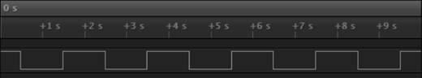

В качестве альтернативы настройке всех атрибутов отдельных выводов мы можем установить атрибуты одного или нескольких выводов с помощью одного вызова с помощью функции gpio_config (). Он принимает структуру с именем gpio_config_t в качестве входных данных и устанавливает направление, подтягивание, опускание и прерывание настроек всех выводов, представленных в битовой маске. Например::

```c
gpio_config_t gpioConfig;
gpioConfig.pin_bit_mask = (1 << 16) | (1 << 17);
gpioConfig.mode         = GPIO_MODE_OUTPUT; 
gpioConfig.pull_up_en   = GPIO_PULLUP_DISABLE;
gpioConfig.pull_down_en = GPIO_PULLDOWN_ENABLE; 
gpioConfig.intr_type    = GPIO_INTR_DISABLE;
gpio_config(&gpioConfig);
```

See also:

- [gpio_pad_select_gpio](#_bookmark1237)
- [gpio_set_direction](#_bookmark1214)
- [gpio_set_level](#_bookmark1216)
- [gpio_config](#_bookmark1206)

###  Pull up and pull down settings

 Мы обычно думаем о входном выводе GPIO как о том, что на него подается сигнал высокого или низкого уровня. Это означает, что он подключен к + ve или заземлению. Но что, если он не связан ни с одним из них? В этом случае считается, что штифт находится в плавающем состоянии. Есть моменты, когда мы хотим определить неподключенный контакт как логически высокий или низкий. Неподключенный штифт, который должен считаться высоким, называется «вытянутым», а неподключенный штифт, который следует считать низким, называется «спущенным». Это происходит из-за практики физического оборудования, заключающейся в подключении резисторов для повышения или понижения сигнала, когда он в противном случае был бы плавающим.

В ESP32 SDK мы можем определить GPIO как подтягивающийся или опускаемый с помощью функции gpio_set_pull_mode (). Эта функция принимает в качестве ввода номер контакта, который мы хотим установить, и режим вытягивания, связанный с этим контактом.

Например:  

```
gpio_set_pull_mode(21, GPIO_PULLUP_ONLY);
```

See also:

- [gpio_set_pull_mode](#_bookmark1217)

###  GPIO Interrupt handling

Если учесть, что сигнал на выводе может перемещаться от высокого к низкому или от низкого к высокому, такое изменение может быть тем, что наше приложение будет интересно знать. Чтобы определить, когда происходит такое изменение, мы можем непрерывно опрашивать значение пина, чтобы обнаружить изменение перехода. Однако это не лучшее решение по ряду причин.

Во-первых, мы должны выполнить проверку, чтобы увидеть, изменилось ли значение. Это пустая трата циклов, если предположить, что уровень сигнала не изменяется. Во-вторых, будет задержка с момента, когда событие произойдет, до момента, когда мы проверяем. Если нам нужно будет немедленно отреагировать, мы задержимся из-за этой задержки. В-третьих, можно полностью пропустить изменение сигнала, если продолжительность изменения мала. Например, если мы проверяем значение булавки и находим его высоким, а затем сразу же после проверки он становится низким и затем снова высоким, в следующий раз, когда мы проводим опрос, мы все равно увидим высокий пин и никогда не узнаем, что он когда-либо был низким короткий период.

Решением всех этих проблем является понятие прерывания. Прерывание похоже на ваш дверной звонок в вашем доме. Без дверного звонка (или прислушиваясь к тому, что кто-то стучит) вам придется периодически проверять, есть ли кто-нибудь за дверью. Это тратит ваше время в большинстве случаев, когда там никого нет, а также гарантирует, что, когда там кто-то есть, вы своевременно обращаетесь к ним.

На земле ESP32 мы можем определить функцию обратного вызова прерывания, которая будет вызываться, когда вывод изменяет свое значение сигнала. Мы также можем определить, что является причиной для вызова обратного вызова. Мы можем сконфигурировать обработчик обратного вызова (технически называемый обработчиком прерываний) для каждого контакта.

Во-первых, давайте рассмотрим функцию обратного вызова прерывания. Это регистрируется вызовом gpio_isr_register (), который принимает обработчик обратного вызова, который вызывается, когда прерывание происходит на любом выводе GPIO (ISR = Программа обработки прерывания). В обработчике обратного вызова мы можем запросить статус флага прерывания с помощью:

```
uint32_t gpio_intr_status = READ_PERI_REG(GPIO_STATUS_REG);      // 0-31 uint32_t gpio_intr_status_h = READ_PERI_REG(GPIO_STATUS1_REG); // 31-39
```

В качестве альтернативы мы можем использовать глобальную переменную GPIO, которая представляет собой предварительно отображенную структуру и доступ:

- GPIO.status_w1tc – Flags for GPIO0 to GPIO31
- GPIO.status1_w1tc.val – Flags for GPIO32 to GPIO39

Мы можем включить или отключить обработку прерываний на GPIO с помощью GPIO, вызвав:

```
gpio_intr_enable().
```

 Чтобы включить прерывание для определенного вывода, мы используем функцию под названием gpio_set_intr_type(). Это позволяет нам установить причину возникновения прерывания. Причины включают в себя:

- Disable – не вызывать прерывание при изменении сигнала.
- PosEdge – вызов обработчика прерывания при изменении с низкого уровня на высокий.

  

- NegEdge – Вызвать обработчик прерывания при изменении от высокого к низкому.

  

-  AnyEdge – Вызвать обработчик прерывания либо при изменении с низкого на высокий, либо при изменении с высокого на низкий.


-  Hi – Вызовите обработчик прерывания, пока сигнал высокий.

- Lo – Вызовите обработчик прерывания, когда сигнал низкий.

Обработчик прерываний может быть помечен для загрузки в ОЗУ команд во время компиляции. По умолчанию сгенерированный код может жить во флэш-памяти. Если пометить его как живой в оперативной памяти, он всегда будет там и готов к немедленному исполнению.

Например:

```c
void IRAM_ATTR my_gpio_isr_handle(void *arg) {
...
c}
```

Также предусмотрена вторая реализация обработки прерываний, которая позволяет зарегистрировать функцию обратного вызова, связанную с любым заданным выводом. Это избавляет нас от необходимости писать код переключателя в общем обработчике прерываний, чтобы определить, какой вывод вызывает нас. Думайте об этом как о наборе удобных функций высокого уровня.

Вот пример процессора прерываний:

```c
static char tag[] = "test_intr"; static QueueHandle_t q1;
#define TEST_GPIO (25)
static void handler(void *args) { 
    gpio_num_t gpio;
    gpio = TEST_GPIO; xQueueSendToBackFromISR(q1, &gpio, NULL);
}
void test1_task(void *ignore) { 
    ESP_LOGD(tag, ">> test1_task"); gpio_num_t gpio;
    q1 = xQueueCreate(10, sizeof(gpio_num_t));

    gpio_config_t gpioConfig; 
    gpioConfig.pin_bit_mask  = GPIO_SEL_25; 
    gpioConfig.mode          = GPIO_MODE_INPUT; 
    gpioConfig.pull_up_en    = GPIO_PULLUP_DISABLE;
    gpioConfig.pull_down_en  = GPIO_PULLDOWN_ENABLE; 
    gpioConfig.intr_type     = GPIO_INTR_POSEDGE; 
    gpio_config(&gpioConfig);

    gpio_install_isr_service(0);
    gpio_isr_handler_add(TEST_GPIO, handler, NULL); 
    while(1) {
        ESP_LOGD(tag, "Waiting on queue");
        BaseType_t rc = xQueueReceive(q1, &gpio, portMAX_DELAY);
        ESP_LOGD(tag, "Woke from queue wait: %d", rc);
    }
    vTaskDelete(NULL);
}
```

See also:

- [Interrupt Service Routines – ISRs](#_bookmark177)
- [gpio_install_isr_service](#_bookmark1208)
- [gpio_isr_handler_add](#_bookmark1211)
- [gpio_isr_handler_remove](#_bookmark1212)
- [gpio_isr_register](#_bookmark1213)
- [gpio_intr_enable](#_bookmark1209)
- [gpio_intr_disable](#_bookmark1210)
- [gpio_set_intr_type](#_bookmark1215)
- [gpio_intr_enable](#_bookmark1209)
- [gpio_intr_disable](#_bookmark1210)

###  Expanding the number of available GPIOs

Хотя устройства ESP имеют ограниченное количество выводов GPIO, это не должно быть для нас ограничением. У нас есть возможность расширить число доступных нам GPIO с помощью относительно недорогих интегральных схем.

PCF8574

Один из доступных расширителей GPIO называется PCF8574. (PFC8574A такой же, но имеет другой набор адресов).

Это устройство I2C и, следовательно, работает только на двух проводах. Используя эту микросхему, мы предоставляем 3-битный адрес (000-111), который используется для выбора адреса ведомого устройства. Поскольку каждый адрес имеет 8 входов и выходов, и мы можем иметь до 8 устройств, это означает в общей сложности 64 дополнительных контакта.

Похоже, что устройство будет использовать подтягивающий резистор для высокого и принесет контакт на землю для низкого. Это означает, что мы не можем использовать контакты для источника высокого тока, но можем для низкого.

Вот схема контактов для устройства:

 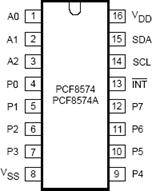

 Here is a description of the pins:

| **Symbol**   | **Pin**                   | **Description**            |
| ------------ | ------------------------- | -------------------------- |
| A0-A2        | 1, 2, 3                   | Addressing                 |
| P0-P7        | 4, 5, 6, 7, 9, 10, 11, 12 | Bi directional I/O         |
| INT          | 13                        | Interrupt output           |
| SCL          | 14                        | Serial Clock Line          |
| SDA          | 15                        | Serial Data Line           |
| VDD          | 16                        | Supply Voltage (2.5V – 6V) |
| Vss (Ground) | 8                         | Ground                     |

 The address that the slave device can be found upon is configurable via the A0-A2 pins. It appears at the following address:

PCF8574

| 0    | 1    | 0    | 0    | A2   | A1   | A0   |
| ---- | ---- | ---- | ---- | ---- | ---- | ---- |
|      |      |      |      |      |      |      |

 

PCF8574A

| 0    | 1    | 1    | 1    | A2   | A1   | A0   |
| ---- | ---- | ---- | ---- | ---- | ---- | ---- |
|      |      |      |      |      |      |      |

 The pins A0-A2 must not float. This results in the following table:

| **A2** | **A1** | **A0** | **Address   PCF8574** | **Address   PCF8574A** |
| ------ | ------ | ------ | --------------------- | ---------------------- |
| 0      | 0      | 0      | 0x20                  | 0x38                   |
| 0      | 0      | 1      | 0x21                  | 0x39                   |
| 0      | 1      | 0      | 0x22                  | 0x3a                   |
| 0      | 1      | 1      | 0x23                  | 0x3b                   |
| 1      | 0      | 0      | 0x24                  | 0x3c                   |
| 1      | 0      | 1      | 0x25                  | 0x3d                   |
| 1      | 1      | 0      | 0x26                  | 0x3e                   |
| 1      | 1      | 1      | 0x27                  | 0x3f                   |

 Here is an Arduino example program that drives LEDs to create a Cylon effect.

\

```c
#include <Wire.h> 
#include <Ticker.h>
// SDA - Yellow – 4
// CLK - White – 5
\#define SDA_PIN 4
\#define CLK_PIN 5
Ticker ticker; int counter = 0; int dir = 1;

void timerCB() { 
	Wire.beginTransmission(0x20); 
	Wire.write(~((uint8_t)1<<counter)); 
    Wire.endTransmission();
    counter += dir;
    if (counter == 8) { 
        counter = 6;
        dir = -1;
    } else if (counter == -1) { 
        counter = 1;
        dir = 1;
    }
}

void setup() {
    Wire.begin(SDA_PIN,CLK_PIN); ticker.attach(0.1, timerCB);
}

void loop() {
}
```

  The corresponding circuit is:

  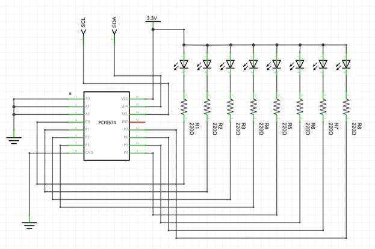

And on a breadboard:

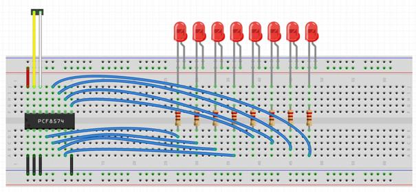  

See also:

- •          [8BIT IO EXPANDER (PCF8574)](http://hackaday.com/2008/12/27/parts-8bit-io-expander-pcf8574/)
- •          [Datasheet ](http://www.nxp.com/documents/data_sheet/PCF8574.pdf)– NXP
- •                    [YouTube – ](https://www.youtube.com/watch?v=8z0DMMDjdiA)[ESP32 Technical Tutorial: PCF8574 GPIO Extender](https://www.youtube.com/watch?v=8z0DMMDjdiA)
- •          [Product page ](http://www.ti.com/product/pcf8574)– TI
- •          [Working with I2C](#_bookmark178)

 PCF8575

The PCF8575 is a 16bit bi-directional port expander leveraging I2C. The pin-outs are labeled:

| INT        | Interrupt         |
| ---------- | ----------------- |
| A0, A1, A2 | Address selection |
| P00-P07    |                   |
| P10-P17    |                   |
| SCL        | I2C clock         |
| SDA        | I2C data          |

 

The address that the slave device can be found upon is configurable via the A0-A2 pins. It appears at the following address:

PCF8575

| 0    | 1    | 0    | 0    | A2   | A1   | A0   |
| ---- | ---- | ---- | ---- | ---- | ---- | ---- |
|      |      |      |      |      |      |      |

The pins A0-A2 must not float. This results in the following table:

| **A2** | **A1** | **A0** | **I2C Address   PCF8575** |
| ------ | ------ | ------ | ------------------------- |
| 0      | 0      | 0      | 0x20                      |
| 0      | 0      | 1      | 0x21                      |
| 0      | 1      | 0      | 0x22                      |
| 0      | 1      | 1      | 0x23                      |
| 1      | 0      | 0      | 0x24                      |
| 1      | 0      | 1      | 0x25                      |
| 1      | 1      | 0      | 0x26                      |
| 1      | 1      | 1      | 0x27                      |

 

See also:

•          [Datasheet – NXP](https://www.nxp.com/docs/en/data-sheet/PCA8575.pdf)

MCP23017

MCP23017 от Microchip - это 16-битный расширитель портов ввода / вывода, использующий интерфейс I2C. Устройство может работать от 1,8 до 5,5 В. Цена на экземпляр одного из них на eBay составляет около 1 доллара. Устройство имеет 16 контактов GPIO, которые могут быть установлены как вход или выход, управляемый в двух банках (портах). Мы можем читать или записывать значения по одному банку за раз, что означает, что если мы хотим записать все 16 битов, это будет две операции I2C и одинаковые для чтения. Устройство также может генерировать прерывания для обнаружения входного сигнала. Если мы представим тактовую частоту 100 кГц, то для включения или выключения бита (и мы можем сделать это группами по 8), это будет 3 байта данных плюс подтверждения… ~ 30 бит…, что будет означать максимальную частоту переключения около 0,3 мс. MCP23017 может работать на различных скоростях, включая 100 кГц и 400 кГц.

The pin interface is:

| **Pin** | **Label** | **Description**             |
| ------- | --------- | --------------------------- |
| 1       | GPB0      | Bi-directional I/O          |
| 2       | GBP1      | Bi-directional I/O          |
| 3       | GBP2      | Bi-directional I/O          |
| 4       | GBP3      | Bi-directional I/O          |
| 5       | GBP4      | Bi-directional I/O          |
| 6       | GBP5      | Bi-directional I/O          |
| 7       | GBP6      | Bi-directional I/O          |
| 8       | GBP7      | Bi-directional I/O          |
| 9       | VDD       | Power (3.3V – 5V)           |
| 10      | VSS       | Ground                      |
| 11      | NC        | Not connected               |
| 12      | SCL       | Serial clock input          |
| 13      | SDA       | Serial data input/output    |
| 14      | NC        | Not connected               |
| 15      | A0        | Address pin                 |
| 16      | A1        | Address pin                 |
| 17      | A2        | Address pin                 |
| 18      | RESET     | Hardware reset              |
| 19      | INTB      | Interrupt output for port B |
| 20      | INTA      | Interrupt output for port A |
| 21      | GPA0      | Bi-directional I/O          |
| 22      | GPA1      | Bi-directional I/O          |
| 23      | GPA2      | Bi-directional I/O          |
| 24      | GPA3      | Bi-directional I/O          |
| 25      | GPA4      | Bi-directional I/O          |
| 26      | GPA5      | Bi-directional I/O          |
| 27      | GPA6      | Bi-directional I/O          |
| 28      | GPA7      | Bi-directional I/O          |

 

The I2C address of the device is 7 bits given by

 

| **6** | **5** | **4** | **3** | **2** | **1** | **0** |
| ----- | ----- | ----- | ----- | ----- | ----- | ----- |
| 0     | 1     | 0     | 0     | A2    | A1    | A0    |

 And hence has addresses in the range 0x20 – 0x27.

The register addresses are:


| **Register address** | **Name** | **Description**                                              |
| -------------------- | -------- | ------------------------------------------------------------ |
| 0x00                 | IODIRA   | Direction control for port   A:   •            1 – input   •            0 – output |
| 0x01                 | IODIRB   | Direction control for port   B:   •            1 – input   •            0 – output |
| 0x02                 | IPOLA    | Polarity inversion for   input for port A:   •            1 – inverted   •            0 – as-is |
| 0x03                 | IPOLB    | Polarity inversion for   input for port B:   •            1 – inverted   •            0 – as-is |
| 0x04                 | GPINTENA | Interrupt enable for a   change for port A:   •            1 – Enable input pin for interrupt on change event   •            0 – Disable input pin for interrupt on change event |
| 0x05                 | GPINTENB | Interrupt enable for a   change for port B:   •            1 – Enable input pin for interrupt on change event   •            0 – Disable input pin for interrupt on change event |
| 0x06                 | DEFVALA  | Default values for   interrupt change comparison for port A. |
| 0x07                 | DEFVALB  | Default values for   interrupt change comparison for port B. |
| 0x08                 | INTCONA  | Interrupt control for port   A:   •            1 – Compare the value on the pin to the value in DEFVALA   •            0 – Compare the value on the pin to its previous value |
| 0x09                 | INTCONB  | Interrupt control for port   B:   •            1 – Compare the value on the pin to the value in DEFVALB   •            0 – Compare the value on the pin to its previous value |
| 0x0a                 | IOCON    | Same register as 0x0b                                        |


|      |         |                                                              |
| ---- | ------- | ------------------------------------------------------------ |
| 0x0b | IOCON   | Same register as 0x0a                                        |
| 0x0c | GPPUA   | Pull up control for Port   A:   •            1 – Pull-up via a 100K resistor   •            0 – Pull-up disabled |
| 0x0d | GPPUB   | Pull up control for Port   B:   •            1 – Pull-up via a 100K resistor   •            0 – Pull-up disabled |
| 0x0e | INTFA   | Interrupt flags for Port   A:   •            1 – Pin caused an interrupt   •            0 – No interrupt detected |
| 0x0f | INTFB   | Interrupt flags for Port   B:   •            1 – Pin caused an interrupt   •            0 – No interrupt detected |
| 0x10 | INTCAPA | Values of GPIO when   interrupt occurred on port A:   •            1 – Pin was high   •            0 – Pin was low |
| 0x11 | INTCAPB | Values of GPIO when   interrupt occurred on port B:   •            1 – Pin was high   •            0 – Pin was low |
| 0x12 | GPIOA   | Read – Reads the values on   port A                          |
| 0x13 | GPIOB   | Read – Reads the values on   port B                          |
| 0x14 | OLATA   |                                                              |
| 0x15 | OLATB   |                                                              |

  

​                                                  **Bit**                        **Label**                        **Description**                                      7                        BANK                        Register mapping:        •                 Registers in        banks        •                 Registers sequential                                      6                        MIRROR                        Interrupt pin        mapping:        •                 1 – INT pins        connected        •                 0 – INT pins separate. INTA is associated with port A and INTB is associated with port        B                                      5                        SEQOP                        Sequential operation        mode:        •                 1 – Sequential operation disabled        •                 0 – Sequential operation enabled                                      4                        DISSLW                        Slew rate control                                      3                        HAEN                        Hardware address        enable                                      2                        ODR                        Open drain output for        INT                                      1                        INTPOL                        Polarity of INT        output:        •                 1 – Active        high        •                 0 – Active        low                                      0                        N/A                        Not used. Set as 0.                                                      


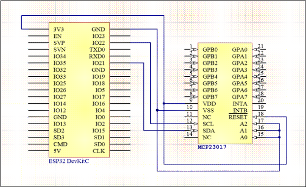

See also:

•          [Data sheet](http://ww1.microchip.com/downloads/en/DeviceDoc/21952b.pdf)

•          [Github: code fragment](https://github.com/nkolban/esp32-snippets/tree/master/hardware/expanders/mcp23017)

•          [Github: telanoc/esp32_generic_i2c_rw](https://github.com/telanoc/esp32_generic_i2c_rw)

 

##  Interrupt Service Routines – ISRs

Представьте, что вы написали приложение ESP32 на C. Когда вы пишете это приложение, вы делаете предположения о том, что произойдет. Представь, что ты пишешь:

заявление А; заявление Б; заявление С;

Вы предполагаете, что программа выполнит оператор A, а затем перейдет к оператору B и затем перейдет к оператору C. Кроме того, если у вас есть переменные, которые определены, если операторы не изменяют эти переменные, вы ожидаете, что они будут такими же значения в начале и в конце. Это предположение, что вы должны быть в состоянии принять как истину.

С ESP32 мы программируем намного ближе к оборудованию, чем в некоторых других средах. При работе с оборудованием события ESP32 могут происходить извне, что требует нашего внимания. GPIO может изменить свой уровень сигнала, либо поступит новый сетевой пакет или появятся последовательные данные. В каждом из этих (и более) случаев может потребоваться прервать то, что мы в данный момент делаем в данный момент, и обработать это событие. Для этого у нас есть доступ к так называемым «подпрограммам обработки прерываний» или ISR. Обычно это функции C, которые мы предоставляем в качестве обратных вызовов, которые могут быть вызваны практически в любое время. Они могут быть вызваны между операторами C или даже во время операторов C. Состояние запущенной в настоящий момент программы сохраняется, и происходит «переключение контекста», вызывающее запуск ISR. Чтобы сохранить здравомыслие, когда вы пишете ISR, существуют правила, которым вы обязательно должны следовать.

Во-первых, ISR должен быть как можно короче. Помните, что когда вы прыгаете в ISR, ISR не знает, что вы делали, когда произошло прерывание. Возможно, вы занимались чем-то критически важным, и вам нужно как можно быстрее вернуться к нему. Вы, безусловно, никогда не должны выполнять какие-либо действия, которые могут блокировать.

Далее вы должны немного предположить о состоянии окружающей среды. Вы не можете принимать значения переменных, которые вам не принадлежат, и вы абсолютно не должны изменять значения переменных, которые вам не принадлежат. Не берите в голову риск, пытаясь отладить проблемы, которые появляются только один раз в 1000 запусков, потому что выбор времени был "правильным", это кошмар, которого следует избегать.

Вы никогда не должны вызывать что-то, что может привести к созданию другого прерывания. Это может привести к бесконечному циклу, когда ISR вызывает немедленное прерывание, которое обрабатывается, когда вы возвращаетесь из ISR, которое затем продолжается и продолжается.

Учитывая эти ограничения, что вы можете сделать? Ответ заключается в том, чтобы разработать решение, которое правильно предвидит и обрабатывает запросы на прерывание. Не существует единой формулы, которая подходила бы всем, но, как правило, если вы можете немедленно реагировать на прерывание с небольшими побочными эффектами или вообще без них, тогда это безопасно. Например, если прерывание сигнализирует о том, что вывод GPIO изменил значение, вы можете обновить ячейку памяти, которая определена так, чтобы отражать «текущее» состояние вывода, и затем немедленно вернуться. Если вам необходимо выполнить расширенную обработку, подумайте о том, чтобы записать сообщение в очередь или разблокировать семафор, а затем немедленно вернуться. Поскольку в ESP32 используется FreeRTOS, который предоставляет упреждающий планировщик задач, у вас могут быть задачи, которые запускаются в фоновом режиме, которые «просыпаются» при возникновении событий. Эти пробуждения должны быть отделены от ISR, и очередь или семафор - отличный способ достичь этого. Следующие API безопасны в процедурах ISR:

- xTaskResumeFromISR()
- xTaskNotifyGiveFromISR()
- xTaskNotifyAndQueryFromISR()
- xTaskNotifyFromISR()
- xQueueSendFromISR()
- xQueueSendToBackFromISR()
- xQueueSendToFrontFromISR()
- xQueueReceiveFromISR()
- uxQueueMessagesWaitingFromISR()
- xQueueOverwriteFromISR()
- xQueuePeekFromISR()
- xQueueIsQueueFullFromISR()
- xQueueIsQueueEmptyFromISR()
- xQueueSelectFromSetFromISR()
- xSemaphoreTakeFromISR()
- xSemaphoreGiveFromISR()
- xTimerStartFromISR()
- xTimerStopFromISR()
- xTimerChangePeriodFromISR()
- xTimerResetFromISR()
- xTimerPendFunctionCallFromISR()
- xEventGroupSetBitsFromISR()
- xEventGroupClearBitsFromISR()
- xEventGroupGetBitsFromISR()

## SPI - последовательный периферийный интерфейс

SPI - это протокол шины, который позволит ESP32 взаимодействовать с периферийными устройствами или интегральными схемами, которые соответствуют протоколу SPI. По логике это выглядит следующим образом:


 

В рамках протокола одно устройство (обычно ESP32) действует как «ведущий» шины, а все остальные устройства действуют как «ведомые» шины. Это означает, что одновременно происходит связь между ведущим и одним отдельным подчиненным. Подчиненные устройства не общаются друг с другом. Назначение шины состоит в том, что мы можем подключить несколько устройств к ESP32 (ведущему устройству), используя только несколько проводов, в отличие от необходимости иметь несколько проводов для каждого отдельного устройства.

В протоколе SPI есть в основном три соединения (провода) к каждому устройству.

Первая называется «линия часов». Это исходящий сигнал от мастера, который используется для синхронизации действий между всеми участниками. Обычно это обычная последовательность сигналов с высоким / низким одинаковым расстоянием. Частота часов определяет скорость передачи по шине. Когда часы переходят от высокого к низкому или от низкого к высокому, это указывает в протоколе SPI, что подчиненное устройство должно отправлять и получать данные.

Следующая строка, которую мы рассмотрим, это строка данных, которая записывается исключительно мастером и читается ведомыми. Линия называется «Master Out / Slave In», что является прекрасным описанием ее назначения. Обычно это сокращенно до MOSI. Ведущий последовательно передает данные, исходящие по этой линии, и ведомый получает данные. Биты данных в линии синхронизируются с линией синхронизации, так что ведомое устройство знает, когда следующий бит готов для чтения.

Третья строка также является строкой данных, которая записывается исключительно ведомым устройством и читается мастером. Линия интеллектуально называется «Master In / Slave Out» и сокращенно «MISO». Опять же, линия часов используется, чтобы указать, когда ведомое устройство должно перевести свои выходные биты.

Если бы было только одно устройство, с которым общался мастер, этих трех линий было бы достаточно ... однако это не большая часть шины. Если у нас есть несколько устройств, очевидная проблема заключается в том, как один раб узнает, что с ним разговаривают, а не с каким-то потенциально отличным рабом? Ответ заключается в том, что у каждого ведомого устройства есть уникальная строка ввода, называемая «Выбор ведомого» (SS). Обычно у ведомого выбора есть одно значение (например, высокое), и только когда ведущий управляет ведомым выбором с другим значением (например, низкое), это ведомое устройство знает, что к нему обращаются. Правила гласят, что подчиненное устройство должно отвечать (получать или передавать) только на шине, когда его линия выбора подчиненного устройства указывает, что это необходимо сделать.

  

Пока устройство активно, потому что оно выбрано мастером, оно может одновременно считывать данные из линии MOSI, одновременно записывая данные в мастер через линию MISO. Сосредоточив внимание на единственном взаимодействии хозяин / раб, история выглядит так:

Поскольку это последовательный протокол, и мы будем получать данные в байтах, мы должны знать, будут ли данные поступать сначала LSB или сначала MSB. Там будет возможность контролировать это.

Для часов мы будем фиксировать данные, и нам нужно будет знать, какие ребра и настройки важны. Там будет опция режима часов, чтобы контролировать это. В SPI есть два атрибута: фаза и полярность. Фаза (CPHA) - фиксируем ли мы данные на высоком или низком уровне, а полярность (CPOL) - на высоком или низком, означает, что часы неактивны.

CPOL = 0 означает, что часы имеют низкий уровень по умолчанию, CPOL = 1 означает, что часы имеют высокий уровень по умолчанию. Когда CPOL = 0, тогда следующие значения для CPHA:

CPHA = 0 означает, что данные получены по переднему фронту тактового сигнала, CPHA = 1 означает, что данные получены по переднему фронту тактового сигнала.

Когда CPOL = 1, тогда следующие значения для CPHA:

CPHA = 0 означает, что данные собираются по переднему фронту тактового сигнала, CPHA = 1 означает, что данные собираются по переднему фронту тактового сигнала.

SPI объединяет эти два флага в четыре определенных и именованных режима:

| **Mode**  | **Clock Polarity – CPOL** | **Clock Phase – CPHA** |
| --------- | ------------------------- | ---------------------- |
| SPI_MODE0 | 0 (Clock   default low)   | 0                      |
| SPI_MODE1 | 0 (Clock   default low)   | 1                      |
| SPI_MODE2 | 1 (Clock   default high)  | 0                      |
| SPI_MODE3 | 1 (Clock   default high)  | 1                      |

По умолчанию для большинства целей будет MODE0.

Также для часов, с какой скоростью мы должны знать, с какой скоростью будут перемещаться данные. Будет опция контроля скорости часов, чтобы контролировать это.

Смотрите также:

- [Sparkfun: Serial Peripheral Interface (SPI)](https://learn.sparkfun.com/tutorials/serial-peripheral-interface-spi)
-  [Wikipedia: Serial Peripheral Interface Bus](https://en.wikipedia.org/wiki/Serial_Peripheral_Interface_Bus)

### Using the ESP-IDF SPI driver

В отличие от других устройств и процессоров, представленных на рынке, ESP32 не предписывает использовать фиксированный набор контактов для функций CLK, MOSI и MISO. Вместо этого контакты, выбранные вами в приложении, будут выполнять эти функции. Если вы разрабатываете печатные платы, это открывает гораздо больше уровней гибкости, поскольку упрощает подключение и маршрутизацию каналов.

Поскольку ESP32 не ограничивает вас одной шиной SPI, использование SPI на ESP32 спроектировано в виде нескольких отдельных шагов.

1. Мы инициализируем автобус, определяющий его природу.
2. Опишем устройство к ESP32, которое подключено к настроенной шине. Из этого мы получаем дескриптор, который относится к этому устройству.
3. Мы общаемся с устройством, используя ссылку на него.

 Мы используем понятие транзакции для описания взаимодействия ESP32 как мастера с подчиненным периферийным устройством.

Мы можем представить, что выполняются следующие действия:

- Команда отправлена
- Адрес отправлен
- Данные считываются с ведомого устройства, и одновременно данные записываются на подчиненное устройство.

Действия команды и адреса являются необязательными и могут быть опущены, что приводит только к параллельной отправке и получению данных.

Следующее иллюстрирует отношения между некоторыми из логических компонентов, с которыми мы будем работать с точки зрения драйвера SPI. Определение шины идентифицирует контакты, используемые для шины для MOSI, MISO и CLK. Далее мы определяем логическое устройство и характеристики этого устройства на шине. Обратите внимание, что тактовая частота шины является атрибутом определения устройства. Когда я впервые попытался понять это, это смутило меня.

Конечно, у шины есть тактовая частота, которая одинакова для всех устройств? В ESP32 у нас больше гибкости, чем когда-либо прежде. ESP32 может связываться с различными устройствами, используя разные скорости шины в зависимости от выбранного в данный момент устройства. Например, если мы говорим с устройством «A», мы можем использовать тактовую частоту 100 кГц, однако, если мы говорим с устройством «B», мы можем использовать другую тактовую частоту. Поскольку только одно устройство одновременно является активным из-за выбора ведомого устройства, другие устройства могут игнорировать тактовую частоту (и другие линии данных), и, следовательно, скорость тактового генератора не учитывается для устройства, которое не выбрано.

  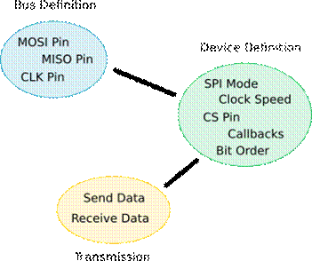

Чтобы использовать драйвер SPI, мы начинаем с вызова spi_bus_initialize (). Здесь мы идентифицируем контакты на ESP32, которые должны использоваться для функций SPI, таких как CLK, MISO и MOSI.

Затем мы вызываем spi_bus_add_device (), чтобы сообщить ESP32 о внешнем устройстве SPI. Это включает в себя опциональное назначение вывода для выбора ведомого (CS), а также тактовую частоту для связи с этим устройством. Вызов spi_bus_add_device () заполняет для нас дескриптор, который мы можем впоследствии использовать для ссылки на это устройство.

После этого ESP32 и внешнее устройство SPI имеют связь, и теперь они могут взаимодействовать. Мы можем либо поставить в очередь транзакции, используя вызов spi_device_queue_trans (), и впоследствии запросить их результаты с помощью вызова spi_device_get_trans_result (), либо мы можем синхронно взаимодействовать с устройством SPI, используя вызов spi_device_transmit ().

Собирая все это вместе, вот пример, который передает несколько байтов по шине:

```c
#include <driver/spi_master.h> 
void test_spi_task(void *ignore) {
	ESP_LOGD(tag, ">> test_spi_task");
	spi_bus_config_t bus_config; 
    bus_config.sclk_io_num   = clkPin; // CLK
    bus_config.mosi_io_num   = mosiPin; // MOSI
    bus_config.miso_io_num   = misoPin; // MISO
    bus_config.quadwp_io_num = -1; // Not used 
    bus_config.quadhd_io_num = -1; // Not used
    ESP_LOGI(tag, "... Initializing bus.");

	ESP_ERROR_CHECK(spi_bus_initialize(HSPI_HOST, &bus_config, 1));
 

	spi_device_handle_t handle; 
	spi_device_interface_config_t dev_config;
	dev_config.address_bits      = 0;
	dev_config.command_bits      = 0;
	dev_config.dummy_bits        = 0;
	dev_config.mode              = 0;
	dev_config.duty_cycle_pos    = 0;
	dev_config.cs_ena_posttrans  = 0;
	dev_config.cs_ena_pretrans   = 0;
	dev_config.clock_speed_hz    = 10000; 
	dev_config.spics_io_num      = csPin; 
	dev_config.flags             = 0;
	dev_config.queue_size        = 1;
	dev_config.pre_cb            = NULL;
	dev_config.post_cb  		= NULL; 
	ESP_LOGI(tag, "... Adding device bus.");
	ESP_ERROR_CHECK(spi_bus_add_device(HSPI_HOST, &dev_config, &handle));

	char data[3];
	spi_transaction_t trans_desc; 
	trans_desc.address    = 0;
	trans_desc.command    = 0;
	trans_desc.flags      = 0;
	trans_desc.length     = 3 * 8;
	trans_desc.rxlength   = 0; trans_desc.tx_buffer = data; trans_desc.rx_buffer = data;

	data[0] = 0x12; 
	data[1] = 0x34; 
	data[2] = 0x56;

	ESP_LOGI(tag, "... Transmitting."); 
	ESP_ERROR_CHECK(spi_device_transmit(handle, &trans_desc));

	ESP_LOGI(tag, "... Removing device."); 
	ESP_ERROR_CHECK(spi_bus_remove_device(handle));

	ESP_LOGI(tag, "... Freeing bus."); 
	ESP_ERROR_CHECK(spi_bus_free(HSPI_HOST));

	ESP_LOGD(tag, "<< test_spi_task"); 
	vTaskDelete(NULL);
}
```

If we then examine the result in the output of a logic analyzer we find:

  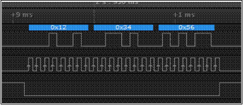

See also:

-  [spi_bus_initialize](#_bookmark1368)
- [spi_bus_add_device](#_bookmark1366)
- [spi_device_transmit](#_bookmark1372)
- [spi_device_queue_trans](#_bookmark1371)
- [spi_device_get_trans_result](#_bookmark1370)

### The Arduino Hardware Abstraction Layer SPI

Уровень аппаратной абстракции Arduino для SPI предоставляет API высокого уровня для работы с SPI. На ESP32 есть несколько периферийных устройств SPI, поэтому мы должны всегда определять, с какой из них мы работаем. Идентификатор экземпляра SPI содержится в экземпляре spi_t. Мы получаем указатель на один из них, вызывая spiStartBus.

Контакты на ESP32, которые могут использоваться для SPI, могут быть динамически сопоставлены. Помните, что один экземпляр SPI может иметь до 4 контактов ... это SCK, MOSI, MISO и SS. Для трех интерфейсов SPI, предоставляемых ESP32, ниже приведены предложения с собственной поддержкой:

 

| **SPI**  | **MOSI** | **MISO** | **CLK** | **SS** |
| -------- | -------- | -------- | ------- | ------ |
| **HSPI** | 13       | 12       | 14      | 15     |
| **VSPI** | 23       | 19       | 18      | 5      |
| **FSPI** | 8        | 7        | 6       | 11     |

Из этих трех шина FSPI не должна использоваться для приложений, так как она используется внутри ESP32.

Следующая диаграмма иллюстрирует номера выводов по умолчанию для SPI для VSPI и HSPI ... но, пожалуйста, помните, что это только значения по умолчанию и могут быть переназначены при необходимости.


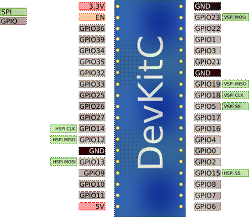

Получив экземпляр SPI, мы вызываем spiAttachMOSI (), spiAttachMISO (), spiAttachCLK () и spiAttachSS (), чтобы установить соответствующие сопоставления выводов. Для передачи значения пина -1 используется значение по умолчанию, в противном случае используется предоставленный явный номер пина.

Когда у нас есть экземпляр SPI и прикреплены выводы, мы можем начать отправку и получение данных.

```c
spi_t *spi = spiStartBus(VSPI, 1000000, SPI_MODE0, SPI_MSBFIRST); 
spiAttachSCK(spi, sckPin);
spiAttachMISO(spi, misoPin); 
spiAttachMOSI(spi, mosiPin);
spiAttachSS(spi, 0, ssPin);//if you want hardware SS 
spiEnableSSPins(spi, 1 << 0);//activate SS for CS0 spiSSEnable(spi);

//transfer some data

const char * data = "hello spi"; 
uint8_t out[strlen(data)];
spiTransferBytes(spi, (uint8_t *)data, out, strlen(data));

//out now contains the response from the slave
```

See also:

- [spiStartBus](#_bookmark1928)
- [spiAttachMISO](#_bookmark1902)
- [spiAttachMOSI](#_bookmark1903)
- [spiAttachSCK](#_bookmark1904)
- [spiAttachSS](#_bookmark1905)

###  Common SPI devices

Теперь, когда мы знаем о существовании SPI, мы можем спросить себя, какие типы периферийных устройств доступны для использования? Вот краткий список некоторых наиболее интересных, с которыми я столкнулся:

| **Device**           | **Description**                           |
| -------------------- | ----------------------------------------- |
| MAX7219/MAX7221      | 7 segment or 8x8 matrix LED   controller. |
| MCP3208              | 12 bit Analog to Digital                  |
| Nokia 5110 / PCD8544 | 84x48 pixel LCD                           |
| SSD1306              | 128x64 OLED display                       |
| ST7735               | 128x128 display                           |
| TJCTM24024-SPI       | 320x240 TFT display                       |
| MFRC522              | RFID                                      |
| nRF24L01             | Communications device                     |

 

 