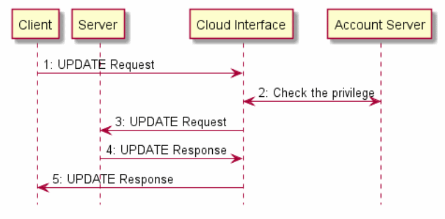

[Copyright Open Connectivity Foundation, Inc. © 2016-2018. All rights Reserved](https://openconnectivity.org/)

# 5 Архитектура

## 5.1 Обзор

Архитектура обеспечивает взаимодействие на основе ресурсов между артефактами IoT, то есть физическими устройствами или приложениями. Архитектура использует существующие отраслевые стандарты и технологии и предоставляет решения для установления соединений (беспроводных или проводных) и управления потоком информации между устройствами, независимо от их форм-факторов, операционных систем или поставщиков услуг.

В частности, архитектура обеспечивает:

-  Структура взаимодействия и взаимодействия между несколькими сегментами рынка (потребительская, корпоративная, промышленная, автомобильная, здравоохранение и т. Д.), ОС, платформы, способы связи, транспорта и использования
-  Общую и согласованную модель для описания среды и предоставления информации и семантической функциональной совместимости
- Общие протоколы связи для обнаружения и подключения
- Общие механизмы обеспечения безопасности и идентификации
- Возможность инноваций и дифференциации продуктов
- Масштабируемое решение, предназначенное для решения различных возможностей устройства, применимое к интеллектуальным устройствам, а также к самым маленьким связанным вещам и носимым устройствам

Архитектура основана на принципах проектирования ориентированной на ресурсы архитектуры и описана в разделах с 5.2 по 5.6 соответственно. В разделе 5.2 приводятся руководящие принципы операций OCF. Раздел 5.3 определяет функциональную блок-схему и Framework. В разделе 5.5 приведен пример сценария с ролями. В разделе 5.6 приведен пример сценария перехода на не-OCF-экосистему.

## 5. 2 Принцип

В архитектуре объекты в физическом мире (например, датчик температуры, электрический свет или бытовой прибор) представлены в качестве ресурсов. Взаимодействие с сущностью достигается посредством представления ресурсов (раздел 7.7) с использованием операций, которые соответствуют архитектурному стилю репрезентативного переноса состояния (REST), то есть взаимодействия RESTful.

Архитектура определяет общую структуру Рамочной основы как информационной системы и взаимосвязи организаций, входящих в OCF. Объекты отображаются как ресурсы, с их уникальными идентификаторами (URI) и интерфейсами поддержки, которые позволяют выполнять операции RESTful в ресурсах. Каждая операция RESTful имеет инициатора операции (клиента) и ответчика на операцию (сервер). В Framework понятие клиента и сервера реализуется через роли (раздел 5.5). Любое устройство может действовать как Клиент и инициировать операцию RESTful на любом устройстве выступая в роли сервера. Аналогично, любое устройство, которое предоставляет объекты в качестве ресурсов, действует как сервер. В соответствии с архитектурным стилем REST каждая операция RESTful содержит всю информацию, необходимую для понимания контекста взаимодействия и управляется с помощью небольшого набора общих операций, то есть CREATE, RETRIEVE, UPDATE, DELETE и NOTIFY (CRUDN), определенных в разделе 8, которые включают представления ресурсов.

На рисунке 1 изображена архитектура.

 

 Рисунок 1: Архитектура - концепции

 Архитектура концептуально организована в три основных аспекта, которые обеспечивают полное разделение внимания: модель ресурсов, операции RESTful и абстракции.

- Модель ресурсов: модель ресурсов предоставляет абстракции и концепции, необходимые для логической модели и логического функционирования приложения и его среды. Модель основных ресурсов является общей и агностикой для любого конкретного домена приложения, такого как интеллектуальный домашний, промышленный или автомобильный. Например, модель ресурсов определяет ресурс, который абстрагирует Entity, и представление ресурса отображает состояние Entity. Другие модели модели ресурсов могут использоваться для моделирования других аспектов, например поведения.
- Операции RESTful: общие операции CRUDN определяются с использованием парадигмы RESTful для моделирования взаимодействия с ресурсом в протоколе и технологическом агностическом пути. Конкретные протоколы обмена сообщениями или сообщениями являются частью абстракции протокола, а отображение ресурсов для конкретных протоколов приведено в разделе 11.8.
- Абстракция: абстракции в модели ресурсов и операции RESTful отображаются на конкретные элементы с использованием примитивов абстракции. Обработчик объекта используется для сопоставления сущности с ресурсом, а примитивы абстракции соединений используются для сопоставления логических операций RESTful с протоколами или технологиями подключения к данным. Обработчики объектов могут также использоваться для сопоставления ресурсов для объектов, которые достигаются по протоколам, которые не поддерживаются OCF.

## 5. 3 Функциональная блок-схема

Функциональная блок-схема включает в себя все функции, необходимые для работы. Эти функциональные возможности классифицируются как соединения L2, сети, транспорта, структуры и приложений. Функциональные блоки изображены на рисунке 2 и перечислены ниже.

 

Рисунок 2: Функциональная блок-схема

- Подключение L2: обеспечивает функциональные возможности, необходимые для установления соединений физического уровня и уровня канала передачи данных (например, соединение Wi-Fi ™ или Bluetooth®) с сетью.
- Сеть. Обеспечивает функции, необходимые для Устройства для обмена данными между собой по сети (например, Интернет).
- Транспорт: обеспечивает сквозной транспортный поток с определенными ограничениями QoS. Примеры транспортного протокола включают в себя TCP и UDP или новые транспортные протоколы, разрабатываемые в IETF, например, Delay Tolerant Networking (DTN).
- Фреймворк: обеспечивает основные функциональные возможности, определенные в этой спецификации. Функциональный блок является источником запросов и ответов, которые являются содержимым связи между двумя Устройствами.
- Вертикальный профиль домена: предоставляет специфические функциональные возможности сегмента рынка, например функции для умного дома

Когда два устройства взаимодействуют друг с другом, каждый функциональный блок в устройстве взаимодействует со своим партнером в одноранговом устройстве, как показано на рисунке 3

 

 Рисунок 3: Модель расслоения связи

## 5.4  Фреймворк

Фреймворк состоит из функций, которые обеспечивают основные функциональные возможности для работы.

1. Идентификация и адресация. Определяет возможности идентификации и адресации. Функция идентификации и адресации определена в разделе 6.
2. Открытие. Определяет процесс обнаружения доступных
   1. Устройства (обнаружение конечных точек в разделе 10) и
   2. Ресурсы (обнаружение ресурсов в разделе 11.3)
3. Модель ресурсов. Указывает возможность представления объектов в терминах ресурсов и определяет механизмы для управления ресурсами. Функция модели ресурса определена в разделе 7.
4. CRUDN. Предоставляет общую схему взаимодействия между Клиентом и Сервером, как определено в разделе 8. 
5. Сообщения. Предоставляет конкретные протоколы сообщений для работы RESTful, то есть CRUDN. Например, CoAP является основным протоколом обмена сообщениями. Функция обмена сообщениями определена в разделе 11.8.
6. Управление устройствами. Определяет дисциплину управления возможностями устройства и включает в себя подготовку устройств и первоначальную настройку, а также мониторинг и диагностику устройств. Функция управления устройством определена в разделе 11.5.
7. Безопасность. Включает механизмы авторизации, авторизации и контроля доступа, необходимые для безопасного доступа к объектам. Функция безопасности определена в разделе 13.

 

## 5.5 Пример сценария с ролями

Взаимодействие определяется между логическими объектами, известными как "Роли". Определены три роли: клиент, сервер и посредник.

На рисунке 4 показан пример ролей в сценарии, в котором смартфон отправляет сообщение запроса на термостат; исходный запрос отправляется через HTTP, но он передается в сообщение запроса CoAP через промежуточный шлюз и затем доставляется в термостат. В этом примере смартфон берет на себя роль Клиента, шлюз выполняет роль посредника, а термостат выполняет роль сервера.

Рисунок 4: Пример, иллюстрирующий роли

## 5.6 Пример сценария: переход на экосистему, отличную от OCF

Вариант использования для этого сценария - это дисплей (например, наручные часы), который используется для мониторинга датчика сердечного ритма, который реализует протокол, который не поддерживается OCF. На рисунке 5 представлен подробный логический вид концепций, описанных на рисунке 1

Рисунок 5: Структура - подробное описание архитектуры

Детали могут быть реализованы многими способами, например, с использованием Сервера с обработчиком сущности для непосредственного взаимодействия с не OCF-устройством, как показано на рисунке 6.

Рисунок 6: Мостовое соединение сервера с устройством без OCF

 При запуске Сервер запускает обработчики объектов, которые обнаруживают не OCF-системы (например, устройство датчика сердечного ритма) и создают ресурсы для каждого обнаруженного устройства или функциональности. Обработчик объекта создает ресурс для каждого обнаруженного устройства или функциональности и привязывается к этому ресурсу. Эти ресурсы становятся доступными для сервера.

 После того, как ресурсы создаются и становятся доступными для обнаружения, Дисплейное устройство может обнаруживать эти ресурсы и работать с ними, используя механизмы, описанные в этой спецификации. Запросы к ресурсу на сервере затем интерпретируются обработчиком сущности и пересылаются на не OCF-устройство, используя протокол, поддерживаемый не OCF-устройством. Возвращенная информация от устройства без OCF затем отображается на соответствующий ответ для этого ресурса.

##  5.7 Облачная архитектура OCF

В этом разделе описывается архитектура OCF Cloud на рисунке 7:

Рисунок 7: Архитектура OCF Cloud для развертывания

Архитектура Cloud включает в себя следующие три сетевых объекта:

-  Сервер облачного интерфейса - логический объект, к которому в основном относится устройство OCF. Он инкапсулирует функции Account Server и Resource Directory. Интерфейс облака маршрутизирует пакет между устройствами OCF на основе URI запроса в заголовке пакета. Клиент должен поддерживать постоянное соединение с сервером
- Сервер учетных записей - логический объект, который обрабатывает регистрацию устройств, проверку подлинности Auth Token и обрабатывает запросы входа и обновления токена с устройства.
- Каталог ресурсов - логический объект, содержащий информацию о ресурсах, публикуемую серверами. Клиент при поиске ресурса получает ответ от Каталога ресурсов от имени Сервера. Затем с информацией, включенной в форму ответа каталога ресурсов, Клиент напрямую подключается к Серверу.

Когда клиент пытается получить доступ к Серверу, Клиент подключается к Серверу облачного интерфейса, а затем Облачный интерфейс направляет полученное сообщение на указанный Сервер после проверки привилегии.

 

Рисунок 8: Маршрутизация конечных точек

