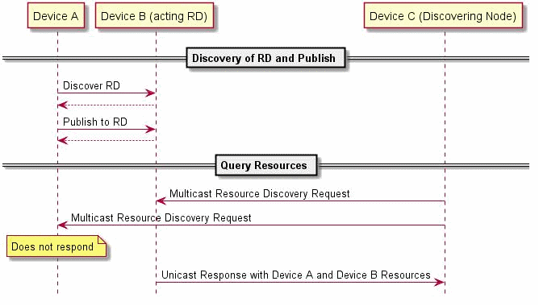
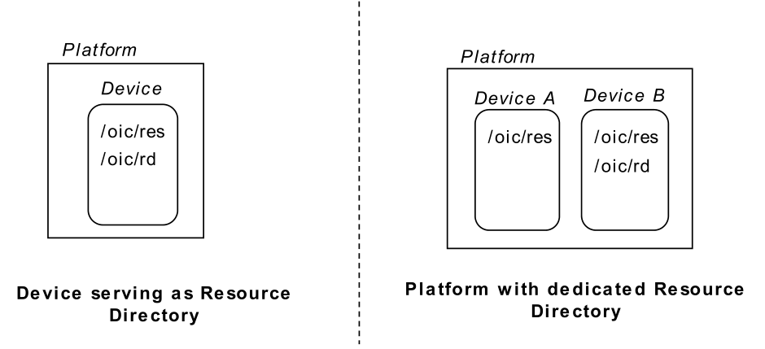
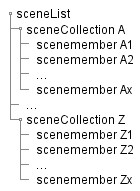
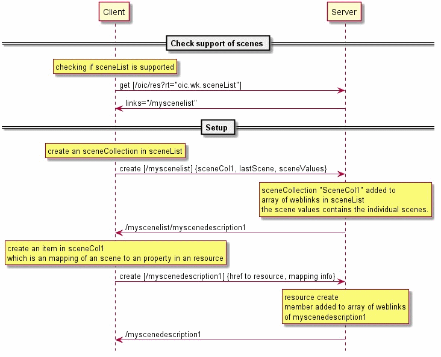
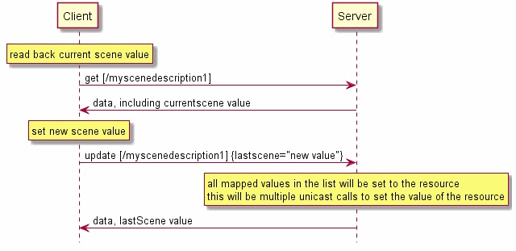
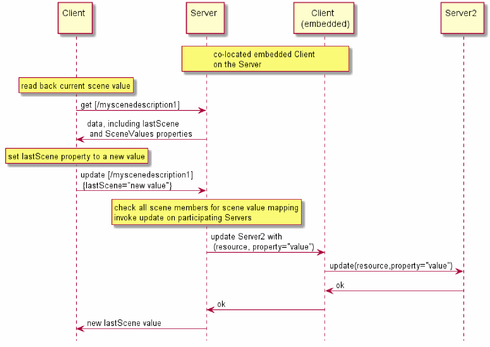
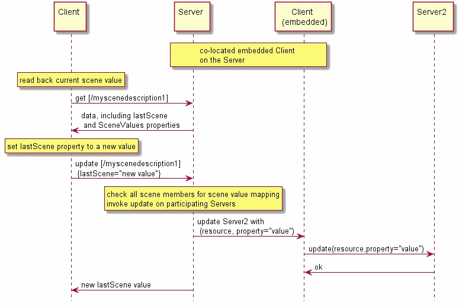

[Copyright Open Connectivity Foundation, Inc. © 2016-2018. All rights Reserved](https://openconnectivity.org/)

# 11 Функциональные взаимодействия

## 11.1 Вступление

Функциональные взаимодействия между Клиентом и Сервером описаны в разделе 11.2 через раздел 11.6 соответственно. Функциональные взаимодействия используют CRUDN-сообщения (раздел 8) и включают в себя обнаружение, уведомление и управление устройствами. Эти функции требуют поддержки основных ресурсов, определенных в таблице 18. Более подробная информация об этих ресурсах приведена ниже в этом разделе.

| Pre-defined URI | Resource Name | Resource Type | Related Functional Interaction | Mandatory |
| --------------- | ------------- | ------------- | ------------------------------ | --------- |
| “/oic/res”      | Default       | “oic.wk.res”  | Discovery                      | Yes       |
| “/oic/p”        | Platform      | “oic.wk.p”    | Discovery                      | Yes       |
| "/oic/d”        | Device        | “oic.wk.d”    | Discovery                      | Yes       |
| (none)          | Configuration | “oic.wk.con”  | Device Management              | No        |
| "/oic/mnt"      | Maintenance   | “oic.wk.mnt”  | Device                         | No        |

## 11.2 Подключение, подготовка и настройка

Включение и подготовка полностью определены Спецификацией безопасности OCF.
Если устройство поддерживает обновление клиентом настраиваемой информации, оно должно сделать это путем предоставления основного ресурса oic.wk.con (таблица 19) в «/oic/res»;

Таблица 19. Ресурс конфигурации

| Example URI      | Resource   Type Title  | Resource   Type ID (“rt” v alue) | Interfaces | Description                                                  | Related   Functional Interaction |
| ---------------- | ---------------------- | -------------------------------- | ---------- | ------------------------------------------------------------ | -------------------------------- |
| /example/oic/con | Device Configuration   | oic.wk.con                       | oic.if.rw  | Тип ресурса, через который предоставляется   настраиваемая информация, специфичная для устройства. Свойства ресурса,   указанные в «oic.wk.con», перечислены в таблице 20. | Configuration                    |
| /example/oic/con | Platform Configuration | oic.wk.con.p                     | oic.if.rw  | Необязательный тип источника Reso, с помощью   которого настраивается информация, специфичная для платформы. Свойства,   указанные в «oic.wk.con.p», перечислены в таблице 21. | Configuration                    |

Таблица 20. Определение типа ресурса «oic.wk.con»

| Property title   | Property name                        | Value type   | Value rule | Unit | Access mode | Mandatory | Description                                                  |
| ---------------- | ------------------------------------ | ------------ | ---------- | ---- | ----------- | --------- | ------------------------------------------------------------ |
| (Device) Name    | n CommonProperty of /example/oic/con | string       |            |      | R, W        | yes       | Человеческое дружественное имя, настраиваемое конечным пользователем (например, Бобом термостат). Общее свойство «n» основного ресурса oic.wk.con и общее свойство «n» основного ресурса «/ oic / d» должны иметь одинаковое значение. Когда значение "n" общего свойства Базового ресурса oic.wk.con изменяется, это должно быть отражено в общем свойстве «n» Базового ресурса «/ oic / d». |
| Location         | loc                                  |              |            |      | R,W         | no        | Предоставляет информацию о местоположении, где доступно      |
| Location Name    | locn                                 | string       |            |      | R,W         | no        | Удобное для человека название места. Например, «Гостиная».   |
| Currensy         | c                                    | string       |            |      | R,W         | no        | Указывает валюту, которая используется для любых денежных операций |
| Region           | r                                    | string       |            |      | R,W         | no        | Текст произвольной формы Указывает текущий регион, в котором географически расположено устройство. |
| Localized Names  | ln                                   | array        |            |      | R,W         | no        | Удобное для человека название устройства на одном или нескольких языках. Это свойство представляет собой массив объектов, каждый из которых имеет поле «language» (содержащее языковой тег IETF RFC 5646) и поле «value», содержащее имя устройства на указанном языке. Если это свойство и свойство Имя устройства (n) поддерживаются, значение Имя устройства (n) должно быть включено в этот массив. |
| Default Language | dl                                   | language-tag |            |      | R,W         | no        | Язык по умолчанию, поддерживаемый устройством, указанный как языковой тег IETF RFC 5646. По умолчанию клиенты могут обрабатывать любое строковое свойство как принадлежащее этому языку, если в свойстве не указано иное. |

Таблица 21. Определение типа ресурса «oic.wk.con.p»

| Property title | Property name | Value type | Value rule | Unit | Access mode | Mandatory | Description                                                  |
| -------------- | ------------- | ---------- | ---------- | ---- | ----------- | --------- | ------------------------------------------------------------ |
| Platform Names | mnpn          | array      |            |      | R, W        | no        | Дружеское название Платформы. Это свойство представляет собой массив из n объектов, в котором каждый объект имеет поле «language» (содержащее языковой тег IETF RFC 5646) и поле «value»,содержащее понятное для платформы имя на указанном языке. Для примера, [{«language»: «en», «value»: «Ноутбук Дэйва»}] |

## 11.3   Поиск ресурсов

### 11.3.1 Вступление

Discovery - это функция, которая позволяет обнаруживать конечные точки, а также обнаружение ресурсов.

Обнаружение конечных точек подробно описано в разделе 10. Этот раздел в основном описывает обнаружение на основе ресурсов.

### 11.3.2 Обнаружение на основе ресурсов: механизмы

#### 11.3.2.1 Обзор

В рамках обнаружения клиент может найти соответствующую информацию о других партнерах OCF. Эта информация может быть экземплярами ресурсов, типов ресурсов или любой другой информации, представленной в модели ресурсов, которую сверстник OCF хотел бы, чтобы другой сверстник OCF обнаружил.

Как минимум, обнаружение на основе ресурсов использует следующее:

1. Определяется ресурс для открытия обнаружения. Представление этого ресурса должно содержать информацию, которая может быть обнаружена.
2. Ресурс для включения обнаружения должен быть указан и общеизвестен a-priori. Должно быть идентифицировано устройство для размещения ресурса для включения обнаружения.
3. Механизм и процесс публикации информации, которая должна быть обнаружена с помощью ресурса, чтобы включить обнаружение.
4. Механизм и процесс доступа и получения информации из ресурса, чтобы обеспечить обнаружение. Запрос может использоваться в запросе для ограничения возвращаемой информации.
5. Возможности публикации
6. Возможности доступа.
7. Политика видимости информации.

 В зависимости от выбора базовых аспектов, определенных выше, Framework определяет три механизма обнаружения ресурсов:

-  Прямое обнаружение, когда ресурсы публикуются локально на устройстве, на котором размещаются ресурсы, и обнаруживаются через запрос сверстников.
- Непрямое обнаружение, когда ресурсы публикуются третьей стороной, помогающей открытию и сверстникам публиковать и выполнять обнаружение против ресурса, чтобы включить обнаружение на вспомогательной стороне 3rd.
-  Обнаружение рекламы, когда ресурс для включения обнаружения размещается локально для инициатора запроса на обнаружение, но удаленно для Устройства, которые публикуют информацию об обнаружении.

Устройство должно поддерживать прямое обнаружение.

#### 11.3.2.2 Прямое обнаружение

В прямом поиске,

1) Устройство, предоставляющее информацию, должно разместить ресурс, чтобы включить обнаружение.

2) Устройство публикует информацию, доступную для обнаружения, с локальным ресурсом для включения обнаружения (т. Е. Локальной области).

3) Клиенты, заинтересованные в обнаружении информации об этом устройстве, должны выдавать запросы RETRIEVE непосредственно на ресурс. Запрос может быть выполнен как одноадресный или многоадресный. Запрос может быть общим или может быть квалифицированным или ограниченным, используя соответствующие запросы в запросе.

4) Устройство «Сервер», которое получает запрос, отправляет ответ с обнаруженной информацией непосредственно обратно на запрашивающее «клиентское» устройство.

5) Информация, которая включена в запрос, определяется политиками, установленными для локального ресурса на отвечающем устройстве.

#### 11.3.2.3 Непрямое обнаружение ресурсов (открытие каталога на основе каталогов)

При косвенном обнаружении информация о ресурсе, который будет обнаружен, размещается на сервере, на котором не размещен ресурс. Подробные сведения об обнаружении каталога на основе каталога см. В разделе 11.3.6.

При косвенном открытии:

a) Ресурс, который должен быть обнаружен, размещен на устройстве, которое не является ни клиентом, инициирующим обнаружение, ни устройством, которое предоставляет или публикует информацию, которая будет обнаружена. Это устройство может использовать один и тот же ресурс для обеспечения обнаружения для нескольких агентов, которые хотят обнаружить, и для нескольких агентов с информацией, которая будет обнаружена.

b) Устройство, которое необходимо открыть или с информацией для обнаружения, публикует эту информацию с ресурсом, который будет обнаружен на другом устройстве. Политики общей информации, включая срок службы / срок действия, определяются издательским устройством. Издательское устройство может изменять эти политики по мере необходимости.

c) Клиент, выполняющий обнаружение, может отправить запрос обнаружения одноадресной рассылки на устройство, на котором размещена информация об обнаружении, или отправить запрос многоадресной рассылки, который должен контролироваться и отвечать на это устройство. В обоих случаях устройство, принимающее информацию об обнаружении, действует от имени издательского устройства.

d) Политики обнаружения могут быть установлены устройством, на котором размещена информация об обнаружении, или стороной, которая публикует информацию, которая будет обнаружена. Информация обнаружения, возвращаемая в ответ обнаружения, должна соответствовать политикам, действующим на момент запроса.

#### 11.3.2.4 Advertisement Discovery

В открытии рекламы:

a) Ресурс для включения обнаружения размещен локально для устройства, инициирующего запрос обнаружения (клиент). Ресурс для включения обнаружения может быть основным ресурсом или обнаружен как часть бутстрапа.

b) Запрос может быть зависимым от реализации или быть локальным запросом RETRIEVE для ресурса, который позволяет обнаруживать.

c) Устройство с информацией, подлежащей обнаружению, должно опубликовать соответствующую информацию на ресурсе, который позволяет обнаруживать.

d) Издательское устройство несет ответственность за опубликованную информацию. Издательское устройство может ОБНОВИТЬ информацию на ресурсе, чтобы включить обнаружение на основе его потребностей, отправив дополнительные запросы на публикацию. Политики обнаруженной информации, включая время жизни, определяются издательским устройством.

### 11.3.3 Поиск на основе ресурсов: процесс публикации информации

Механизм публикации информации с ресурсом для включения обнаружения может быть выполнен как локально, так и удаленно. Процесс публикации изображен на рисунке 14. 

Устройство, которое имеет информацию для обнаружения, должно: 

a) либо обновлять ресурс, который разрешает обнаружение, если он размещен локально, либо 

b) выдавать запрос UPDATE с информацией на устройство, на котором размещается ресурс, который позволяет обнаруживать. Устройство, на котором размещен ресурс для включения обнаружения, добавляет / обновляет ресурс, чтобы включить обнаружение с предоставленной информацией, а затем отвечает на устройство, которое запросило публикацию ресурса с ответом UPDATE. 


Рисунок 14. Поиск на основе ресурсов: процесс публикации информации

### 11.3.4 Поиск на основе ресурсов: поиск информации

 

Процесс обнаружения (рис. 15) инициируется как запрос RETRIEVE к ресурсу для включения обнаружения. Запрос может быть отправлен на одно устройство (как в одноадресном) или на несколько Устройств (как в многоадресной рассылке). Конкретные механизмы, используемые для одноадресной или многоадресной рассылки, определяются поддержкой в слое подключения данных. Ответ на запрос содержит информацию, которая должна быть обнаружена на основе политик для этой информации. Политики могут определять, какая информация делится, когда и кому запрашивающий агент. Информация, которая может быть обнаружена, может быть

ресурсов, типов, конфигурации и многих других стандартов или пользовательских аспектов в зависимости от запроса соответствующего ресурса и формы запроса. Необязательно запросчик может сузить информацию, которая должна быть возвращена в запросе с использованием параметров запроса в запросе URI.


Рисунок 15. Поиск на основе ресурсов: поиск информации

**Поиск ресурсов**

На всех Устройствах для поддержки обнаружения должны быть реализованы следующие основные ресурсы:

- "/oic/res" для обнаружения ресурсов
- "/oic/p" для обнаружения платформы
- "/oic/d" для обнаружения информации об устройстве

Устройства должны выставлять каждую из «/oic/res», «/oic/d» и «/oic/ p» через необеспеченную конечную точку. Более подробная информация об этих обязательных основных ресурсах описана в таблице 22

 Ресурс платформы -

OCF распознает, что на одной платформе может быть размещено более одного экземпляра устройства. Клиентам нужен способ обнаружения и доступа к информации на платформе. Основной ресурс «/oic/p» предоставляет свойства конкретной платформы. Все экземпляры устройства на одной и той же платформе должны иметь одинаковые значения любых открытых объектов (т.e. Устройство может выставлять необязательные свойства в «/oic/p», но при экспонировании значение этого свойства должно быть таким же, как значение это свойство на всех других устройствах на этой платформе)

Ресурс устройства -

Ресурс устройства должен иметь предопределенный URI «/oic/d». Ресурс «/oic/d» предоставляет свойства, относящиеся к устройству, как определено в таблице 22. Открытые свойства определяются конкретным экземпляром устройства и определяются типом (-ами) ресурсов «/oic/d» на этом устройство.

Поскольку все типы ресурсов «/oic/d» неизвестны априори, тип (ы) ресурсов «/oic/d» определяется путем обнаружения через основной ресурс «/oic/res». Ресурс устройства «/oic/d» должен иметь тип ресурса по умолчанию, который помогает при загрузке взаимодействий с этим устройством (тип по умолчанию описан в таблице 22.)

 Индикация протокола -

Возможно, устройству необходимо поддерживать различные протоколы обмена сообщениями в зависимости от требований для разных профилей вертикальных доменов. Например, профиль Smart Home может использовать CoAP, а профиль Industrial может использовать DDS. Чтобы обеспечить совместимость, устройство использует индикацию протокола, чтобы указать транспортные протоколы, которые они поддерживают, и может обмениваться данными.

Таблица 22

| Pre-defined URI** | Resource Type Title | Resource Type ID (“rt” value) | **Interfaces** | Description                                                  | Связанное функциональное взаимодействие |
| ----------------- | ------------------- | ----------------------------- | -------------- | ------------------------------------------------------------ | --------------------------------------- |
| /oic/res          | Default             |                               | “oic.if.ll”    | Ресурс, через который соответствующий Сервер   обнаружен и проверен на наличие доступных ресурсов.   «/oic/res» должен раскрывать ресурсы, которые можно   обнаружить на устройстве. Когда сервер получает запрос запроса RETRIEVE «/oic/res» (например, «GET /oic/res»), он должен отвечать списком ссылок всех   доступных для себя ресурсов обнаружения. «/ Oic / d» и «/ oic / p» являются доступными для поиска ресурсами,   поэтому их ссылки включены в ответ «/oic/res». Свойства, выставленные «/   oic / res», перечислены в таблице 23. | Discovery                               |
| /oic/p            | Platform            |                               | “oic.if.r”     | Обнаруженный ресурс, через который обнаруживается   определенная платформа.   Свойства, выставленные «/oic/p»,   перечислены в таблице 26 | Discovery                               |
| /oic/d            | Device              |                               | “oic.if.r”     | Обнаружение через ресурс «/oic/res»,   который предоставляет свойства, специфичные для экземпляра устройства.   Свойства, выставленные «/ oic/d», перечислены в таблице 25   «/Oic/d» может   иметь один или несколько типов (-ов) ресурсов, которые являются   специфическими для устройства, в дополнение к типу ресурсов по умолчанию или   если они переопределяют тип ресурса по умолчанию. Базовый тип «oic.wk.d» определяет свойства, которые должны быть   открыты всеми Устройствами. Тип (ы) определенного типа устройства зависит от   класса устройства (например, кондиционер, дымовая сигнализация и   комбинированный свет / вентилятор); применимые значения определяются   спецификацией устройства OCF. | Discovery                               |

Таблица 23 определяет тип ресурса «oic.wk.res».

| Property title | Property name | Value type | Value rule           | Unit | Access mode | Manatory | Description                                                  |
| -------------- | ------------- | ---------- | -------------------- | ---- | ----------- | -------- | ------------------------------------------------------------ |
| Name           | N             | string     |                      |      | R           | no       | Human-friendly   name defined by the  vendor                 |
| Links          | Links         | array      | See [7.8.2](#page62) |      | R           | yes      | The array   of Links describes theURI, supported Resource Types and interfaces, and   access policy. |

Устройство должно поддерживать обнаружение на основе CoAP в качестве механизма обнаружения базовой линии (см. Раздел 10.4).

В «/oic/res» перечисляются все Ресурсы, которые указаны как доступные для обнаружения (см. Раздел 11.3). Также перечислены следующие типы ресурсов архитектуры:

- Ресурс интроспекции, обозначенный значением «rt» «oic.wk.introspection»,
- «/oic/d», обозначенное значком «rt» «oic.wk.d»,
- «/oic/sec/doxm», обозначенное значком «rt» «oic.r.doxm», как определено в спецификации безопасности OCF
- «/oic/sec/pstat», обозначенное значком «rt» «oic.r.pstat», как определено в спецификации безопасности OCF
- «/oic/sec/acl2», обозначенное значком «rt» «oic.r.acl2», как определено в спецификации безопасности OCF
- «/oic/sec/cred» с указанием «rt» значения «oic.r.cred», как определено в спецификации безопасности OCF

Условно требуется:

- «/oic/res» с «rt» значением «oic.wk.res» в качестве самореференции при условии, что «oic/res» должен сигнализировать о том, что он наблюдается клиентом.

Ресурс Introspection применим только для устройств, на которых размещаются вертикальные типы ресурсов (например, «oic.r.switch.binary») или определенные для поставщика типы ресурсов. Устройствам, на которых размещаются только ресурсы, необходимые для работы с устройством в качестве клиента, не нужно внедрять ресурс Introspection.

 В таблице 24 представлен реестр OCF для схем протокола.

| SI Number | Protocol    |
| --------- | ----------- |
| **1**     | coap        |
| **2**     | coaps       |
| **3**     | http        |
| **4**     | https       |
| **5**     | coap + tcp  |
| **6**     | coaps + tcp |

Примечание. Обнаружение конечной точки, используемой определенным протоколом, выходит за рамки. Механизм, используемый Клиентом для формирования запросов в другом протоколе обмена сообщениями, отличном от обнаружения, выходит за рамки.

Следующее относится к использованию "/oic/d", как определено выше:

- Устройство может выбрать отображение своего типа (типов) устройства (например, холодильника, кондиционера или составной части нескольких типов устройств), добавив тип устройства в список типов ресурсов, связанных с «/oic/d».
  - Например; "rt" из "/oic/d" становится ["oic.wk.d", "oic.d. <thing1>", "oic.d. <thing2>"]; где «oic.d. <thing1>» и «oic.d. <thing2>» определены в другой спецификации, такой как спецификация устройства OCF.
  -  Это означает, что свойства, предоставляемые "/oic/d", по умолчанию являются обязательными свойствами в таблице 25.
- Вертикаль может расширить список свойств, определенных типом ресурса «oic.wk.d». В этом случае вертикаль должна назначить новый тип ресурса, специфичный для идентификатора типа ресурса. Обязательные свойства, определенные в таблице 25, должны присутствовать всегда.
- Устройство может выбрать предоставление отдельного обнаруживаемого ресурса с идентификатором типа ресурса, установленным в тип устройства, определенный OCF. В этом случае Ресурс эквивалентен экземпляру «oic.wk.d» и соответствует его определению. Как таковой, Ресурс должен как минимум выставлять обязательные Свойства "oic.wk.d". В случае, когда Ресурс, помеченный таким образом, определяется как экземпляр Коллекции в соответствии с разделом 7.8.3, тогда Ресурсы, которые являются частью этой Коллекции, должны как минимум включать Типы Ресурса, предусмотренные для Типа Устройства. Например, если Ресурс Коллекции имеет значение «rt» [«oic.d.light»], Коллекция включает экземпляр «oic.r.switch.binary», который является обязательным для «oic.d.light». "согласно спецификации устройства OCF. Таблица 25 Определение типа ресурса «oic.wk.d» определяет базовый тип ресурса для ресурса «/oic/d»

| Property title         | Prop erty name | Value type | Values rule | Unit | Acc ess mode | Mand atory | Description                                                  |
| ---------------------- | -------------- | ---------- | ----------- | ---- | ------------ | ---------- | ------------------------------------------------------------ |
| (Device) Name          | n              | string     |             |      | R            | yes        | Человеческое дружественное имя, определенное продавцом.   При наличии свойства «n»   для «/oic/con» оба имеют одинаковое   значение свойства. Когда значение свойства "n" для "/ oic / con" изменяется, оно должно быть   отражено в значении свойства "n" для "/oic/d". |
| Spec Version           | icv            | string     |             |      | R            | yes        | Версия спецификации спецификации ядра, для которой   реализовано это устройство. Синтаксис «ocf. <Major>. <Minor>.   <Subversion>», где <major>, <minor и <sub-version> - это   основные, второстепенные и Номера версий спецификации соответственно. В этой   версии спецификации строковое значение должно быть «ocf.2.0.0». |
| Device ID              | di             | uuid       |             |      | R            | yes        | Уникальный идентификатор для устройства. Это значение   должно быть таким же (то есть зеркальным), что и свойство doxm.deviceuuid,   как определено в OCF Security. Обработка чувствительности к конфиденциальности   для свойства "di", см. Раздел 13.8 в OCF Security. |
| Data Model Version     | dmv            | csv        |             |      | R            | yes        | Specversion ResourceSpecification,   в которой реализована эта модель данных устройства; если он соответствует   спецификациям (ям) Вертикального устройства, то версиям Спецификации   Вертикали, к которой применяется данная модель устройства. Синтаксис   представляет собой общий список <res>. <Major>.<Minor>. <Sub-version> или <vertical>. <Major>. <Minor>. <Sub-версия>. <Res> это строка «ocf.res», а <vertical>   - это имя вертикали, определенной в спецификации ресурса для вертикали. <Major>, <minor> и <sub-version> являются мажорными,   минорными и промежуточными зонами спецификаций соответственно. Одна запись в   строке csv должна   быть доступной лицензированной версией Спецификации Ресурсного Типа для   Устройства (например, «ocf.res.1.0.0»). Если   применимо, единичная запись (-и) в csv должна быть реализуемой вертикалью (например, «ocf.sh.1.0.0»). Это значение может быть   предоставлено поставщиком. Синтаксис, определяющий это значение, представляет   собой запись, заданную паролем, с помощью аргумента x или <Domain_Name>. <Vendor_string>.   Например, "ocf. Res.1.0.0, ocf.sh1.0.0, x.com. Example.string", порядок значений в строке через запятую может быть в любом порядке (то есть без   предписанного порядка). Это   свойство не должно превышать 256 октетов. |
| Protocol               | piid           | uuid       |             |      | R            | yes        | Уникальный и неизменный идентификатор устройства. Клиент может обнаружить, что одно Устройство поддерживает несколько протоколов   связи, если обнаружит, что Устройство использует одно значение Независимого  от протокола идентификатора для всех протоколов, которые он поддерживает. Обработка чувствительности к конфиденциальности для свойства «piid», см. В разделе 13.8 в   OCF Security. |
| Localized Descriptions | ld             | array      |             |      | R            | no         | Подробное описание устройства, ни один из основных языков.   Это свойство представляет собой массив из n объектов, каждый из которых имеет поле «language» (содержащее языковой тег IETF RFC 5646) и поле «value», содержащее описание   устройства на указанном языке.. |
| Software Version       | sv             | string     |             |      | R            | no         | Версия программного обеспечения устройства.                  |
| Manufacturer Name      | dmn            | array      |             |      | R            | no         | Название производителя устройства на одном или нескольких   языках.   Это свойство представляет собой массив объектов, каждый из   которых имеет поле «language»   (содержащее языковой тег IETF RFC   5646) и поле «value»,   содержащее название производителя на указанном языке. |
| Model Number           | dmno           | string     |             |      | R            | no         | Номер модели, указанный производителем.                      |

Дополнительные типы ресурсов ресурса «/oic/d» определяются спецификацией устройства OCF.

Table 26. "oic.wk.p" Resource Type definition

| Property title              | Prop erty name | Value type | Val ue rule | Unit | Acce ss mode | Man dato ry | Description                                             |
| --------------------------- | ------------------- | -------------- | --------------- | ------ | --------------- | ----------- | ------------------------------------------------------------ |
| Platform ID                 | pi                  | string         |                 |        | R               | yes         | Уникальный   идентификатор для физической формы (UIUID); все это будет UUID в соответствии   с IETF RFC 4122. Рекомендуется, чтобы UUID создавался с использованием   стандартной схемы генерации (UUID версии 4), специфичной для RFC. Обработка   частной собственности для свойства «pi», см. Раздел 1 3.8 в разделе   «Безопасность OCF». |
| Manufacturer Name           | mnmn                | string         |                 |        | R               | yes         | Наименование   производителя                                 |
| Manufacturer Details   Link | mnml                | uri            |                 |        | R               | no          | Ссылка на   производитель, представленный как URI            |
| Model Number               | mnmo             | string         |                 |        | R               | no          | Номер модели, указанный   изготовителем                      |
| Date of Manufacture         | mndt             | date           |                 | Time | R               | no          | Дата изготовления   платформы.                               |
| Serial number               | mnsel            | string       |                 |        | R               | no          | Серийный номер   Платформы, может быть уникальным для каждой платформы одного и того же номера   модели. |
| Platform Version            | mnpv             | string       |                 |        | R               | no          | Версия платформы -   строка (определяется производителем)    |
| OS Version                  | mnos             | string       |                 |        | R               | no          | Версия резидентной ОС   платформы - строка (определяется производителем) |
| Hardware Version            | mnhw             | string       |                 |        | R               | no          | Версия аппаратного  обеспечения платформы                   |
| Firmware version           | mnfv              | string       |                 |        | R               | mnmon o     | Версия прошивки платформы                                  |
| Support link                | mnsl              | uri           |                 |        | R               | n o         | URI, указывающий на поддержку информации от производителя  |
| SystemTime                  | st                  | date-time    |                 |        | R               | n o         | Справочное время для   Платформы.                            |
| Vendor ID                   | vid                | stri n g       |                 |        | R               | n o         | Строка, определенная поставщиком для платформы. Строка имеет произвольную форму и зависит от поставщика, какой текст ее заполнить. |

### 11.3.5 Resource discovery using “/oic/res”

Обнаружение с использованием «/oic/res» является механизмом обнаружения по умолчанию, который должен поддерживаться всеми устройствами следующим образом:

a) Каждое устройство обновляет локальные «/oic/res» ресурсы, которые можно обнаружить (см. раздел 7.3.2.2). Каждый раз, когда на устройстве создается экземпляр нового ресурса, и если этот ресурс можно обнаружить удаленному устройству, этот ресурс публикуется с ресурсом «/oic/res», который является локальным для устройства (в качестве экземпляра ресурса).

b) Устройство, которое хочет обнаружить ресурсы или типы ресурсов на одном или нескольких удаленных устройствах, делает запрос RETRIEVE на «/oic/res» на удаленных устройствах. Этот запрос может быть отправлен многоадресной рассылкой (по умолчанию) или одноадресной рассылкой, если будет проверен только конкретный хост. Запрос RETRIEVE может быть необязательно ограничен с использованием соответствующих предложений в части запроса запроса. Запросы могут выбираться на основе типов ресурсов, интерфейсов или свойств.

c) Запрос применяется к представлению ресурсов. «/oic/res» - единственный ресурс, чье представление имеет «rt». Таким образом, «/oic/res» - единственный ресурс, который можно использовать для обнаружения многоадресной передачи на уровне транспортного протокола.

d) Устройство, получающее запрос RETRIEVE, отвечает списком ресурсов, типом ресурсов каждого из ресурсов и интерфейсами, поддерживаемыми каждым ресурсом. Кроме того, можно также отправить информацию о действующих в ресурсе политиках. Поддерживаемая политика включает в себя наблюдаемость и открытость. (Подробнее см. Ниже)

e) Получающее устройство может выполнить более глубокое обнаружение на основе ресурсов, возвращенных в запросе, в «/oic/res».

 

Информация, которая возвращается при обнаружении против «/oic/res», минимальна:

• URI (относительный или полностью определенный URL) ресурса

• Тип (ы) ресурсов каждого ресурса. Более чем один тип ресурса может быть возвращен, если ресурс включает несколько типов. Чтобы получить доступ к ресурсам нескольких типов, в запросе указывается конкретный тип ресурса, который является целевым.

• Интерфейсы, поддерживаемые этим ресурсом. Можно вернуть несколько интерфейсов. Чтобы получить доступ к определенному интерфейсу, этот интерфейс должен быть указан в запросе. Если интерфейс не указан, предполагается интерфейс по умолчанию.

Различные ответы «/oic/res» возвращаются в соответствии с запрашивающими Клиентами, которые указывают их ссылку посредством включения или иным образом опции OCF-Accept-Content-Format-Version.

Для клиентов, которые не включают опцию OCF-Accept-Content-Format-Version, ответ «/oic/res» должен использовать «sec» и «port» для предоставления информации для зашифрованного соединения. См. E.2.8 для схемы для Link.

Для клиентов, которые включают параметр OCF-Accept-Content-Format-Version, ответ «/oic/res» включает в себя «массив ссылок» для соответствия IETF RFC 6690. Каждая ссылка должна использовать параметр «eps» для предоставления информацию для зашифрованного соединения и нести «привязку» к значению OCF URI, где компонент полномочий <deviceID> указывает устройство, на котором размещен целевой ресурс.

Схема JSON для обнаружения с использованием «/oic/res» описана в D.9, схема, применимая к запрашивающим Клиентам, которые не включают опцию OCF-Accept-Content-Format-Version, описана в E.4 и E 0,5. Также обратитесь к разделу 10 (Обнаружение конечных точек) для получения подробной информации об обнаружении многоадресной рассылки с использованием «/oic/res» на транспорте CoAP.

Например, устройство Light может возвращать следующие клиенты OIC 1.1:

```json
[{
  "di": "e61c3e6b-9c54-4b81-8ce5-f9039c1d04d9",
  "links": [
     {
        "href": "coaps://[fe80::b1d6]:44444/oic/res",
        "rel": "self",
        "rt": ["oic.wk.res"],
        "if": ["oic.if.ll", "oic.if.baseline"],
        "p": {"bm": 3}
     },
     {
        "href": "/oic/p",
        "rt": ["oic.wk.p"],
        "if": ["oic.if.r", "oic.if.baseline"],
        "p": {"bm": 3, "sec": true, "port": 11111}
    },
    {
        "href": "/oic/d",
        "rt": ["oic.wk.d", "oic.d.light"],
        "if": ["oic.if.r", "oic.if.baseline"],
        "p": {"bm": 3, "sec": true, "port": 11111}
    },
    {
        "href": "/myLight",
        "rt": ["oic.r.switch.binary"],
        "if": ["oic.if.a", "oic.if.baseline"],
        "p": {"bm": 3, "sec": true, "port": 11111}
    }
  ]
}]
```

Световое устройство может вернуть следующее для клиентов, которые запрашивают с помощью Content Format «application / vnd.ocf + cbor» в Accept Option:

```json
[
  {
    "href": "/oic/res",
    "anchor": "ocf://dc70373c-1e8d-4fb3-962e-017eaa863989/oic/res",
    "rel": "self",
    "rt": ["oic.wk.res"],
    "if": ["oic.if.ll", "oic.if.baseline"],
    "p": {"bm": 3},
    "eps": [{"ep": "coap://[fe80::b1d6]:44444"}]
  },
  {
    "href": "/oic/p",
    "anchor": "ocf://dc70373c-1e8d-4fb3-962e-017eaa863989,
    "rt": ["oic.wk.p"],
    "if": ["oic.if.r", "oic.if.baseline"],
    "p": {"bm": 3},
    "eps": [{"ep": "coap://[fe80::b1d6]:44444"}, {"ep": "coaps://[fe80::b1d6]:11111"}]
  },
  {
    "href": "/oic/d",
    "anchor": "ocf://dc70373c-1e8d-4fb3-962e-017eaa863989,
    "rt": ["oic.wk.d", "oic.d.light"],
    "if": ["oic.if.r", "oic.if.baseline"],
    "p": {"bm": 3},
    "eps": [{"ep": "coap://[fe80::b1d6]:44444"}, {"ep": "coaps://[fe80::b1d6]:11111"}]
  },
  {
    "href": "/myLight",
    "anchor": "ocf://dc70373c-1e8d-4fb3-962e-017eaa863989,
    "rt": ["oic.r.switch.binary" ],
    "if": ["oic.if.a", "oic.if.baseline"],
    "p": { "bm": 3 },
    "eps": [{ "ep": "coap://[fe80::b1d6]:44444"},{"ep": "coaps://[fe80::b1d6]:11111"}]
  }
]
```

После выполнения поиска с использованием «/oic/res» клиенты могут обнаружить дополнительные сведения о сервере, выполнив обнаружение с помощью «/oic/p», / oic/rts и т.д. Если клиент уже знает о Сервере, он может обнаруживать использование других ресурсов без необходимости через открытие «/ oic/res».

### 11.3.6 Открытие каталога ресурсов (RD)

#### 11.3.6.1 Введение

##### 11.3.6.1.1 Косвенное обнаружение для поиска Ресурсов

Прямое обнаружение - это механизм, используемый в настоящее время для поиска Ресурсов в сети. Когда необходимо, ресурсы запрашиваются на конкретном устройстве напрямую или пакет многоадресной рассылки отправляется всем устройствам. Каждое запрошенное устройство отвечает напрямую своими Ресурсами на устройство обнаружения. Ресурсы, доступные локально, регистрируются на одном устройстве. В некоторых ситуациях может потребоваться один из других механизмов, описанных в разделе 11.3.2.3, называемый косвенным открытием. Косвенное обнаружение - это когда стороннее устройство, кроме устройства обнаружения и обнаруженного устройства, помогает в процессе обнаружения. Стороннее устройство, называемое Resource Directory (RD), предоставляет информацию только о ресурсах от имени другого устройства, но не содержит ресурсы на части этого устройства.


На рисунке 16 устройство B действует как каталог ресурсов для устройства A и устройства D. Устройство A и устройство D публикуют информацию о своих ресурсах на устройство B. Устройство C может запросить устройство B для получения информации о ресурсах устройства A и устройства D. Устройство A и устройство D может не отвечать на многоадресный запрос, когда устройство B в качестве каталога ресурсов отвечает на запрос от их имени.

Косвенное обнаружение полезно для ограниченного Устройства, которому нужно не работать для управления питанием, и которое не может обрабатывать каждый запрос на обнаружение, или когда Устройства могут не находиться в одной сети и требуют оптимизации для обнаружения. Как только ресурсы обнаружены с использованием косвенного обнаружения, то есть запроса RD, тогда доступ к ресурсу осуществляется посредством запроса, отправляемого непосредственно на устройство, на котором размещен этот ресурс.

##### 11.3.6.1.2 Каталог ресурсов

Каталог ресурсов (RD) - это устройство, которое помогает с косвенным обнаружением. Устройство, которое действует как RD, будет участвовать в следующих операциях.

- Обнаружение RD - процедура, с помощью которой публикующие устройства обнаруживают RD и получают критерии для выбора из множества обнаруженных RD.
- Публикация ресурсов - процедуры, с помощью которых Устройства публикуют информацию о своих ресурсах, т.е. ссылки. Будущая редакция этой спецификации позволит модифицировать записи RD с помощью операций UPDATE и DELETE. Любые операции UPDATE или DELETE, выполняемые с RD в этой спецификации, должны либо игнорироваться, либо генерировать ошибку.
- Предоставление ресурсов - функция, с помощью которой RD предоставляют ссылки, размещенные на сторонних устройствах, через свои собственные "/oic /res".

Для вышесказанного RD используют тип ресурса "oic.wk.rd", определенный в таблице 27 и таблице 28. Устройство, которое поддерживает возможность размещения косвенного обнаружения, должно выставить экземпляр "oic.wk.rd" в своем " /oic/res ", чтобы объявить, что он служит RD. Обнаруживаемый экземпляр «oic.wk.rd» должен разрешать только безопасные соединения (например, конечная точка со схемой «coaps» или «coaps + tcp»). Издательское устройство может отправить запрос RETRIEVE в «/ oic / rd», чтобы получить критерии выбора среди нескольких RD. Затем он может отправить запрос ОБНОВЛЕНИЕ в "/ oic / rd" со своими ссылками в полезной нагрузке, чтобы опубликовать ссылки в "/oic/res" RD. Издательское устройство несет ответственность за обеспечение того, чтобы RD имел правильные опубликованные ссылки для показа через «/oic/res».

| Predefined URI | Resource Type Title | Resource Type ID (“rt” value) | Interfaces      | Description                                                  | Related Functional Interaction |
| -------------- | ------------------- | ----------------------------- | --------------- | ------------------------------------------------------------ | ------------------------------ |
| "/oic/rd"      | Resource Directory  | oic.wk.rd                     | oic.if.baseline | The discoverable Resource Type through with   which an RD 1 ) facilitates i ts discovery and provides the criteria to   select an RD and 2 ) allows Devices to publish their Links in “/oic/res” of   the RD. | Discovery                      |

Table 27. "oic.wk.rd" Resource Type definition

| Property title | Property name | Value type | Value rule | Unit | Access mode | Mandatory | Description                                                  |
| -------------- | ------------- | ---------- | ---------- | ---- | ----------- | --------- | ------------------------------------------------------------ |
| Selector       | sel           | Integer    |            |      | R           | yes       | Предоставляет критерии для выбора RD. Целое число, представляющее   значение, рассчитанное RD.   Значение находится в диапазоне от 0 до 100. Чем ниже значение, тем   предпочтительнее RD |

Table 28. "oic.wk.rd" Properties

RD может быть запрошен в своем ресурсе "/oic/res", чтобы найти ресурсы, размещенные на других устройствах. Эти устройства могут быть сонными узлами или любым другим устройством, которое не может или не может отвечать на запросы обнаружения. Издательское устройство может публиковать весь или частичный список ресурсов, которые они размещают в RD.

Затем RD отвечает на запросы на обнаружение ресурсов от имени публикующего устройства (например, когда устройство может перейти в спящий режим). Для общего обнаружения ресурсов RD ведет себя как любой другой сервер при ответе на запросы к /oic/res.

Остальная часть раздела 11.3.6 разделена на три части. Первая часть охватывает «Обнаружение RD» (раздел 11.3.6.2), то есть обнаружение и выбор RD. Вторая часть посвящена публикации ресурсов (раздел 11.3.6.3), то есть публикации ресурсов. Третья часть посвящена «Экспонированию ресурсов» (раздел 11.3.6.4), где RD отвечает на запросы от устройств, которые ищут ресурсы.

####  11.3.6.2 RD discovery

##### 11.3.6.2.1 Открывая RD

RD  должен поддерживать обнаружение RD



На рисунке 17 показано, что устройство, которое хочет опубликовать свои ресурсы, сначала обнаруживает RD, а затем публикует информацию о желаемом ресурсе. После того как набор ресурсов был опубликован в RD, устройство публикации не должно отвечать на запросы обнаружения ресурсов многоадресной рассылки для этих опубликованных ресурсов, когда RD находится в том же домене многоадресной рассылки. В этом случае только RD должен отвечать на запросы обнаружения ресурса многоадресной рассылки на опубликованном ресурсе.

Разрешено, чтобы несколько устройств действовали как RD. Причина поддержки нескольких RD состоит в том, чтобы сделать сети масштабируемыми, обрабатывать сбои сети и предотвращать централизованные узкие места сбоев устройства. Это не исключает сценарий, в котором сценарий использования или среда развертывания может требовать развертывания одного устройства в среде в качестве единственного RD (например, модель шлюза).

Обнаружение RD может привести к ответам от более чем одного RD. Если более чем один RD отвечает, обнаруживающее устройство может выбрать один из них на основе весовых параметров, предоставленных в ответе от RD.

Клиент, который выполняет обнаружение ресурсов, использует RD так же, как и любой другой сервер для обнаружения. Он может отправлять одноадресный запрос в RD, когда ему нужны только Ресурсы, опубликованные в RD, или выполнять многоадресный запрос, когда он не требует или не имеет явных знаний о RD.



RD также могут быть обнаружены следующими способами:

- Предварительная конфигурация. Устройства, желающие опубликовать информацию о ресурсах, могут быть предварительно сконфигурированы с помощью информации (например, IP-адреса, порта, транспорта и т. Д.) Конкретного RD. Эта предварительная конфигурация может быть выполнена при входе в систему или может быть обновлена на устройстве с использованием внеполосного метода. Эта предварительная настройка может быть выполнена производителем.
- Ориентированный на запрос: Издательское устройство, желающее обнаружить каталоги ресурсов с помощью обнаружения, ориентированного на запросы, может выполнить многоадресный запрос на обнаружение ресурсов для «/oic/res?rt=oic.wk.rd». Только и все Устройства, которые могут быть RD, должны ответить на этот запрос. Ответ "/ oic / rd" должен включать информацию о RD, т. Е. О наличии ссылки "oic .wk.rd" (как определено типом ресурса), и последующий запрос к "/ oic / rd" будет производить весовые параметры разрешить обнаруживающему устройству выбирать между RD (см. подробности в разделе 11.3.6.2.2 выбора RD). Ресурс "oic.wk.rd" должен быть создан на Устройствах, действующих как RD. Схема "oic.wk.rd" определена в D.13.

##### 11.3.6.2.2 Процесс выбора RD

Устройство, которое хочет использовать RD, найдет ноль или более RD в сети. В сети может отсутствовать RD. При обнаружении RD Устройство должно выбрать RD из всех RD, найденных в сети. Устройство может отправить запрос RETRIEVE в «/oic/rd» определенного RD, RD должен ответить с представлением «/oic/rd/», содержащего критерии выбора, как определено свойством «sel». Чем ниже значение свойства sel, тем предпочтительнее отвечающий RD. Создание значения "sel" определяется поставщиком.
Например, ответ «/oic/rd» может возвращать следующее.

```json
{
   "rt": ["oic.wk.rd"],
   "if": ["oic.if.baseline"],
   "sel": 50
}
```

Выбор, основанный на значении свойства sel, гарантирует, что устройство может определить, подходит ли найденный RD для его нужд.

Во время выбора RD могут возникнуть следующие ситуации:

1. Один или несколько RD присутствуют в сети
2. в сети нет RD
3. дополнительный RD прибывает в сеть

В первом сценарии RD уже присутствуют. Если один RD обнаружен, то этот RD может использоваться. Когда обнаружено несколько RD, устройство может использовать значение свойства sel для выбора RD.

Во втором сценарии Издательское устройство может продолжать поиск RD до тех пор, пока оно не будет найдено, или полностью отказаться от использования RD.

В третьем сценарии Устройство уже опубликовало свои ресурсы для существующего RD, а затем обнаруживает новый RD в сети. После оценки значения свойства «sel» Устройство может перейти к новому RD. Устройство должно удалить информацию о своих ресурсах из текущего используемого RD и опубликовать информацию в новом RD.

#### 11.3.6.3 Публикация ресурса

##### 11.3.6.3.1 Обзор

RD должен предоставлять возможность устройствам публиковать информацию о своих ресурсах в RD.

##### 11.3.6.3.2 Публикация ресурсов

###### 11.3.6.3.2.1 Обзор

После процесса выбора RD устройство может отправить свою информацию о ресурсах в выбранный RD, то есть опубликовать ссылки в своем «/ oic/res» на «/oic/res» RD.

Издательское устройство может принять решение опубликовать все Ресурсы или только несколько из Ресурсов на RD. Публикующее устройство должно публиковать только ресурсы, которые в противном случае публикуются в своем собственном "/oic/res"; публикующее устройство не должно публиковать недопустимые ресурсы или ресурсы, размещенные на каком-либо другом устройстве. Публикующее устройство должно отвечать на запросы на обнаружение на своем ресурсе "/oic/res", если все его обнаруживаемые ресурсы не были опубликованы в RD.

###### 11.3.6.3.2.2 Публикация: Push Resource information

Информация о ресурсе может быть опубликована с использованием запроса UPDATE, отправленного в «/oic/rd».

Устройство, на котором размещен Ресурс, может опубликовать информацию о Ресурсе, то есть Ссылку, нацеленную на Ресурс, в RD, отправив запрос UPDATE с Ссылкой в полезной нагрузке. Опубликованная ссылка должна быть открыта через "/oic/res" RD.

Когда устройство впервые публикует ссылку или ссылки, оно должно отправить запрос UPDATE в ресурс "/oic/rd" RD, включающий в себя следующие пары ключ-значение в полезной нагрузке:

• значение di –  это должно быть идентификатором устройства публикующего устройства, то есть значением «di» для «/ oic / d».

• links - его значение должно быть массивом ссылок, которые будут опубликованы. В ссылках может отсутствовать параметр «ins», и в этом случае RD назначит значение для каждой ссылки. Предоставленный клиентом параметр «ins» может быть отменен RD, например, RD может игнорировать предоставленное значение «ins».

• ttl - его значение указывает, как долго (в секундах) публикующее устройство запрашивает RD сохранить эту опубликованную ссылку.

Обратите внимание, что полезная нагрузка должна содержать соответствующий контент-формат «application/vnd.ocf \+ cbor»:

```json
{
  "di": "e61c3e6b-9c54-4b81-8ce5-f9039c1d04d9",
  "links": [
    {
      "anchor": "ocf://e61c3e6b-9c54-4b81-8ce5-f9039c1d04d9",
      "href": "/myLightSwitch",
      "rt":["oic.r.switch.binary"],
      "if":["oic.if.a", "oic.if.baseline"],
      "p":{"bm": 3},
      "eps": [
        {"ep": "coaps://[fe80::b1d6]:1111", "pri": 2},
        {"ep": "coaps://[fe80::b1d6]:1122"},
        {"ep": "coaps+tcp://[2001:db8:a::123]:2222", "pri": 3}
      ]
    },
    {
      "anchor": "ocf://e61c3e6b-9c54-4b81-8ce5-f9039c1d04d9",
      "href": "/myLightBrightness",
      "rt":["oic.r.brightness"],
      "if":["oic.if.a", "oic.if.baseline"],
      "p":{"bm": 3},
      "eps": [{"ep": "coaps://[[2001:db8:a::123]:2222"}]
    }
  ],
  "	ttl": 600
}
```

Когда RD получает этот начальный запрос UPDATE, он определяет, следует ли удовлетворить запрос или нет. После удовлетворения запроса RD должен отправить ответ ОБНОВЛЕНИЕ на Публикующее устройство. Ответ должен содержать полезную нагрузку с той же информацией, что и исходный запрос UPDATE, со следующими возможными различиями:

-  Для каждой ссылки в ответ должен быть включен параметр «ins». RD должен назначить уникальное значение «ins», идентифицирующее ссылку среди всех ссылок, которые он рекламирует. Если устройство публикации включило значение «ins» в запрос UPDATE, RD может использовать его, если оно не соответствует ни одному из существующих значений «ins» в опубликованных ссылках.
-  Значение свойства "ttl" должно быть присвоено RD, и оно должно быть включено в ответ. RD должен использовать значение, включенное в запрос UPDATE, но может назначить значение, которое ниже, если оно не может выполнить запрошенное значение "ttl". По истечении этого времени RD удаляет Ссылки. Чтобы сохранить связь, издательское устройство может обновить «ttl», используя схему UPDATE.

RD должен добавить новые ссылки в свой «/oic/res» и предоставить их действительному запросу на обнаружение, т.е. запросу RETRIEVE:

```json
{
  "di": "e61c3e6b-9c54-4b81-8ce5-f9039c1d04d9",
  "links": [
    {
      "anchor":  "ocf://e61c3e6b-9c54-4b81-8ce5-f9039c1d04d9",
      "href":    "/myLightSwitch",
      "rt":["oic.r.switch.binary"],
      "if":["oic.if.a",  "oic.if.baseline"],
      "p":{"bm": 3},
      "eps":  [
        {"ep": "coaps://[fe80::b1d6]:1111", "pri": 2},
        {"ep": "coaps://[fe80::b1d6]:1122"},
        {"ep": "coaps+tcp://[2001:db8:a::123]:2222", "pri": 3}
      ],
      "ins":11235
    },
    {
      "anchor":  "ocf://e61c3e6b-9c54-4b81-8ce5-f9039c1d04d9",
      "href":    "/myLightBrightness",
      "rt":["oic.r.brightness"],
      "if":["oic.if.a",  "oic.if.baseline"],
      "p":{"bm": 3},
      "eps":  [{"ep":  "coaps://[[2001:db8:a::123]:2222"} ],
      "ins":	112358
    }
  ],
  "ttl": 600
}
```

После того, как публикующее устройство опубликовало ресурсы в RD, оно может решить не отвечать на запросы многоадресного обнаружения для тех же ресурсов по отношению к своему собственному «/oic/res», особенно в том же домене многоадресной рассылки, что и RD. После публикации Ресурсов ответственность за ответы на запросы к опубликованным Ресурсам лежит на RD.
Существует еще одна возможность, что RD и публикующее устройство отвечают на многоадресный запрос от обнаруживающего устройства. Это создаст дублирование информации, но является альтернативой, которая может использоваться для ненадежных сетей. Это не рекомендуемый вариант, но для промышленных сценариев это одна из возможностей. В любом случае, обнаружение клиентов должно быть всегда готово к обработке дублирующейся информации в ответах на запрос многоадресного обнаружения. Схема "/ oic / rd" определена в D.13 для указания публикации в ресурсе "/ oic / rd".

#### 11.3.6.4 Экспозиция ресурсов

##### 11.3.6.4.1 «/oic/res» и извлечение ресурсов

Процесс обнаружения на основе «/oic/res» остается таким же, как и при отсутствии RD. Ресурсы можно обнаружить, извлекая ресурс «/oic/res», отправив многоадресный или одноадресный запрос. В случае запроса на обнаружение многоадресной рассылки RD должен включать в свой ответ любые опубликованные Ресурсы от имени устройства, на котором размещаются Ресурсы. Клиенты должны быть готовы обработать дублирующую информацию о ресурсах от более чем одного RD, отвечающего с той же информацией, или от RD и хостинга (публикация информации о ресурсах), которые отвечают на запрос. Взаимодействие с Ресурсами, обнаруженное с помощью RD, выполняется с использованием того же механизма и методов, что и с Ресурсами, обнаруженными путем получения ресурса «/oic/res» устройства, на котором размещаются Ресурсы (например, подключитесь к устройству хостинга и выполните операции CRUDN в ресурсе ).

 Каталоги ресурсов предоставляют разные ответы «/oic/res» в соответствии с запрашивающими Клиентами, которые указывают на их предпочтение с форматом контента. OCF 1.0 Запрос клиентов с «Content Format of application / vnd.ocf + cbor» в опции «Принять», в то время как «application / cbor» Content-Format в опции «Принять» указывает клиентов OIC 1.1. Для клиентов OIC 1.1 клиентский ответ «/oic/res» включает ссылки, соответствующие спецификации OIC 1.1, которые могут понять клиенты OIC 1.1. В этом случае Ресурсы, размещенные одним и тем же устройством, должны быть сгруппированы вместе в одном объекте JSON с «di», указывающим хостинг-устройство. Для стороннего ресурса, то есть ресурса, который не относится к ответному RD, его значение «href» должно быть полностью квалифицированным URI протокола передачи с IP-адресом и номером порта в качестве его компонента полномочий (например, coaps: / / [2001: db8: б :: c2e5]: 22222 / myLightSwitch).

 Например, RD может вернуть следующие клиенты OIC 1.1:

```json
[{
  "di": "88b7c7f0-4b51-4e0a-9faa-cfb439fd7f49",
  "links": [
    {
      "href": "/oic/res",
      "rel": "self",
      "rt": ["oic.wk.res"],
      "if": ["oic.if.ll", "oic.if.baseline"],
      "p": {"bm": 3, "sec": false}
    },
    {
      "href": "/oic/d",
      "rt": ["oic.wk.d", "oic.d.fan"],
      "if": ["oic.if.r", "oic.if.baseline"],
      "p": {"bm": 3, "sec": false}
    },
    {
      "href": "/oic/p",
      "rt": ["oic.wk.p"],
      "if": ["oic.if.r", "oic.if.baseline"],
      "p": {"bm": 3, "sec": true, "port": 33333}
    },
    {
      "href": "/myFanIntrospection",
      "rt": ["oic.wk.introspection"],
      "if": ["oic.if.r", "oic.if.baseline"],
      "p": {"bm": 3, "sec": true, "port": 33333}
    },
    {
      "href": "/oic/rd",
      "rt": ["oic.wk.rd"],
      "if": ["oic.if.baseline"],
      "p": {"bm": 3, "sec": true, "port": 33333}
    },
    {
      "href": "/myFanSwitch",
      "rt": ["oic.r.switch.binary"],
      "if": ["oic.if.a", "oic.if.baseline"],
      "p": {"bm": 3, "sec": true, "port": 33333}
    },
    {
      "href": "/oic/sec/doxm",
      "rt": ["oic.r.doxm"],
      "if": ["oic.if.baseline"],
      "p": {"bm": 1, "sec": false}
    },
    {
      "href": "/oic/sec/pstat",
      "rt": ["oic.r.pstat"],
      "if": ["oic.if.baseline"],
      "p": {"bm": 1, "sec": true, "port": 33333}
    },
    {
      "href": "/oic/sec/cred",
      "rt": ["oic.r.cred"],
      "if": ["oic.if.baseline"],
      "p": {"bm": 1, "sec": true, "port": 33333}
    },
    {
      "href": "/oic/sec/acl2",
      "rt": ["oic.r.acl2"],
      "if": ["oic.if.baseline"],
      "p": {"bm": 1, "sec": true, "port": 33333}
    }
  ]
},
{
  "di": "dc70373c-1e8d-4fb3-962e-017eaa863989",
  "links": [
    {
      "href": "coap://[2001:db8:b::c2e5]:66666/oic/d",
      "rt": ["oic.wk.d", "oic.d.light", "oic.d.virtual"],
      "if": ["oic.if.r", "oic.if.baseline"],
      "p": {"bm": 3, "sec": false}
    },
    {
     "href": "coaps://[2001:db8:b::c2e5]:22222/oic/p",
      "rt": ["oic.wk.p"],
      "if": ["oic.if.r", "oic.if.baseline"],
      "p": {"bm": 3, "sec": true, "port": 22222}
    },
    {
      "href": "coaps://[2001:db8:b::c2e5]:22222/myLightSwitch",
      "rt": ["oic.r.switch.binary"],
      "if": ["oic.if.a", "oic.if.baseline"],
      "p": {"bm": 3, "sec": true, "port": 22222}
    },
    {
      "href": "coaps://[2001:db8:b::c2e5]:22222/myLightBrightness",
      "rt": ["oic.r.brightness"],
      "if": ["oic.if.a", "oic.if.baseline"],
      "p": {"bm": 3, "sec": true, "port": 22222}
    }
  ]
}]
```

Для клиентов OCF 1.0 ответ «/oic/res» включает ссылки OCF 1.0 с параметром «anchor», содержащим URI OCF. Ответ «/oic/res» имеет один массив ссылок для соответствия IETF RFC. Каждая ссылка должна содержать «привязку» Параметр значения OCF URI, где компонент полномочий <deviceID> указывает устройство, на котором размещен целевой ресурс , Например, RD может вернуть следующее клиенту OCF 1.0.

```json
[
  {
   "anchor": "ocf://88b7c7f0-4b51-4e0a-9faa-cfb439fd7f49",
   "href": "/oic/res",
   "rel": "self",
   "rt": ["oic.wk.res"],
   "if": ["oic.if.ll", "oic.if.baseline"],
   "p": {"bm": 3},
   "eps": [{"ep": "coap://[2001:db8:a::b1d4]:77777"}, {"ep": "coaps://[2001:db8:a::b1d4]:33333"}]
  },
  {
   "anchor": "ocf://88b7c7f0-4b51-4e0a-9faa-cfb439fd7f49",
   "href": "/oic/d",
   "rt": ["oic.wk.d", "oic.d.fan"],
   "if": ["oic.if.r", "oic.if.baseline"],
   "p": {"bm": 3},
   "eps": [{"ep": "coap://[2001:db8:a::b1d4]:77777"}, {"ep": "coaps://[2001:db8:a::b1d4]:33333"}]
  },
  {
   "anchor": "ocf://88b7c7f0-4b51-4e0a-9faa-cfb439fd7f49",
   "href": "/oic/p",
   "rt": ["oic.wk.p"],
   "if": ["oic.if.r", "oic.if.baseline"],
   "p": {"bm": 3},
   "eps": [{"ep": "coaps://[2001:db8:a::b1d4]:33333"}]
  },
  {
   "anchor": "ocf://88b7c7f0-4b51-4e0a-9faa-cfb439fd7f49",
   "href": "/myFanIntrospection",
   "rt": ["oic.wk.introspection"],
   "if": ["oic.if.r", "oic.if.baseline"],
   "p": {"bm": 3},
   "eps": [{"ep": "coaps://[2001:db8:a::b1d4]:33333"}]
  },
  {
   "anchor": "ocf://88b7c7f0-4b51-4e0a-9faa-cfb439fd7f49",
   "href": "/oic/rd",
   "rt": ["oic.wk.rd"],
   "if": ["oic.if.baseline"],
   "p": {"bm": 3},
   "eps": [{"ep": "coaps://[2001:db8:a::b1d4]:33333"}]
  },
  {    
   "anchor": "ocf://88b7c7f0-4b51-4e0a-9faa-cfb439fd7f49",    
   "href": "/myFanSwitch",    
   "rt": ["oic.r.switch.binary"], 
   "if": ["oic.if.a", "oic.if.baseline"], 
   "p": {"bm": 3},    
   "eps": [{"ep": "coaps://[2001:db8:a::b1d4]:33333"}]    
  },   
  {    
   "anchor": "ocf://88b7c7f0-4b51-4e0a-9faa-cfb439fd7f49",    
   "href": "/oic/sec/doxm",   
   "rt": ["oic.r.doxm"],  
   "if": ["oic.if.baseline"], 
   "p": {"bm": 1},    
   "eps": [{"ep": "coap://[2001:db8:a::b1d4]:77777"}, {"ep": "coaps://[2001:db8:a::b1d4]:33333"}]    
  },   
  {    
   "anchor": "ocf://88b7c7f0-4b51-4e0a-9faa-cfb439fd7f49",    
   "href": "/oic/sec/pstat",  
   "rt": ["oic.r.pstat"], 
   "if": ["oic.if.baseline"], 
   "p": {"bm": 1},    
   "eps": [{"ep": "coaps://[2001:db8:a::b1d4]:33333"}]    
  },   
  {    
   "anchor": "ocf://88b7c7f0-4b51-4e0a-9faa-cfb439fd7f49",    
   "href": "/oic/sec/cred",   
   "rt": ["oic.r.cred"],  
   "if": ["oic.if.baseline"], 
   "p": {"bm": 1},    
   "eps": [{"ep": "coaps://[2001:db8:a::b1d4]:33333"}]    
  },   
  {    
   "anchor": "ocf://88b7c7f0-4b51-4e0a-9faa-cfb439fd7f49",    
   "href": "/oic/sec/acl2",   
   "rt": ["oic.r.acl2"],  
   "if": ["oic.if.baseline"], 
   "p": {"bm": 1},    
   "eps": [{"ep": "coaps://[2001:db8:a::b1d4]:33333"}]    
  },   
  {    
   "anchor": "ocf://dc70373c-1e8d-4fb3-962e-017eaa863989",    
   "href": "/oic/d",  
   "rt": ["oic.wk.d", "oic.d.light"], 
   "if": ["oic.if.r", "oic.if.baseline"], 
   "p": {"bm": 3},    
   "eps": [{"ep": "coap://[2001:db8:b::c2e5]:66666"}, {"ep": "coaps://[2001:db8:b::c2e5]:22222"}]    
  },   
  {    
   "anchor": "ocf://dc70373c-1e8d-4fb3-962e-017eaa863989",    
   "href": "/oic/p",  
   "rt": ["oic.wk.p"],    
   "if": ["oic.if.r", "oic.if.baseline"], 
   "p": {"bm": 3},    
   "eps": [{"ep": "coaps://[2001:db8:b::c2e5]:22222"}]    
  },   
  {    
   "anchor": "ocf://dc70373c-1e8d-4fb3-962e-017eaa863989",    
   "href": "/myLightSwitch",  
   "rt": ["oic.r.switch.binary"], 
    "if": ["oic.if.a", "oic.if.baseline"],
    "p": {"bm": 3},
    "eps": [{"ep": "coaps://[2001:db8:b::c2e5]:22222"}]
  },   
  {
    "anchor": "ocf://dc70373c-1e8d-4fb3-962e-017eaa863989",
    "href": "/myLightBrightness",
    "rt": ["oic.r.brightness"],
    "if": ["oic.if.a", "oic.if.baseline"],
    "p": {"bm": 3},
    "eps": [{"ep": "coaps://[2001:db8:b::c2e5]:22222"}]
  }
]
```


## 11.4 Notification

### 11.4.1 Overview

Сервер должен поддерживать операцию NOTIFY, чтобы позволить клиенту запрашивать и получать уведомления о желаемых состояниях одного или нескольких ресурсов в асинхронном режиме. В разделе 11.4.2 указан механизм наблюдения, в котором обновления доставляются запрашивающему.

### 11.4.2 Observe

В механизме наблюдения клиент использует операцию RETRIEVE, чтобы потребовать от сервера обновления в случае изменений состояния ресурса. Механизм Observe состоит из пяти этапов, которые показаны на рисунке 19 и описаны ниже.

Примечание: механизм наблюдения может использоваться только для ресурса с наблюдаемым потенциалом (раздел 7.3.2.2).


#### 11.4.2.1 RETRIEVE request with observe indication

Клиент передает сообщение запроса RETRIEVE на сервер для запроса обновлений для Ресурса на Сервере, если есть изменение состояния. Сообщение запроса RETRIEVE содержит следующие параметры:

•         fr: уникальный идентификатор клиента

•         to: ресурсу, который Клиент просит соблюдать

•         ri: Идентификатор запроса RETRIEVE

•         op: RETRIEVE

•         obs: Индикация для запроса на наблюдение

#### 11.4.2.2 Processing by the Server

После получения запроса RETRIEVE сервер может проверить, имеет ли Клиент соответствующие права на запрошенную операцию, а свойства читаемы и наблюдаемы. Если проверка прошла успешно, сервер кэширует информацию, связанную с запросом наблюдения. Сервер кэширует значение параметра ri из запроса RETRIEVE для использования в первоначальном ответе и будущих ответах в случае изменения состояния.

#### 11.4.2.3 RETRIEVE response with observe indication

Сервер должен передать ответное сообщение RETRIEVE в ответ на сообщение запроса RETRIEVE от Клиента. Ответное сообщение RETRIEVE должно включать следующие параметры.

Если валидация прошла успешно, ответ включает указание наблюдения. Если нет, в ответе отсутствует указание наблюдения, которое сигнализирует запрашивающему клиенту о том, что регистрация для уведомления не была разрешена.

Ответное сообщение RETRIEVE должно включать следующие параметры:

•         fr: уникальный идентификатор сервера

•         to: уникальный идентификатор клиента

•         ri: идентификатор, включенный в запрос RETRIEVE

•         cn: представление информационного ресурса по запросу клиента

•         rs: результат операции RETRIEVE

•         obs: указание, что ответ делается на запрос наблюдения

#### 11.4.2.4 Resource monitoring by the Server

Сервер должен контролировать состояние, указанное в запросе Наблюдателя от Клиента. В любое время, когда происходит изменение состояния наблюдаемого ресурса, сервер отправляет другой ответ RETRIEVE с указанием наблюдения. Механизм не позволяет клиенту указывать какие-либо границы или ограничения, которые вызывают уведомление, решение остается полностью на сервере.

#### 11.4.2.5 Additional RETRIEVE responses with observe indication

Сервер должен передать обновленные ответные сообщения RETRIEVE после наблюдаемых изменений в состоянии Ресурсов, указанных Клиентом. Ответное сообщение RETRIEVE должно включать параметры, перечисленные в разделе 11.4.2.3.

#### 11.4.2.6 Cancelling Observe

Клиент может явно отменить наблюдение, отправив запрос RETRIEVE без поля указания наблюдения на тот же ресурс на сервере, который он наблюдал. Для некоторых сопоставлений протоколов клиент может также быть в состоянии отменить наблюдение, переставая реагировать на ответы RETRIEVE.

## 11.5   Device management

###  11.5.1 Overview

The Device Management includes the following functions:

Диагностика и обслуживание

Функции управления устройством, указанные в этой версии спецификации, предназначены для решения основных функций управления устройством. Ожидается добавление новых функций управления устройствами в будущих версиях спецификации.

### 11.5.2 Диагностика и обслуживание

Функция «Диагностика и обслуживание» предназначена для использования администраторами для устранения проблем, возникающих при работе Устройства во время работы в полевых условиях. Если диагностика и обслуживание поддерживаются устройством, базовый ресурс «/oic/mnt» должен поддерживаться, как описано в таблице 29.

###  11.5.3 Network monitoring 

Мониторинг сети используется для мониторинга текущего состояния сети устройства. Тип ресурса мониторинга сети «oic.wk.nmon» и описан в таблице 31. Тип ресурса может возникать несколько раз, если реализовано более 1 сетевого интерфейса. Общее свойство «n» может использоваться для различения различных сетевых интерфейсов, например, для различения сетевых интерфейсов Wi-Fi 2.4 и 5G.


Примерами типичных используемых значений для ianaifType являются 71 (ieee80211) для Wi-Fi и 6 (ethernetCsmacd) для Ethernet.

 

Устройство должно начать сбор данных мониторинга сети при приеме операции UPDATE с параметром «col» = true. Устройство должно прекратить сбор сетевых данных при приеме операции UPDATE с параметром «col» = false. Собранные сетевые данные должны быть сброшены, когда операция UPDATE с параметром «reset» = true принимается, если параметр «reset» равен false, тогда значения не должны быть сброшены. Рисунок 20 иллюстрирует взаимодействие с сетевым мониторингом Ресурс

## 11.6 Сцены

### 11.6.1 Введение

Сцены - это механизм для автоматизации определенных операций.
Сцена - это статическая сущность, которая хранит набор определенных значений свойств для коллекции ресурсов. Сцены предоставляют механизм для сохранения настроек в нескольких Ресурсах, которые могут размещаться на нескольких отдельных Серверах. После настройки сцены могут использоваться несколькими Клиентами для вызова настройки.
Сцены могут быть сгруппированы и использованы повторно, группа сцен также является сценой.
Короче говоря, Сцены в комплекте пользовательских настроек.

### 11.6.2 Сцены

### 11.6.2.1 Введение

Сцены описываются с помощью Ресурсов. Ресурсы сцены размещаются на сервере, а ресурс верхнего уровня указан в «/ oic / res». Это означает, что Клиент может определить, размещена ли функциональность Сцены на Сервере, посредством обнаружения Ресурса, как определено в 11.3. Настройка сцен определяется взаимодействием с клиентом. Это включает в себя создание новых сцен и сопоставление свойств сервера, которые являются частью сцены.
Функциональность Scene создается несколькими ресурсами и имеет структуру, показанную на рисунке 23. Ресурсы sceneList и sceneCollection являются перегруженными ресурсами Collection. Ресурс sceneCollection содержит список сцен. Этот список содержит ноль или более сцен. Ресурс sceneMember содержит отображение между Сценой и тем, что должно происходить в соответствии с этой Сценой на указанном Ресурсе.



Рисунок 23 - Общая структура ресурсов сцены

#### 11.6.2.2 Создание сцены

Клиент, желающий взаимодействовать со Сценами, должен сначала определить, поддерживает ли Сервер функцию Сцены; элементы сцены, являющиеся Ресурсами конечного устройства, которые обновляются изменением сцены, не обязательно должны располагаться на сервере, поддерживающем функцию сцены. Это можно сделать, проверив, содержит ли «/ oic / res» «rt» ресурса sceneList. Это изображено на первых шагах рисунка 24. Ресурс sceneCollection создается Сервером с использованием некоторого механизма вне пределов. Создание сцен клиентом в настоящее время не поддерживается. Это повлечет за собой определение Сцены с соответствующим списком Значений Сцены и отображений для каждого Ресурса, являющегося частью Сцены. Отображение для каждого Ресурса, являющегося частью Ресурса sceneCollection, описывается Ресурсом, называемым sceneMember. Ресурс sceneMember содержит ссылку на
Resource и отображение между Scene, указанным в свойстве «sceneValues», и фактическим значением свойства «Resource», указанным в ссылке.



Рисунок 24. Взаимодействия для проверки поддержки сцен и настройки определенных сцен.

#### 11.6.2.3 Взаимодействие со сценами

Все способные Клиенты могут взаимодействовать со Сценами. Разрешенные значения сцены и последнее примененное значение сцены можно получить с сервера, на котором установлена сцена. Значение сцены должно быть изменено путем выполнения операции UPDATE с полезной нагрузкой, которая устанавливает для свойства lastScene одно из перечисленных допустимых значений сцены. Эти шаги показаны на рисунке 25. Обратите внимание, что значение свойства «lastScene» не подразумевает, что текущее состояние всех ресурсов, являющихся частью сцены, будет соответствовать отображенному значению. Это связано с тем, что установка значений сцены не моделируется как фактические состояния системы. Это означает, что другой Клиент может изменить только один Ресурс, являющийся частью Сцены, не имея обратной связи об изменении состояния Сцены.



Рисунок 25 - Клиентские взаимодействия на определенной сцене
Как описано ранее, сцена может ссылаться на один или несколько ресурсов (то есть, sceneMembers), которые присутствуют на одном или нескольких серверах. Участники сцены пересматриваются каждый раз, когда происходит изменение сцены. Эта оценка инициируется Клиентом, который либо встроен как часть Сервера, на котором размещена Сцена, либо отдельно от Сервера, обладающего знаниями о Сцене, посредством операции RETRIEVE. Наблюдение за ссылочными Ресурсами осуществляется с помощью механизма, описанного в
11.4.2. Встроенный клиент, расположенный на одном устройстве с сервером, является обычным клиентом, но взаимодействует только с функциональными возможностями сцены. Во время оценки сопоставления для нового значения сцены будут применены к серверам, которые содержат sceneMembers из обновляемой сцены. Это поведение изображено на рисунке 26.





Рисунок 26 - Обзор взаимодействия из-за изменения сцены

#### 11.6.2.4 Сводка типов ресурсов, определенных для функциональных возможностей сцены 

В таблице 35 приведен список типов ресурсов, которые являются частью сцен.

Таблица 35 - список типов ресурсов для сцен

| **Friendly Name (informativ e)** | **Resource   Type (rt)** | **Short   Description**                                      | Clause |
| -------------------------------- | ------------------------ | ------------------------------------------------------------ | ------ |
| sceneList                        | "oic.wk.scenelist"       | Коллекция верхнего уровня, содержащая sceneCollections       | N/A    |
| sceneCollection                  | "oic.wk.scenecollection" | Описание ноля или более сцен                                 | N/A    |
| sceneMember                      | "oic.wk.scenemember"     | Описание отображений для каждой конкретной ресурсной части sceneCollection | N/A    |

### 11.6.3 Соображения безопасности

Создание сцен на сервере, который поддерживает эти функции, зависит от ACL, применяемых к ресурсам, и от клиента, имеющего соответствующие разрешения. Взаимодействие между Клиентом (встроенным или отдельным) и Сервером, на котором размещен Ресурс, на который ссылается как Участник Сцены, зависит от Клиента, имеющего соответствующие разрешения для доступа к Ресурсу на хост-Сервере.
См. ИСО / МЭК 30118-2: 2018 для получения подробных сведений об использовании ACL, а также о механизмах аутентификации устройства, которые необходимы для обеспечения наличия у Клиента правильных разрешений на доступ к Ресурсам-членам Сцены на Сервере.

# 11.7 Иконки

### 11.7.1 Обзор

Иконки - это примитив, который необходим различным подсистемам OCF, таким как мосты. Необязательный
Тип ресурса "oic.r.icon" был определен для обеспечения общего представления ресурса значка, который может использоваться устройствами.
11.7.2 Ресурс
Значок Resource соответствует значению, указанному в таблице 36.


## 11.8 Самоанализ

### 11.8.1 Обзор

Самоанализ - это механизм для объявления возможностей Ресурсов, размещенных на Устройстве.
Предполагаемое использование данных устройства самоанализа (IDD) должно включать динамических клиентов, например, Клиенты, которые могут использовать IDD) для динамического создания пользовательского интерфейса или динамического создания переводов размещенных ресурсов в другую экосистему. Другое использование Introspection заключается в том, что эта информация может использоваться для генерации клиентского кода. IDD предназначен для дополнения существующих данных, уже находящихся в сети. Это означает, что необходимо использовать существующие механизмы, чтобы получить полный обзор того, что реализовано в Устройстве. Например, IDD не передает информацию о наблюдаемости, поскольку она уже передана со свойством «p» в ссылках в «/ oic / res» (см. 7.8.2.2.2).
IDD рекомендуется передавать как статические данные. Это означает, что данные не изменяются во время работы устройства. Однако, когда IDD не является статическим, ресурс самоанализа должен быть наблюдаемым, и значение свойства url ресурса «oic.wk.introspection» должно измениться, чтобы указать, что IDD изменен.
IDD описывает Ресурсы, которые составляют Устройство. Полный список включенных ресурсов Таблица 20. IDD описывается как OpenAPI 2.0 в файле формата JSON. Текст в следующем маркированном списке содержит термины OpenAPI 2.0, такие как пути, методы и т. Д. Файл OpenAPI 2.0 должен содержать описание ресурсов:

- IDD будет использовать синтаксис HTTP, например, определять операцию CRUDN как методы HTTP и использовать коды состояния HTTP.
- IDD не обязательно должен определять все коды состояния, которые указывают на ошибку.
- IDD не нужно определять схему, когда код состояния указывает на отсутствие полезной нагрузки (см. Пример кода состояния HTTP 204).
- Пути (URL) ресурсов в IDD должны быть без описания конечной точки OCF, например это должен быть не полный URL-адрес, а только относительный путь от конечной точки OCF, или href. Относительный путь может включать в себя параметр запроса (например, «? If = oic.if.ll»), в таких случаях текст, следующий (и включающий) знак «?» разделитель должен быть удален перед приравниванием к «href», который передается через «/ oic / res».
- Следующие ресурсы должны быть исключены в IDD:
- Ресурс с типом ресурса: «oic.wk.res», если не определены сторонние или необязательные свойства.
- Ресурс с типом ресурса: "oic.wk.introspection".
- Ресурсы, которые управляют Wi-Fi Easy Setup, см. OCF Easy Wi-Fi Setup.
- Следующие ресурсы должны быть включены в IDD при реализации необязательных или определенных сторонних свойств:
- Ресурсы с типом: "oic.wk.p" и "oic.wk.d" (например, ресурсы, связанные с обнаружением).
- Безопасность виртуальных ресурсов из ИСО / МЭК 30118-2: 2018.
- Когда Устройство не предоставляет экземпляры Вертикальных Типов Ресурсов, и не имеет каких-либо определенных Сторонами Ресурсов (см. 7.8.4.4), и не нуждается в включении Ресурсов в
  IDD из-за других пунктов в этом пункте, тогда IDD должен быть пустым файлом OpenAPI 2.0. Пример пустого файла OpenAPI 2.0 можно найти в Приложении F.2.
- Все другие Ресурсы, индивидуально адресуемые Клиентом (т. Е. «Href» может быть разрешен, и по крайней мере одна операция поддерживается с ответом успешного пути), должны быть перечислены в IDD.
- Для каждого ресурса IDD должен включать:
- Все реализованные методы
- Для типа ресурса, определенного OCF, в IDD могут существовать только методы, перечисленные в определении OpenAPI 2.0. Для определенного Типа ресурса OCF методы, не перечисленные в определении OpenAPI 2.0, не должны существовать в IDD. Поддерживаемые методы, содержащиеся в IDD, должны соответствовать перечисленным интерфейсам OCF. Например, если метод POST указан в IDD, то в IDD будет указан интерфейс OCF, который разрешает UPDATE.
- По поддерживаемому методу:
- Реализованы параметры запроса для каждого метода.
- Это включает поддерживаемые интерфейсы OCF ("if") в качестве значений перечисления.
- Схемы полезной нагрузки для запросов и ответных органов метода.
- Если схема предоставляет представление запроса или ответа на пакет («oic.if.b»), схема должна содержать представления для всех типов ресурсов, которые могут быть включены в представление пакета. Представления должны быть предоставлены в самой IDD.
- Данные схемы должны передаваться схемой OpenAPI 2.0.
- Объект схемы OpenAPI 2.0 должен соответствовать:
- схемы должны быть полностью решены, например, вне файла OpenAPI 2.0 не должно быть ссылок.
- Схемы должны перечислять, какие интерфейсы OCF поддерживаются в методе.
- Схемы должны перечислять, если свойство является необязательным или обязательным.
- Схемы должны включать все ключевые слова валидации свойств. Если перечисление определено, перечисление должно содержать значения, поддерживаемые устройством. Если к перечислению существуют расширения, определенные поставщиком (определенные в соответствии с 7.8.4.4), они должны быть включены в перечисление.
- схемы должны указывать